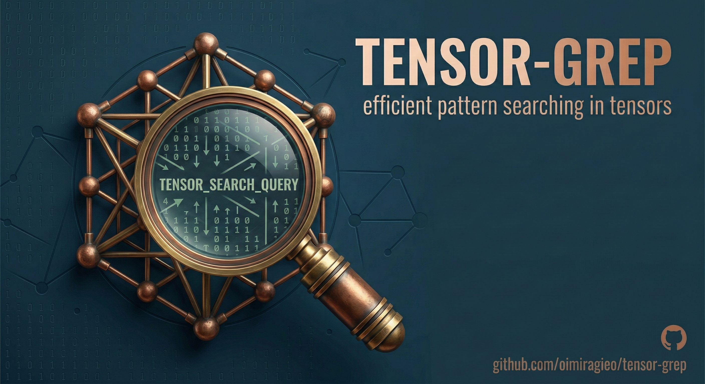

<div align="center">
  
</div>

# tensor-grep (tg)

Line oriented search tool using PyTorch and NVIDIA RAPIDS cuDF to accelerate regex matching and structural AST searching via Graph Neural Networks. Combines the raw performance of ripgrep with the semantic power of Transformer AI networks.

`tensor-grep` has first class support on Windows, macOS and Linux, gracefully routing workloads to pure Rust CPU backends when GPUs are unavailable, or scaling across massive multi-GPU arrays instantly via PCIe NVLink when running on enterprise hardware.

[](https://github.com/oimiragieo/tensor-grep/actions)
[](https://pypi.org/project/tensor-grep/)

Dual-licensed under MIT or the UNLICENSE.

### CHANGELOG
Please see the [CHANGELOG.md](CHANGELOG.md) for a release history.

## Quick examples comparing tools

Fresh benchmark pass results (2026-03-05, commit `c15ecd1`) from this repository's benchmark scripts are below.

Environment notes:
- End-to-end CLI timings include Python process startup cost.
- `tg` is fastest on the Rust count path in this run.
- `ripgrep` remains faster on most text-search scenarios in this Windows-hosted benchmark setup.

### ripgrep vs tensor-grep (`benchmarks/run_benchmarks.py`)

| Scenario | ripgrep | tensor-grep | Result |
| --- | --- | --- | --- |
| Simple String Match | 0.467s | 0.809s | Parity PASS |
| Case-Insensitive Match | 0.494s | 0.842s | Parity PASS |
| Regex Match | 0.529s | 0.786s | Parity PASS |
| Invert Match | 1.178s | 1.428s | Parity PASS |
| Count Matches | 0.162s | **0.102s** | Parity PASS |
| Context Lines (`-C2`) | 1.770s | 2.054s | Parity PASS |
| Max Count (`-m 5`) | 0.123s | 0.389s | Parity PASS |
| File Glob Filtering | 0.468s | 0.713s | Parity PASS |
| Word Boundary | 0.476s | 0.803s | Parity PASS |
| Fixed Strings (`-F`) | 0.476s | 0.779s | Parity PASS |

### ast-grep vs tensor-grep AST mode (`benchmarks/run_ast_benchmarks.py`)

| Scenario | ast-grep | tensor-grep | Result |
| --- | --- | --- | --- |
| Simple Function Def | 0.146s | 0.446s | Parity PASS |
| Try/Except Block | 0.140s | 0.451s | Parity PASS |
| Class Declaration | 0.120s | 0.447s | Parity PASS |

### Advanced backend microbenchmarks (`benchmarks/run_gpu_benchmarks.py`)

| Backend | Workload | Time | Output |
| --- | --- | --- | --- |
| AST backend | `function_definition` on test module | **0.064s** | 4 matches |
| cyBERT backend | Semantic classification on 10,000 log lines | 0.504s | 2,000 ERROR labels |
| Torch backend | Exact match on 10,000 log lines | 0.550s | 2,000 matches |

### Benchmark Governance (Regression Protection)

- Benchmark scripts now emit machine-readable JSON artifacts in `artifacts/`.
- Use `benchmarks/check_regression.py` to compare current runs against a baseline and fail if regression exceeds threshold.
- Main CI (`.github/workflows/ci.yml`) now includes a required `benchmark-regression` job on Ubuntu that runs `benchmarks/run_benchmarks.py`, enforces baseline regression thresholds, and publishes a markdown summary + JSON/text artifacts.
- Standalone benchmark workflow (`.github/workflows/benchmark.yml`) remains available for manual and scheduled deep benchmark passes.
- Release workflow now validates the full GitHub binary artifact filename matrix and publishes `CHECKSUMS.txt` (SHA256) alongside release binaries for reproducible integrity checks.
- Release asset verification enforces that each managed binary's `CHECKSUMS.txt` digest matches GitHub release `asset.digest` metadata, closing post-upload integrity gaps.

## Why should I use `tensor-grep`?

- **It scales linearly with hardware.** If you are dealing with massive log files (100GB+) and you have access to enterprise NVIDIA GPUs or even modern consumer cards, `tensor-grep` will automatically chunk and distribute regex matching via `cuDF` natively inside GPU VRAM, bypassing CPU entirely.
- **Explicit multi-GPU routing contract.** Runtime scheduling now exposes stable ID enumeration (`DeviceDetector.enumerate_device_ids()`) and rich device enumeration (`DeviceDetector.list_devices()`), where `list_devices()` returns `(device_id, vram_capacity_mb)` for each routable GPU. This is the canonical API contract for sharding/routing decisions.
- **Explicit device pinning override.** Set `TENSOR_GREP_DEVICE_IDS` (for example `TENSOR_GREP_DEVICE_IDS=3,7`) to constrain scheduling and fanout to specific GPUs.
- **Per-request GPU pinning for library/runtime callers.** `SearchConfig(gpu_device_ids=[...])` now propagates through `Pipeline -> MemoryManager -> CuDFBackend` so workloads can be pinned to selected GPUs without mutating process-wide env vars.
- **Explicit pinning is first-class in routing.** When `gpu_device_ids` is provided for search modes that do not require CPU-only semantics, pipeline selection attempts pinned GPU backends first, then safely falls back to `rg`/Rust/CPU if unavailable.
- **Runtime GPU routing observability.** `Pipeline` now records `selected_gpu_device_ids` for the active backend selection so service wrappers and telemetry pipelines can audit exactly which GPU IDs were used.
- **Per-result routing metadata.** `SearchResult` now carries `routing_backend`, `routing_reason`, `routing_gpu_device_ids`, and `routing_gpu_chunk_plan_mb` for structured post-search telemetry.
- **Per-request GPU pinning from CLI.** `tg search ... --gpu-device-ids 0,1` pins the current command to selected GPUs with strict input validation.
- **Device-ID normalization contract.** Duplicate/invalid preferred IDs are ignored during routing normalization; if all requested IDs are invalid, the scheduler falls back to the detected routable GPU set instead of disabling GPU execution.
- **It is a drop-in replacement for ripgrep.** `tg search` accepts the exact same 70+ CLI flags (`-i`, `-v`, `-C`, `-g`, `-t`) that you already know and love from `ripgrep`.
- **In-Place File Mutations (NEW):** Unlike ripgrep, `tensor-grep` natively supports memory-mapped find-and-replace mutability via `--replace`. Apply `sed`-like capture groups (e.g. `$1`) at millions of lines per second without ever leaving the Rust terminal backend.
- **AST-Grep Parity (NEW):** Structural code searching via PyTorch Geometric Graph Neural Networks (GNNs). Run `tg run`, `tg scan`, `tg lsp` to match structural code patterns (e.g. `if ($A) { return $B; }`) rather than dumb text strings.
- **Semantic Understanding:** The `tg classify` command utilizes a specialized `cyBERT` HuggingFace transformer to identify malicious log patterns, detect hidden base64 payloads, and assign severity (WARN/ERROR/INFO) based on *context* rather than strict regex matches.
- **Resilient Fallback:** If you don't have a GPU, `tensor-grep` instantly transparently falls back to an embedded PyO3/Rust backend using `memmap2`, matching the baseline performance of standard CPU ripgrep.

## Why shouldn't I use `tensor-grep`?

I'd like to try to convince you why you *shouldn't* use `tensor-grep`. This should give you a glimpse at some important downsides.

- **You only search small files.** For small codebases, the overhead of moving memory across the PCIe bus into GPU VRAM actually makes `tensor-grep` marginally slower than standard CPU-bound `ripgrep`. It only shines when the dataset is massive.
- **You are on Windows Native.** While we support Windows native PyTorch CUDA, Windows `multiprocessing` uses `spawn()` rather than Linux's `fork()`. This adds an unavoidable ~11 second overhead to boot the CUDA context. (Use WSL2 instead for instant initialization!).
- **You need pure standalone binaries.** While we provide Nuitka-compiled standalone executables, they are ~3GB in size because they must statically bundle PyTorch and the CUDA toolkit.
- **You don't want heavy dependencies.** A full `tensor-grep` installation with AST and NLP capabilities requires installing `torch`, `torch-geometric`, `transformers`, and NVIDIA drivers. If you just want a 3MB fast search tool, stick to pure `ripgrep`.

## Installation

The binary name for `tensor-grep` is `tg`.

### Zero-Dependency Installation (Recommended)
To ensure PyTorch bindings and CUDA/ROCm versions exactly match your hardware without conflicting with your system Python, we recommend using our automated install scripts. These scripts use `uv` to intelligently probe your GPU and build a highly isolated Python 3.12 environment in the background.

**Windows (PowerShell):**
```powershell
irm https://raw.githubusercontent.com/oimiragieo/tensor-grep/main/scripts/install.ps1 | iex
```

**Linux & macOS (Bash):**
```bash
curl -LsSf https://raw.githubusercontent.com/oimiragieo/tensor-grep/main/scripts/install.sh | bash
```

Installer defaults and channels:
- Default behavior installs the latest stable PyPI release.
- Set `TENSOR_GREP_VERSION` to pin a specific stable version (example: `TENSOR_GREP_VERSION=0.2.1`).
- Set `TENSOR_GREP_CHANNEL=main` to install directly from the GitHub `main` branch.
- At completion, the installer prints `tg --version` and returns to the directory where you started the script.
- Windows installer now installs `tg.cmd` shims in `~/.local/bin` and `~/bin`, updates both PowerShell 7 and Windows PowerShell profiles, and replaces stale aliases.

If `tg --version` still reports an older version, check command resolution:
```powershell
Get-Command tg
where.exe tg
```

Examples:
```powershell
# Windows PowerShell: install from main
$env:TENSOR_GREP_CHANNEL = "main"
irm https://raw.githubusercontent.com/oimiragieo/tensor-grep/main/scripts/install.ps1 | iex
```

```bash
# Linux/macOS: install a specific stable release
TENSOR_GREP_VERSION=0.2.1 curl -LsSf https://raw.githubusercontent.com/oimiragieo/tensor-grep/main/scripts/install.sh | bash
```

### Python Package Managers (pip/uv)
If you're a Python programmer, `tensor-grep` can be installed via `pip` or `uv`.

```bash
# Basic CPU fallback installation
pip install tensor-grep

# Full installation with AST matching, NLP, and Linux GPU RAPIDS dependencies
uv pip install "tensor-grep[ast,nlp]" cudf-cu12 --extra-index-url https://pypi.nvidia.com
```

### Node.js (npx)
```bash
npx tensor-grep search "ERROR" .
```

### Standalone Binaries (For IT/SecOps)
If you cannot run scripts or prefer not to use `uv`, download the monolithic standalone executables from the GitHub Releases page. These `~3GB` files are built via Nuitka and contain Python, PyTorch, and the CUDA drivers completely bundled together:
* `tg-windows-amd64-nvidia.exe`
* `tg-linux-amd64-nvidia.bin`
* `tg-macos-amd64-cpu.bin`

### Docker
```bash
docker run --gpus all -v $(pwd):/workspace factory/tensor-grep:latest-cuda search "ERROR" /workspace/logs
```

## Whirlwind tour

The command line usage of `tensor-grep` doesn't differ much from other tools that perform a similar function. The full details can be found in `tg --help`.

To recursively search the current directory, while respecting all `.gitignore` files, ignore hidden files and directories and skip binary files:

```bash
$ tg foobar
```

(Note: Because `tensor-grep` perfectly intercepts `sys.argv`, you don't even need to type `tg search foobar`. Just typing `tg foobar` routes exactly as `rg foobar` does!)

Make the search case insensitive with `-i`, invert the search with `-v` or show the 2 lines before and after every search result with `-C2`:

```bash
$ tg -i -v -C2 foobar
```

Force all matches to be surrounded by word boundaries with `-w`:

```bash
$ tg -w foobar
```

Search only Python and Javascript files:

```bash
$ tg -tpy -tjs foobar
```

Inspect routable multi-GPU inventory and VRAM sizing:

```bash
$ tg devices
$ tg devices --format json
$ tg devices --json
```

### AI Assistant Integration (MCP)
`tensor-grep` includes a native Model Context Protocol (MCP) server! This allows modern AI assistants (like Claude Desktop or Cursor) to directly utilize our GPU-accelerated regex engine, structural AST parsers, and cyBERT NLP log classifiers right inside their context windows.

To use it with Claude Desktop, just add this to your `claude_desktop_config.json`:
```json
{
  "mcpServers": {
    "tensor-grep": {
      "command": "tg",
      "args": ["mcp"]
    }
  }
}
```

Available MCP tools now include:
- `tg_search`
- `tg_ast_search`
- `tg_classify_logs`
- `tg_devices` (returns routable GPU IDs and VRAM inventory; supports JSON output)

For machine consumers of CLI JSON output (`tg search ... --format json`), routing metadata is included:
- `routing_backend`
- `routing_reason`
- `routing_gpu_device_ids`
- `routing_gpu_chunk_plan_mb`

**AI Prompt Configuration:**
If you are building custom AI agents or bots, we provide an optimized prompt template explicitly outlining when and how AI models should use `tensor-grep`. Check out the [`SKILL.md`](SKILL.md) file to seamlessly inject our capabilities into your agent's system prompt!

### AST / Structural Searching
Run semantic code structure searches that ignore formatting, whitespace, and comments:

```bash
$ tg run --ast --lang python "if ($A) { return $B; }" ./src
```

### NLP Log Classification
Scan a system log and rely on the CyBERT NLP model to automatically cluster and print warnings, ignoring explicit Regex patterns entirely:

```bash
$ tg classify /var/logs/syslog
```

## Building & Developing

`tensor-grep` uses a hybrid Rust & Python architecture.

```bash
$ git clone https://github.com/oimiragieo/tensor-grep
$ cd tensor-grep

# Install dependencies using uv
$ uv pip install -e ".[dev,ast,nlp]"

# Build the Rust PyO3 core locally via Maturin
$ python -m maturin develop --release

# Run the test suite
$ pytest tests/
```

## Hardware & Software Requirements

To unlock its 3x-10x GPU-accelerated speeds, your system must meet these requirements:

* **Hardware:**
  * NVIDIA GPU (GTX 10-Series or newer, RTX 30/40/50 series recommended)
  * Minimum 4GB VRAM (8GB+ recommended for massive logs)
* **Software / Drivers:**
  * **NVIDIA Display Drivers:** v535.xx or newer
  * **CUDA Toolkit:** 12.0 or newer (CUDA 12.4 highly recommended)
* **Python Environments:**
  * **Linux / WSL2:** Requires NVIDIA RAPIDS `cuDF` (`cudf-cu12`) for maximum throughput.
  * **Windows Native:** Requires PyTorch with CUDA 12 support.

## Enterprise Roadmap: GPUDirect Storage (GDS)

The absolute theoretical limit of local hardware parsing is bounded by the PCIe bus. Currently, `tensor-grep` uses Apache Arrow via `memmap2` to achieve end-to-end zero-copy routing:

**NVMe Disk -> OS Page Cache (CPU RAM via mmap) -> PCIe Bus -> GPU VRAM**

For multi-terabyte log repositories, the CPU RAM bounce-buffer becomes the limiting factor. The next frontier for `tensor-grep v2.0` is the integration of **NVIDIA cuFile (GPUDirect Storage)**. By replacing the Rust mmap with a Rust C++ FFI call to `cuFileRead()`, we can instruct the NVMe controller to bypass the CPU entirely and DMA (Direct Memory Access) the bytes straight from the SSD into the GPU VRAM.

## Tips

### Windows PyTorch Spawn Overhead
Because Windows Python `multiprocessing` requires `spawn()` rather than Linux's `fork()`, the PyTorch CUDA context takes ~11 seconds to initialize across multiple worker processes on Windows. 
- For small files (< 50MB), `tensor-grep` automatically bypasses the GPU on Windows to avoid this delay, routing to an optimized `CPUBackend` instead.
- For massive logs (> 200MB), the 11s Windows spawn overhead is absorbed by the sheer throughput of the GPU matrix math.

To achieve maximum enterprise performance on a Windows machine, **run tensor-grep inside WSL2**, where `fork()` allows instantaneous CUDA bindings.
