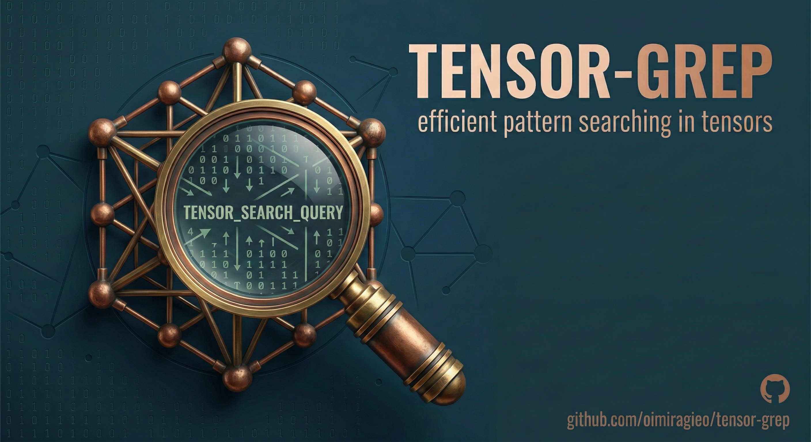

<div align="center">
  
</div>

# tensor-grep

[](https://pypi.org/project/tensor-grep/)
[](https://github.com/oimiragieo/tensor-grep/actions/workflows/ci.yml)
[](LICENSE)

**Find the code. Understand the change.**

Search code and logs, follow symbols, and gather the context for your next change from
one command-line interface. `tensor-grep` combines text and structural search with
repository maps, ranked context, and tools for AI-assisted development.

Use it to investigate an unfamiliar project, trace a log message back to its source,
or give a coding assistant a focused set of files instead of an entire repository.
Core local workflows need no API key or GPU.

[Get started](docs/getting-started.md) · [Installation](docs/installation.md) ·
[How it works](docs/architecture.md) · [Releases](https://github.com/oimiragieo/tensor-grep/releases)

## Get started

With Python 3.11 or later:

```bash
python -m pip install tensor-grep
tg --version
```

Then, from a project directory:

```bash
# Find a literal marker and show its line number.
tg search -F -n "TODO" .

# Get an overview of the project's central files and likely entry points.
tg orient .

# Gather relevant code for a question, within a context budget.
tg context . "how are invoices calculated?" --max-tokens 2000
```

New to command-line tools? The [first-search walkthrough](docs/getting-started.md)
uses a small sample project and explains each command and result.

Windows, macOS, and Linux have supported installation paths. The Python package starts
through a Python entry point; the managed installers also set up a native CPU front door.
Some native commands call a Python sidecar, a separate process that supplies the rest of
the tool's features. See [docs/installation.md](docs/installation.md) and the
[support matrix](docs/SUPPORT_MATRIX.md) to choose a channel. npm, Homebrew, and winget
packages are not published yet.

## What you can do

| Task | Start here | What you get |
|---|---|---|
| Investigate code or logs | `tg search PATTERN PATH` | Matching text with file and line information; optional local BM25 relevance ranking with `--rank` |
| Find code by its structure | `tg run`, `tg scan`, `tg test` | Parser-based patterns and a validated AST search/rewrite workflow |
| Learn an unfamiliar repository | `tg inventory`, `tg orient`, `tg map` | File summaries, suggested starting points, and file/symbol maps |
| Follow a symbol | `tg defs`, `tg source`, `tg refs`, `tg callers` | Definitions, source, references, and caller evidence with coverage limits |
| Prepare a change | `tg context`, `tg agent`, `tg prepare` | Relevant code, possible edit targets, confidence information, and suggested validation commands |
| Repeat a workflow | `tg search --index`, `tg session`, `tg checkpoint` | Native search indexes, reusable repository context, and scoped snapshots restored by ID |
| Connect your tools | `tg mcp`, JSON/NDJSON output | Structured results for coding assistants, scripts, and editor integrations |

An **AST** is a parsed representation of source code. Structural search can match a
function call as code rather than as a particular arrangement of spaces and text.
For a Python package installation, first add the structural-search dependency with
`python -m pip install "tensor-grep[scan]"`. The native binary supports this example directly.

This searches Python files for calls to `print`:

```bash
tg run -p 'print($VALUE)' --lang python .
```

Keep the single quotes around AST patterns in PowerShell so `$VALUE` reaches the tool
unchanged. Search is read-only; applying a rewrite is a separate, explicit operation.

## Give an assistant useful context

`tg prepare` brings together a possible edit target, confidence and limitations,
caller evidence, and validation commands. Its JSON output lets a client inspect the
recommendation before deciding what to do:

```bash
tg prepare . "add invoice tax validation" --json
```

A **context capsule** is a structured collection of relevant files, symbols and snippets.
It saves callers from assembling that information through separate searches. Sessions
can reuse repository context across requests. Optional audit manifests and signed evidence
support review workflows; they are not generated or signed automatically for every run.

For automation, start with [docs/harness_api.md](docs/harness_api.md) and the working
recipes in [docs/harness_cookbook.md](docs/harness_cookbook.md). The
[review-bundle guide](docs/enterprise_review_bundle_ci.md) covers evidence checks in CI.

## Choose the right search

- **Known text or a regular expression:** use `tg search`. It supports a validated
  ripgrep-compatible subset; `--format rg` requests ripgrep-shaped output.
- **A code pattern:** use the structural search commands. The supported AST slice is
  useful for focused rules and rewrites; `ast-grep` has a broader surface.
- **A task or question:** use `tg context` or `tg prepare`. Experimental `tg find`
  also offers whole-repository relevance search, with optional local dense matching.
- **Repeated searches:** evaluate indexes and sessions against your workload.

The native CPU engine is one execution path, alongside delegated engines and Python-owned
commands. `rg` remains the cold text-search baseline. Performance claims are
benchmark-governed and workload-specific; the [comparison](docs/tool_comparison.md)
and [benchmarks](docs/benchmarks.md) explain what was measured.

Bounded scans can return partial results. Confidence scores and caller graphs are evidence
to review, not proof that a change is safe or that a symbol is unused. GPU paths and other
opt-in features have separate requirements and limitations in
[docs/EXPERIMENTAL.md](docs/EXPERIMENTAL.md).

## Canonical docs

| Guide | Purpose |
|---|---|
| [First search](docs/getting-started.md) | A sample project, explained results, and a glossary |
| [Architecture](docs/architecture.md) | How the CLI, search engines, Python services, and stored state fit together |
| [docs/installation.md](docs/installation.md) | Install, verify, and troubleshoot the launcher |
| [docs/harness_api.md](docs/harness_api.md) | Machine-readable CLI and MCP contracts |
| [docs/harness_cookbook.md](docs/harness_cookbook.md) | End-to-end automation examples |
| [docs/routing_policy.md](docs/routing_policy.md) | How execution paths are selected |
| [docs/benchmarks.md](docs/benchmarks.md) | Accepted measurements and regression checks |
| [docs/tool_comparison.md](docs/tool_comparison.md) | Workload and language-coverage comparisons |
| [docs/gpu_crossover.md](docs/gpu_crossover.md) | GPU measurements and current limits |
| [docs/SUPPORT_MATRIX.md](docs/SUPPORT_MATRIX.md) | Platforms, runtimes, and delivery channels |
| [docs/CONTRACTS.md](docs/CONTRACTS.md) | Compatibility and output guarantees |
| [docs/CI_PIPELINE.md](docs/CI_PIPELINE.md) | Testing, releases, and dependency maintenance |
| [docs/HOTFIX_PROCEDURE.md](docs/HOTFIX_PROCEDURE.md) | Patch and rollback procedures |

## Contribute and get help

[Report a bug](https://github.com/oimiragieo/tensor-grep/issues/new?template=bug_report.yml),
[request a feature](https://github.com/oimiragieo/tensor-grep/issues/new?template=feature_request.yml),
or [ask a question](https://github.com/oimiragieo/tensor-grep/issues/new?template=question.yml).
Include the command, `tg --version`, your platform, and a small reproducible example.

See [CONTRIBUTING.md](CONTRIBUTING.md) for development and review conventions, and
[SECURITY.md](SECURITY.md) for private vulnerability reporting.

## Future Work

Ongoing work focuses on retrieval quality, cross-file navigation, larger repositories,
and integrations. Experimental features graduate through measured results and compatibility
checks. See the [experimental-feature guide](docs/EXPERIMENTAL.md) for current boundaries
and [GitHub issues](https://github.com/oimiragieo/tensor-grep/issues) for discussion.

## License

Apache-2.0. See [LICENSE](LICENSE). Related project: [gotcontext.ai](https://gotcontext.ai).
