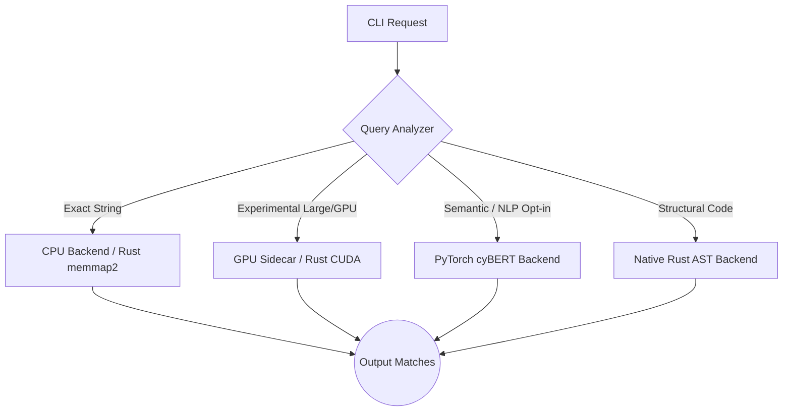

# Tensor-Grep: Routing-First Search, Structural Retrieval, and AI Harness Planning for Real Codebases

> Current-state note (2026-03-30): this document now tracks three active product lines: cold-path text search, native AST/rewrite execution, and AI-harness-oriented repository planning. Not every historical benchmark below describes the current accepted line. The accepted local line on this Windows host keeps `rg` as the default cold-path backend for generic text search, keeps the native Rust AST backend ahead of `sg` on structural search, keeps one-shot AST rewrite apply back under the `sg` ratio gate after the 2026-04-28 fast-path recovery, and adds a repository-planning surface that is now benchmarked against real external repos and headless agent competitors. The latest accepted external planning baseline covers 29 real-repo scenarios and scores `mean_file_hit_rate = 1.0`, `mean_span_hit_rate = 1.0`, and `mean_file_precision = 0.9060`. On bounded cross-language comparison slices, `tensor-grep` currently beats Gemini and Copilot on planning quality, validation targeting, and context efficiency. The patch-correctness benchmark layer is now anchored by one refreshed same-pack 12-scenario scorecard: `artifacts/patch_eval_demo/real_patch_system_scorecard.md`. On that accepted hard pack, `claude-enhanced` lands `1.0 / 1.0`, `claude-baseline` lands `0.75 / 0.75`, Copilot lands `0.5 / 0.5`, and all currently measured Gemini lines land `0.0 / 0.0` (`gemini-cli`, `gemini-baseline`, `gemini-enhanced`). The accepted read is that Gemini's failure line on this host is now operationally understood rather than ambiguous. The runner no longer inherits the user's global `.gemini/GEMINI.md` persona or MCP-heavy settings during benchmark runs, and the Windows timeout path is bounded close to the requested timeout. Even after that cleanup, Gemini still either times out (`~65s` on a `60s` cap) or, with a longer isolated probe, fails to emit valid JSON output; the broader Gemini-enhanced rerun now confirms that the committed Gemini skill/project setup does not recover the line on the accepted pack. The user-style `Claude baseline` vs `Claude + tensor-grep skill + CLAUDE.md` benchmark is now also real on the accepted 12-scenario corpus: plain Claude lands `0.75 / 0.75` for patch-applied / validation-passed, while the enhanced setup is back to `1.0 / 1.0` after tightening the repo-local `CLAUDE.md` task-engagement rule. The cost is latency: `29.89s` baseline vs `52.59s` enhanced on the accepted 12-scenario line. New command-level tracing still shows that at least some of that slowdown is pure Claude deliberation rather than tool cost: on a traced probe, the enhanced path took `24.64s` with `tg_invocation_count = 0`, versus `8.65s` for baseline. The semantic-provider feature (`native | lsp | hybrid`) is implemented and benchmarkable. The broad `click` provider bakeoff still shows no planning-quality gain over `native` while increasing wall-clock cost (`68.374s` native vs `89.79s` LSP vs `89.382s` hybrid), so provider-backed modes remain opt-in rather than default on the broad pack. However, focused provider hard-case artifacts now exist at `artifacts/bench_provider_navigation_click_hardcases.json`, `artifacts/bench_provider_navigation_js_ts_hardcases.json`, and `artifacts/bench_provider_navigation_rust_hardcases.json`, with companion scorecards at `artifacts/bench_provider_navigation_click_hardcases.md`, `artifacts/bench_provider_navigation_js_ts_hardcases.md`, `artifacts/bench_provider_navigation_rust_hardcases.md`, and a combined summary at `artifacts/bench_provider_navigation_hardcases_combined.md`: on the accepted 2-scenario Python alias-wrapper pack, the accepted 2-scenario JS/TS imported-alias wrapper pack, and the accepted 2-scenario Rust use/re-export alias-wrapper pack, `native` caller hit rate is `0.0` while `hybrid` reaches `1.0` caller hit rate; on all three packs, `hybrid` caller precision is `1.0`. Rust test targeting is now clean on the focused external `clap_lex` pack: the accepted rerun at `artifacts/bench_bakeoff_clap_lex_rust_targeting_rerun.json` reaches `mean_test_hit_rate = 1.0` and `mean_validation_cmd_hit_rate = 1.0`. A newer focused Python precision rerun on the `click` slice now lands `mean_file_precision = 1.0` with zero false-positive scenarios; the stable artifacts are `artifacts/bench_bakeoff_click_precision_rerun.json` and `artifacts/bench_bakeoff_click_precision_rerun_analysis.md`. The accepted mechanism is selective pruning, not more graph expansion: for Python `utils.py`, `termui.py`, and `core.py` symbols, once depth-one dependent files exist, `tensor-grep` now drops depth-two-or-worse graph-only spillover from edit-plan dependency ranking. The accepted Rust mechanism is targeted association, not broader graph expansion: Rust test association now recognizes fully qualified symbol usage, inherent-`impl` method usage, and owner-type inheritance for methods inside nested integration tests, and blast-radius filtering preserves `test-graph` and filename-backed matches instead of discarding them. Treat later optimization-history sections as historical unless they are explicitly tied to the current accepted artifacts in `docs/benchmarks.md`, `artifacts/bench_external_eval_native_provider.json`, `artifacts/patch_eval_demo/real_patch_system_scorecard.md`, `artifacts/patch_eval_demo/claude_skill_ab_limit12_current_claude_md_bakeoff.json`, `artifacts/patch_eval_demo/gemini_skill_ab_limit12_bakeoff.json`, `artifacts/bench_bakeoff_click_precision_rerun.json`, `artifacts/bench_bakeoff_clap_lex_rust_targeting_rerun.json`, `artifacts/bench_provider_navigation_click_hardcases.json`, `artifacts/bench_provider_navigation_click_hardcases.md`, `artifacts/bench_provider_navigation_js_ts_hardcases.json`, `artifacts/bench_provider_navigation_js_ts_hardcases.md`, `artifacts/bench_provider_navigation_rust_hardcases.json`, `artifacts/bench_provider_navigation_rust_hardcases.md`, `artifacts/bench_provider_navigation_hardcases_combined.md`, and the provider-mode bakeoff artifacts.
>
> Release-positioning note (2026-05-09): `v1.9.4` is a trust/governance release, not a GPU or raw-search performance release. It closes stale docs-governance expectations, keeps public docs at the released tag, and substitutes `$file` / `{file}` validation placeholders before validation command execution. The latest public dogfood keeps `rg` as the cold exact-text baseline, keeps `tg` positioned as agent-native code intelligence, confirms AST search as a strong differentiator, and keeps GPU experimental until 1GB/5GB correctness and speed gates beat both `rg` and `tg_cpu`.

> post-`v1.19.5` / latest `v1.9.11` GPU dogfood note (2026-05-10): local native CUDA release search passes correctness smoke checks and 1GB and 5GB correctness on both RTX 4070 (`sm_89`) and RTX 5070 (`sm_120`) after refreshing the PyTorch sidecar to `cu128`, but GPU remains slower than `rg` and `tg_cpu`, so auto-recommendation stays false. The native scale artifacts `artifacts/bench_gpu_native_device0_v195_blockers_fixed.json` and `artifacts/bench_gpu_native_device1_v195_blockers_fixed.json` report exact match/file-set correctness at 1GB and 5GB, and the latest `v1.9.11` GPU dogfood still finds no crossover: best 5GB GPU/rg ratios are `35.46x` slower on RTX 4070 and `29.91x` slower on RTX 5070. The benchmark harness records the runtime backend behind `--gpu-device-ids` and treats sidecar-routed rows as unsupported for native CUDA scale gates. The same follow-up makes ambiguous agent capsules expose `alternative_targets`, refreshes root `tg --help` so current agent/GPU/launcher/validation contracts are visible at the CLI, distinguishes a foreign first-PATH `tg.exe` such as Together CLI from tensor-grep-owned stale launchers, and keeps the accepted action for foreign launchers as explicit `doctor`/readiness remediation rather than deleting another tool's command. Directory-level rewrite validation now expands `$file` / `{file}` once per edited file, so commands such as `python -m py_compile "$file"` validate changed files instead of the root directory.
>
> GPU route/staging audit note (2026-05-11): the managed Windows `tg.exe --gpu-device-ids 0 --json ...` route currently reports `routing_backend = "GpuSidecar"` and `sidecar_used = true`, so the slow public rows are sidecar-contaminated rather than clean native CUDA speed evidence. The accepted fix tightens the native benchmark taxonomy with `native_cuda_runtime_gate.status = "UNSUPPORTED"` for sidecar-routed rows, skips GPU timing when the runtime probe is not `NativeGpuBackend`, and exposes native CUDA CPU-staging metrics. The CUDA ingest path now reads file chunks into reusable pageable staging memory, performs CPU binary/line preprocessing there, copies accepted text into pinned DMA buffers, caches NVRTC PTX by architecture and kernel hash, and reuses line descriptors during output materialization; JSON/verbose output separates host file-read time, host preprocess time, host-to-pinned copy time, CPU staging bytes, pageable-host staging bytes, H2D transfer time, kernel time, and wall time.

> post-`v1.19.5` dogfood GPU performance note (2026-05-14): public managed GPU remains not promotion-ready. Single-pattern cold grep still has no crossover, and the many-pattern public managed lane is not credible versus fair `rg -F -e ... -e ...` multi-pattern search. In the public managed dogfood, 100 fixed no-match patterns over `1GB` were `rg` multi-pattern: `0.169s`, `tg` CPU multi-pattern: `0.394s`, and `tg --gpu-device-ids 0` fell back to `NativeCpuBackend` at `0.448s`; the mixed 100-pattern row was `rg` mixed multi-pattern: `0.105s` versus `tg` CPU mixed multi-pattern: `2.220s`, with the GPU-requested row also falling back to `NativeCpuBackend` at `2.211s`. Earlier local CUDA-feature release measurements against sequential `rg` remain implementation history, not a public GPU claim. Public assets must produce `NativeGpuBackend`, `sidecar_used = false`, 1GB and 5GB correctness on RTX 4070 / RTX 5070 class devices, and speed wins for the declared workload class before any promotion.
>
> Windows bridge sidecar note (2026-05-11): post-release dogfood for `v1.10.0` found a launcher-state hole that version-only probes missed. A tensor-grep-owned `tg.com` bridge copied into `Python314\Scripts` correctly outranked a foreign same-directory `tg.exe` and reported `tg 1.10.0` for `--version`, but sidecar-backed commands such as `tg doctor --json` and `tg upgrade` fell through to the ambient Python 3.14 install and failed with `No module named tensor_grep`. The accepted fix is launcher correctness, not performance: copied `tg.com` bridges must resolve the managed `~/.tensor-grep/.venv` sidecar Python and set `TG_NATIVE_TG_BINARY` to the managed native front door rather than the bridge copy. Public release dogfood must include a sidecar-backed command, not just `tg --version`.
>
> Post-`v1.9.4` local fix note (2026-05-10): native CUDA search now passes the required 1GB/5GB correctness gates on a CUDA-feature debug binary after fixing adaptive match-buffer allocation to scale with actual line count and pattern count instead of shard bytes. The accepted interpretation is still conservative: measured GPU 0 rows remain slower than both `rg` and `tg_cpu`, so GPU auto-recommendation stays false. The GPU benchmark harness now probes the runtime backend for `--gpu-device-ids` and marks sidecar-routed rows unsupported for native CUDA scale gates, preventing Python/Torch sidecar timings from being mistaken for native GPU evidence. The same local line adds `alternative_targets` to `tg agent` capsules so ambiguous multi-language tasks can expose plausible cross-language candidates without raising primary-target confidence.
>
> Managed-launcher control-plane note (2026-05-07): the active post-`v1.19.5` branch moves stable script installs toward a release-native public front door. The intended shape is workload-specific and contract-preserving: use the matching release CPU `tg` binary for the normal shell command when a GitHub asset exists, keep the isolated Python environment as `TG_SIDECAR_PYTHON`, and point Python-backed commands back at the managed native binary with `TG_NATIVE_TG_BINARY`. The branch also makes the Rust front door treat `--format rg` as a no-op and preserve `--sort path` when forwarding to ripgrep. The branch benchmark artifact `artifacts/bench_run_benchmarks_native_frontdoor_pr.json` passed parity on all 10 rows with `launcher=explicit_binary` and `tg_binary_source=explicit_arg`; `check_regression.py --allow-env-mismatch` reported no `tg` regressions while flagging faster rg comparator drift. The measured medians on this host were `tg = 0.259509s` and `rg = 0.112597s`, so this remains launcher correctness evidence, not a cold-search speed claim.
>
> Managed-upgrade front-door note (2026-05-08): the `v1.8.27` installer/update release closed stale PyPI metadata, post-upgrade import verification, native installer exit-code checks, and staged managed replacement, but public dogfood found one more launcher-state gap. Running `tg upgrade` from `v1.8.26` installed sidecar `tensor-grep==1.8.27` while the managed native `~/.tensor-grep/bin/tg.exe` still reported `tg 1.8.26`; `tg doctor --json` correctly exposed `rust_binary_version_status = mismatch`. The accepted follow-up direction is correctness, not speed: after verifying the sidecar package version, `tg upgrade` refreshes the matching release-native front door from the GitHub release asset, smoke-tests the downloaded binary with `--version`, verifies the installed destination, and schedules a Windows retry helper if the running native executable is locked. Because pre-fix upgrade code cannot retroactively refresh itself during the same process, dogfood must explicitly test the recovery path where a current sidecar reruns `tg upgrade` and repairs the stale native front door.
>
> Native-front-door upgrade closeout note (2026-05-08): `v1.8.28` shipped the managed native front-door refresh after sidecar upgrades. Release proof is main CI `25541354485`, main CodeQL `25541353932`, release-commit CodeQL `25541905895`, PyPI `tensor-grep==1.8.28`, and GitHub release asset verification with the `native-frontdoor` profile. Public dogfood confirmed PowerShell, `cmd`, unprofiled PowerShell, Git Bash, and WSL all resolve `tg 1.8.28`; `tg doctor --json` reports the sidecar and native front door as matching; and a current `tg upgrade` reports that `1.8.28` is already the latest PyPI version. This is still installer/control-plane correctness evidence, not a cold-search speed claim.
>
> Native CLI parity dogfood note (2026-05-08): the public `v1.8.28` native front door is the first line where cold search and AST startup look genuinely competitive from the installed shell path, but that made advertised-surface drift more visible. The native parser rejected Python-advertised shapes such as `tg search --files`, `tg search --multiline` / `-U`, `tg search --null`, `tg run -r`, and `tg classify --format json`. The accepted follow-up is contract hardening: the native front door should execute these requests directly, forward to ripgrep where that preserves rg semantics, or route to the Python sidecar intentionally. The same dogfood found a GPU benchmark harness issue where an `rg` no-match exit was treated as a correctness failure; no-match is a valid comparator outcome when `tg` also returns zero matches. This note does not promote a new speed claim.
>
> Native-front-door CLI parity closeout note (2026-05-08): `v1.8.29` shipped the public native parser/routing hardening from PR #64 `fix: harden native front-door CLI parity`. Release proof is main CI `25557263658`, main CodeQL `25557263900`, release commit `648a740 chore(release): v1.8.29 [skip ci]`, PyPI `tensor-grep==1.8.29`, and GitHub release assets for Windows/Linux/macOS native CPU front doors plus package-manager bundle files. Public dogfood upgraded from `v1.8.28` to sidecar/native `tg 1.8.29` and verified `tg search --multiline`, `tg search -U`, `tg search --files`, `tg search --null`, `tg run -r`, and `tg classify --format json`. This is advertised-surface correctness and release-path evidence, not a new cold-search speed claim.
>
> Launcher observability closeout note (2026-05-08): `v1.8.32` shipped the public launcher-route observability follow-up from PR #72 `fix: expose launcher route observability`. Release proof is main CI `25581373995`, merge-commit CodeQL/dynamic `25581373725`, release-commit CodeQL/dynamic `25581894666`, release commit `3adf044 chore(release): v1.8.32 [skip ci]`, PyPI `tensor-grep==1.8.32`, and GitHub release assets for Windows/Linux/macOS native CPU front doors plus package-manager bundle files. Public dogfood upgraded from `v1.8.31` to sidecar/native `tg 1.8.32`; `tg doctor --json` now reports current-process launcher kind, fresh-shell launcher kind, and a warning when the current shell still routes through the compatibility shim before the fresh-shell managed native front door. Cold-path benchmark artifacts now record `tg_launcher_command_kind` next to the configured `tg_launcher_mode`, so native-exe, `.cmd` shim, `uv`, and Python-module timings are not mixed into one speed claim. This is observability and attribution correctness, not a cold-search speed promotion.
>
> Agent-token output note (2026-05-07): the `rtk-ai/rtk` design is useful as a token-budget pattern rather than a search-contract replacement. The transferable idea is an explicit agent-bounded profile with global/per-file caps, grouped excerpts, line truncation, and omission counts. `tensor-grep` should implement that as an opt-in formatter/profile if pursued; raw `--format rg`, `--json`, and `--ndjson` must remain stable because agents and parity tests rely on those contracts.
>
> Inference-serving note (2026-05-08): TokenSpeed is relevant as a future reference for agentic LLM serving, especially long-prefix KV-cache scheduling and low-latency OpenAI-compatible serving, but it is not a direct dependency for `tg search` or AST parity. The practical impact for this repo is narrower: keep `classify` and any future local model-backed planning surfaces provider-aware, quiet on unavailable providers, and benchmarked end-to-end before claiming GPU or inference crossover.
>
> Trust-surface note (2026-03-29): review bundle artifacts are now deterministic for identical inputs. `create_review_bundle()` derives bundle `created_at` from packaged artifact timestamps when available instead of stamping wall-clock time unconditionally. The accepted reason is operational, not cosmetic: nondeterministic `created_at` values caused otherwise identical bundles to drift in `bundle_sha256`, which is exactly the wrong behavior for replay, trust verification, and CI parity checks.
>
> Release-surface note (2026-03-30): docs publication now has validator-backed preflight build gates. CI `release-readiness` builds the docs site with `mkdocs build --strict` before release-asset validation, and the tag release workflow now performs the same strict build before `mkdocs gh-deploy --force`. The accepted reason is shippability: without a preflight docs build contract, a broken docs site could survive until tag-time release or fail only during deployment.
>
> CI stabilization note (2026-04-27): the post-`v1.19.5` parity line is accepted as a correctness/release recovery slice, not a speed claim. CI exposed concrete contract gaps after the high-density LLM render and parity work: a false PCRE2 fallback through RustCore when no PCRE2-capable `rg` exists, wrapper-only AST patterns silently falling into the native AST backend, AST filter/interactive rewrite tests depending on ambient AST binaries, Python fallback search drift around `--max-filesize`, replacement output, JSON/native delegation, cached test state, public help fallback drift when Python help passthrough timed out, and local formatter drift from running an older Ruff than CI's pinned `0.15.11`. The accepted fix removes the false PCRE2 fallback, makes wrapper-only AST syntax fail explicitly when the wrapper is unavailable, hermeticizes AST apply/filter coverage, preserves native delegation trigger modes, respects max-filesize in Rust fallback, hardens YAML/runtime cache cleanup, keeps native fallback help aligned with the public command contract, and applies CI-version formatting. Local native benchmark reruns preserved search parity but were not accepted as speed evidence because the Windows comparator drifted across runs; no benchmark row is promoted by this note.
>
> Benchmark automation note (2026-04-27): the standalone scheduled `benchmark.yml` workflow failed after `v1.6.0` even though main CI and release were green. The root cause was workflow provisioning, not a benchmark result: `run_ast_benchmarks.py` requires `rust_core/target/release/tg`, `hyperfine`, and the real `ast-grep` comparator, but the standalone workflow only installed Python benchmark dependencies and `ripgrep`. The accepted fix provisions Rust, installs `hyperfine` and `ast-grep`, validates that `sg` resolves to ast-grep rather than Linux util-linux `sg`, builds the native release binary before benchmark execution, syncs the editable `uv.lock` version to the released `1.6.0` metadata, and adds validator coverage for the benchmark ordering. No benchmark speed claim is changed by this note.
>
> Benchmark refresh note (2026-04-27): the `v1.6.3` local benchmark refresh split the story. Native CPU wins all four native rows (`large_file_200mb_count` now `tg --cpu 0.050s` vs `rg 0.199s`), and AST search remains ahead of `sg` (`0.135s` vs `0.180s`). The cold `run_benchmarks.py` rerun preserved parity but failed the frozen Windows regression gate, so it is not a speed baseline refresh. AST rewrite apply failed its `sg` ratio gate (`tg 1.429s` vs `sg 0.819s`, ratio `1.745x`), so prior rewrite-speed wins remain historical and the current release treats rewrite apply performance as a follow-up. Native GPU crossover also failed (`500MB` and `1GB` timed out, no winning rows), so GPU search remains manual-only unless a local calibration artifact proves otherwise.
>
> AST rewrite recovery note (2026-04-28): the follow-up recovered the simple one-shot apply lane by routing only safe `tg run --rewrite ... --apply` shapes through the existing native `plan_and_apply` path. The accepted local artifact is `artifacts/bench_ast_rewrite.json`: `tg apply 0.534s` vs `sg apply 0.643s`, ratio `0.831x`, with 50,000 rewrites across 1,000 files. JSON, diff, checkpoint, audit, validation, verify, selector, and batch rewrite remain on the plan-first path.
>
> PyPI rewrite smoke note (2026-04-28): post-release package smoke testing found that the `v1.6.4` PyPI console path did not include a standalone native `tg` binary, so `tg run --rewrite` could fall back to the Python search path instead of the Rust rewrite planner/apply engine. The accepted fix exposes Rust AST rewrite plan/apply through the PyO3 wheel extension, uses that embedded path for Python CLI and MCP plan/apply when no standalone native binary is available, and strengthens `scripts/smoke_test_pypi_artifacts.py` so local wheel artifacts must pass rewrite plan and apply smoke tests before publish. The same patch normalizes Windows console-script variadic metavars that can arrive as `$$ARGS` back to the native AST `$$$ARGS` form before routing.
>
> MCP runtime contract note (2026-04-29): the MCP surface now exposes `tg_mcp_capabilities()` so agent clients can distinguish `python-local`, `embedded-safe`, and `native-required` tools before choosing a workflow. The accepted reason is harness reliability, not speed: PyPI wheel and sandbox users need to know when simple rewrite plan/apply can use the embedded PyO3 path and when tools such as `tg_index_search` or `tg_rewrite_diff` require standalone native `tg`. Native-required tools now return a structured `unavailable` envelope with `routing_reason = "native-tg-unavailable"` and `TG_NATIVE_TG_BINARY` remediation instead of forcing clients to infer capability from subprocess failure text.
>
> Cold-path benchmark refresh note (2026-04-28): after `v1.6.5`, the fresh same-machine explicit native-binary run at `artifacts/bench_run_benchmarks_v165_control_plane_current.json` passed parity on all 10 `run_benchmarks.py` rows and `benchmarks/check_regression.py --baseline auto` reported no benchmark regressions. The measured median `tg_time_s` across the 10-row cold-path pack was `0.260132s`. This updates the control-plane status from "still failing the frozen Windows regression gate" to "gate-passing on the current host artifact," but it is not a claim that `tg` universally beats raw `rg`; `rg` remains the cold generic text-search baseline and still wins several individual rows.
>
> Cold-path attribution note (2026-04-28): the follow-up attribution slice measured explicit native binary, discovered CLI, and Python module launcher shapes at `artifacts/bench_cold_path_attribution_v166_word_boundary.json`. The explicit native binary remains the only benchmark-quality local launcher (`mean tg_time_s = 0.270281s`, `median tg_time_s = 0.234517s` in that artifact); the discovered shell `tg` path was slower and resolved to an older user install, so it is environment-drift evidence rather than a release comparator. The narrow code change only lets the benchmark helper route the already-supported `-w/--word-regexp` shape through the experimental positional early-rg lane. The candidate artifact `artifacts/bench_run_benchmarks_word_boundary_positional_candidate.json` passed parity and the frozen Windows regression gate with mean `0.259608s` and median `0.243768s`, but the word-boundary row still measured `rg 0.241s` vs `tg 0.256s`; this remains attribution, not a default cold-path promotion.
>
> Benchmark refresh note (2026-04-29): the fresh local benchmark sweep keeps the product story workload-specific. `run_benchmarks.py` preserved parity on all 10 cold text rows, but `check_regression.py --baseline auto` failed because the `rg` comparator drifted and the case-insensitive `tg` row regressed by 8.93%, so this is not an accepted cold-path speed refresh. Native CPU still won all four native rows (`large_file_200mb_count` `tg --cpu 0.072s` vs `rg 0.417s`), hot repeated-query rows improved on second query (`0.5671s -> 0.1470s`, `0.5476s -> 0.1662s`), AST search stayed ahead of `sg` (single-query Python ratio `0.770x`; multi-language ratios `0.715x-0.800x`), and one-shot AST rewrite apply stayed under the `sg` gate (`0.636s` vs `0.719s`, ratio `0.885x`). Native GPU still found no literal-search crossover: device 0 completed 10MB/100MB slower than `rg` and timed out at 500MB/1GB; device 1 remains blocked by the current PyTorch/CUDA sidecar stack for Blackwell `sm_120`. The repo-retrieval benchmark also now has a committed default smoke dataset (`benchmarks/datasets/repo_retrieval_eval.jsonl`) so `run_repo_retrieval_benchmarks.py` is runnable in a clean checkout; the latest default artifact reports `recall_at_5 = 1.0`, `precision_at_5 = 0.333333`, `mrr_at_5 = 1.0`, `ndcg_at_5 = 1.0`, `file_f1 = 0.492064`, and `line_f1 = 0.492064`. This is benchmark-harness hygiene, not a replacement for the accepted curated repo-map lexical feature line.
>
> Post-release audit note (2026-04-30): the `v1.7.0` PyPI smoke confirmed the console CLI, help path, and MCP capability registry (`version = 1`, `MCPRuntime`, 41 tools). Local `tg doctor --json` also exposed a stale developer native binary (`tg 1.6.5`) after the release pull; rebuilding `rust_core` restored local Python/native parity at `1.7.0`. That drift revealed a release-validator gap: `scripts/validate_release_version_parity.py` now checks the editable `tensor-grep` entry in `uv.lock` against the expected release version. The same audit refreshed the edit and GPU evidence without changing the product claim: AST rewrite apply remains under the `sg` gate (`tg apply 0.464s` vs `sg apply 0.537s`, ratio `0.865x`), while both native GPU and Python sidecar GPU literal-search artifacts still show no crossover and keep GPU routing manual-only.
>
> Dogfood harness-contract note (2026-05-02): using `tensor-grep` as the default search tool in another repo exposed three agent-facing contract issues: the Python console path rejected `tg search --ndjson` when no standalone native binary was resolved, `tg search --help` described aggregate `--json` output as JSON Lines, and large formatted output could crash on Windows console encodings that reject Unicode glyphs. The accepted fix adds a Python NDJSON formatter fallback, corrects the help contract, and routes formatted CLI output through UTF-8-safe stdout fallback. The global agent skill was also tightened to avoid unbounded `--hidden --no-ignore .` scans and to show `Get-Alias tg` when diagnosing PowerShell shim resolution. This is a reliability fix, not a speed claim.
>
> Agent-navigation trust note (2026-05-02): the next dogfood pass confirmed the right product line: `rg` remains the cold exact-text benchmark, while `tg` should earn default agent usage through reliable code-intelligence output. The accepted fix tightens that trust surface without making a new speed claim. Broad agent commands (`context-render`, `defs`, `source`, `refs`, `callers`, `impact`, and blast-radius variants) now expose bounded `--max-repo-files` scans and JSON `scan_limit` metadata; missing symbol lookups return compact `no_match` payloads instead of unrelated full-repo inventories; `.cjs` CommonJS exported functions are extracted for repo maps and source lookup; duplicate parser/call references are deduped; and validation planning prefers real package-manager test scripts over guessed `npx` runner fallbacks when `package.json` provides a test script. The follow-up fix closes the remaining dogfood deltas: native `--ndjson` accepts multiple path roots, doctor JSON reports Python/native version mismatches explicitly, test-only maps keep an agent-visible file inventory, Markdown context renders file snippets even without symbols, and tree-sitter symbol slicing is byte-safe for Unicode-prefixed JS/TS/Rust files. The next polish pass closes the remaining `v1.8.2` agent issues: Python full-CLI `-e/--regexp` parsing now works with `--glob` and explicit paths, recursive globs match relative POSIX paths on Windows, symbol-specific `defs`/`source` JSON omits unrelated repo symbol inventory on hits, `doctor` distinguishes embedded Rust extension acceleration from a standalone native binary, bounded blast-radius scans visit source directories before loose root files and generated build artifacts, and native structured search no longer emits binary-file warnings around JSON/NDJSON output. The post-fix `run_benchmarks.py` guard preserved parity on all 10 text-search rows; `check_regression.py` needed an explicit Python-version mismatch override (`baseline=3.12.12`, current shell `3.14.4`) and then reported comparator drift but no `tg` regressions, so this remains a correctness/reliability release rather than a new performance claim.
>
> Agent-navigation polish note (2026-05-02): the `v1.8.3` dogfood pass found three remaining trust gaps rather than a new speed opportunity. Broad `blast-radius .` could still miss real symbols when the scan cap was spent on earlier source buckets; `context-render . --json` could spend too many tokens on duplicated full inventories even when only a few snippets were needed; and the Python CPU fallback could search `.pyc`/binary blobs during broad agent discovery. The accepted fix keeps `rg` as the raw-search benchmark and tightens `tg` as the agent-native layer: capped repo-map traversal now round-robins within source/test priority bands before miscellaneous root noise, compact/LLM context-render JSON omits full `symbols`, `imports`, `related_paths`, and raw `source` duplication after render assembly, and CPU fallback search skips NUL-bearing binary files unless `-a/--text` or `--binary` explicitly opts in. The live sanity line after the patch found `build_context_render` through broad `blast-radius . --max-repo-files 512`, reduced a four-source LLM context-render JSON probe to about 54 KB while preserving `navigation_pack` validation commands, and removed `__pycache__` hits from a broad unit-test search. This is a reliability and context-efficiency release, not a performance claim.
>
> Agent-output bounding note (2026-05-02): the `v1.8.4` dogfood pass showed that search correctness was no longer the main blocker; bounded, predictable agent output was. The accepted follow-up makes `context-render --json` default to the `llm` compact profile, emits compact wire JSON for that profile, omits duplicated top-level diagnostics that are already represented in `edit_plan_seed` / `navigation_pack`, and surfaces top-level `validation_commands`. On this repo, the same broad one-source `context-render . --query "routing query" --max-files 1 --max-sources 1 --max-render-chars 1200 --json` live probe now emits about `8.2 KB` instead of the previously observed `~13.5 KB` class while preserving source line maps and render diagnostics for MCP compatibility. Raw `blast-radius --json` now accepts `--max-callers` and `--max-files`; the live `build_context_render` probe with both limits at `2` emits about `8.8 KB` and caps nested caller-tree files plus per-file symbol summaries. Capped blast-radius no-matches also get a lazy literal-symbol seed pass so symbols that fall just outside the initial repo-map cap can be recovered without making every successful blast-radius run pay for an extra scan. The Rust extension backend now mirrors the CPU fallback binary guard by skipping NUL-bearing files unless `--text` or `--binary` opts in. This note records a contract and token-efficiency fix, not a search-speed claim; broad blast-radius runtime still needs a separate benchmark-governed optimization slice before any latency claim changes.
>
> Broad blast-radius contract note (2026-05-02): the `v1.8.5` dogfood pass confirmed scoped agent workflows are production-usable, but broad impact analysis still needed stronger boundedness. The accepted follow-up keeps literal-symbol no-match recovery inside `_SYMBOL_LITERAL_SEED_SCAN_LIMIT` instead of recrawling the physical repo without a cap, extends `output_limit` with total/returned/omitted caller and file counts, and lets `node --test` package scripts produce targeted file-level validation commands before the broader package-manager fallback. A live bounded probe on this repo, `blast-radius . --symbol safeParseJSON --json --max-repo-files 512 --max-callers 5 --max-files 5`, completed under a 20-second guard and emitted a compact no-match payload of about `2.3 KB` with transparent `output_limit` counts. The editor-plane guardrail artifact `artifacts/bench_blast_radius_benchmarks_v185_contract_fix.json` measured medium depth-1/2/3 at `0.3132s` / `0.3018s` / `0.3073s` and large depth-1/2/3 at `1.0131s` / `0.9710s` / `0.9630s` on this host. This is a predictability and contract fix, not a new speed claim; `rg` remains the raw text-search baseline and larger broad graph scans still require benchmark-governed optimization before latency claims change.
>
> Agent-output default-budget note (2026-05-02): the `v1.8.6` dogfood pass showed stable scoped behavior but still exposed two agent-cost gaps: raw `blast-radius . --json` could emit high-fanout payloads unless callers remembered `--max-callers` / `--max-files`, and Node test projects with generic package scripts could still get only `pnpm test` instead of a targeted file command. The accepted follow-up makes raw CLI `blast-radius` default to a 25-caller / 25-file output budget while keeping explicit flags as escape hatches for fuller analysis, and it recognizes `node:test` imports or `require("node:test")` in the primary JS/CJS/MJS test file so validation planning can emit `node --test <file>` before the broader package-manager fallback. A first implementation probed every JS related test file and was rejected as unnecessary benchmark risk; the accepted version only probes the primary test. Exa validation matched this direction: current code-graph tooling emphasizes smaller budgeted context surfaces for agents, and the official Node test-runner docs support file-targeted `node --test` invocation (<https://nodejs.org/api/test.html>). The guardrail benchmark does not create a speed claim: same-host 5-repeat comparison measured current large depth-1/2/3 at `1.3703s` / `1.3748s` / `1.3533s` versus clean `origin/main` at `1.3544s` / `1.3756s` / `1.3727s`; medium rows varied more with host noise, so this remains an output-contract fix, not a latency promotion.

**Abstract:**
`tensor-grep` began as a routing-first search engine for text, regex, GPU, and structural search workloads. It has since evolved into a broader repository-analysis substrate for AI harnesses: exact symbol definition and reference discovery, blast-radius planning, trust-aware edit plans, and benchmarked context packing for real codebases. The central architectural claim still holds: **routing is the optimization**. Rather than treating repository intelligence as a single-model problem, `tensor-grep` dispatches simple text queries to native search paths, structural queries to the native Rust AST backend, and higher-level planning to deterministic graph/ranking layers that expose provenance, confidence, and coverage explicitly. The current accepted line shows three distinct strengths. First, the native AST backend beats `ast-grep` on accepted local search benchmarks, and the recovered one-shot rewrite apply path is back under the `sg` ratio gate on the current control artifact. Second, the planning layer achieves perfect primary file/span hit rate on the current external scenario corpus while maintaining materially lower context size than headless Gemini and Copilot baselines. Third, semantic-provider integration (`native | lsp | hybrid`) is now a real feature surface, but benchmarking shows that external LSP providers do not yet improve planning outcomes enough to justify the added latency by default. The practical conclusion is that world-class AI tooling requires deterministic repository planning, measured end-to-end edit benchmarks, and optional semantic enrichment only when it wins on real tasks.

---

## 0. Current Product Line

The current accepted line should be read as a layered system, not just a search CLI:

1. **Cold-path text and regex routing**
   `tensor-grep` keeps `rg` as the default generic-text baseline and only routes away from it when the workload or flags justify doing so.
2. **Native AST and rewrite execution**
   The Rust AST backend is the accepted structural-search path and remains ahead of `sg` on search. Safe simple one-shot rewrite apply is also back under the `sg` ratio gate; contract-heavy rewrite paths remain on the plan-first implementation.
3. **AI-harness repository planning**
   The repo-map/planning stack exposes exact defs/refs/callers, blast radius, edit plans, trust metadata, and machine-readable context bundles.
4. **Optional semantic providers**
   External semantic providers now exist behind `native`, `lsp`, and `hybrid` modes. They are useful for experimentation and IDE-facing surfaces, but the current accepted benchmark line keeps `native` as the default because provider-backed modes have not yet earned a quality win.

The newest accepted planning and comparison artifacts show:

* **External planning baseline (`29` scenarios):**
  `mean_file_hit_rate = 1.0`, `mean_span_hit_rate = 1.0`, `mean_file_precision = 0.9060`
* **Python external precision remains the weakest internal metric:**
  `mean_file_precision = 0.7275`
* **Rust external test targeting focused slice is now clean:**
  the current focused `clap_lex` rerun reaches `mean_test_hit_rate = 1.0`
* **Cross-language bounded comparator slices:**
  `tensor-grep` beats headless Gemini and Copilot on Python (`click`), JavaScript (`commander`), and Rust (`clap_lex`) slices, with the clearest advantage in validation targeting and context efficiency
* **Semantic-provider bakeoff (`click`, 10 scenarios):**
  `native`, `lsp`, and `hybrid` are currently identical on quality metrics, while `lsp` and `hybrid` are slower
* **Patch benchmark track:**
  repo-backed end-to-end patch scoring is now implemented on an accepted hard pack of `12` scenarios and summarized in `artifacts/patch_eval_demo/real_patch_system_scorecard.md`; Claude-enhanced clears the user-style pack, Copilot now has a completed same-pack comparative rerun at `0.5 / 0.5`, and Gemini now also has a completed same-pack baseline rerun at `0.0 / 0.0` after isolation/timeout cleanup made the host behavior reproducible
* **User-style Claude A/B benchmark (`10` scenarios):**
  plain Claude reaches `0.8 / 0.8` for patch applied / validation passed, while `Claude + tensor-grep skill + CLAUDE.md` reaches `1.0 / 1.0` with a mean wall-clock penalty (`26.67s` baseline vs `45.65s` enhanced)
* **Command-level observability:**
  new trace artifacts show that the enhanced slowdown is not entirely a `tg` runtime cost; on at least one traced probe the enhanced path spent `24.64s` inside Claude while making zero `tg` calls

That product state matches the current literature: repository-level graph navigation and retrieval quality matter more than generic tool loops, and end-to-end patch correctness is the next proof obligation rather than more raw navigation features.

## 1. Introduction

Traditional regular expression matching engines represent the core functionality of numerous network security applications, intrusion detection systems, and daily software engineering tasks. As log bandwidth increases, evaluating complex patterns via Deterministic Finite Automata (DFA) on general-purpose CPUs leads to state explosion and suboptimal time complexities. Recent literature, such as the XAV scheme proposed for packet processing [Zhong et al., 2024], has highlighted the necessity of shifting regex evaluation to specialized hardware like FPGAs and GPUs. 

Simultaneously, the demand for semantic code retrieval has evolved beyond simple sequence matching. Advanced tools require an understanding of the Abstract Syntax Tree (AST) to execute structural queries. While ASTs offer precise syntactic structures, recent studies show that querying them directly in Python suffers from severe deserialization overhead. GNN-integrated semantic retrieval models, like GNN-Coder [Ye et al., 2025], demonstrate that combining topological AST representations with neural encoders significantly enhances code clone detection and semantic retrieval. 

`tensor-grep` merges these two disparate fields--high-throughput linear regex matching and deep structural AST traversal--into a unified routing-first CLI and agent-runtime substrate. Most crucially, **tensor-grep is the first framework to recognize that routing is the optimization**. The current accepted line dispatches plain exact-text work to CPU/native or ripgrep-compatible paths, structural work to the native Rust AST backend, and agent workflows to deterministic context/ranking layers. GPU paths remain optional and benchmark-governed rather than part of the default performance claim.

## 2. Architecture and Integration of Third-Party Libraries

`tensor-grep` orchestrates native Rust search/AST paths, ripgrep-compatible fallback behavior, optional GPU/ML sidecars, and deterministic repo-intelligence layers. Historical GPU-sidecar experiments are recorded below as research history, but the current public release treats GPU as opt-in until correctness and speed artifacts prove a real end-to-end crossover.

```mermaid
flowchart TD
    A[CLI Request] --> B{Query Analyzer}
    B -->|Exact String| C[CPU Backend / Rust memmap2]
    B -->|Experimental Large/GPU| D[GPU Sidecar / Rust CUDA]
    B -->|Semantic / NLP Opt-in| E[PyTorch cyBERT Backend]
    B -->|Structural Code| F[Native Rust AST Backend]
    
    C --> G((Output Matches))
    D --> G
    E --> G
    F --> G
```

### 2.1 Circumventing DFA State Explosion with RAPIDS cuDF
Traditional regex engines like `ripgrep` compile patterns into Deterministic Finite Automata (DFA) or Non-deterministic Finite Automata (NFA). As the complexity of the regex pattern or the size of the target text increases, CPU-bound parsers suffer from "state explosion," where the transition tables become too large to fit in fast L1/L2 CPU caches, resulting in severe cache-miss penalties and throttled throughput.

`tensor-grep` has explored NVIDIA RAPIDS `cuDF` and Rust CUDA paths for this class of workload.
- **The Integration:** GPU paths can batch large string workloads into GPU-oriented representations when dependencies and workload size make that plausible.
- **Current Status:** Public 1.9.x dogfood does not accept a GPU speed claim. GPU runs still lose badly or time out on the 100MB/1GB/5GB public scale checks, so the release line keeps GPU experimental and opt-in until exact correctness and speed beat both `rg` and `tg_cpu` on accepted artifacts.

### 2.2 Semantic Understanding via PyTorch and cyBERT
Standard regex matching fails when log formatting changes or when a user wants to find "errors" that aren't explicitly tagged with the word "ERROR" (e.g., "Connection refused by peer"). 

- **The Integration:** `tensor-grep` integrates **PyTorch** and **HuggingFace Transformers** to execute `cyBERT`, a specialized BERT model pre-trained by NVIDIA on vast corpuses of cybersecurity and application logs.
- **Provider Contract:** The default `classify` path is deterministic and local. `TENSOR_GREP_CLASSIFY_PROVIDER=cybert` explicitly opts into the CyBERT/Triton path, and provider failures must fall back quietly before tokenizer/model loading blocks agent loops.
- **Current Status:** These provider paths remain benchmark-governed experiments. They are useful future reference points for large-batch semantic workloads, not default public performance claims.

### 2.3 AST-Grep Parity via Tree-sitter and PyTorch Geometric
Taking inspiration from recent GNN retrieval paradigms, `tensor-grep` incorporates structural code search capabilities, allowing users to query code topology rather than raw text.

- **The Integration:** Source code is first parsed using **Tree-sitter** (a high-performance incremental parsing library written in C) to generate a concrete Abstract Syntax Tree (AST). `tensor-grep` then traverses this tree and maps it into a **PyTorch Geometric** `Data` object, transforming parent-child relationships into tensor edge indices.
- **The Current Speed Story:** The accepted release line is native Rust AST search and rewrite orchestration, not GPU graph matching. Recent dogfood shows `tg` beating `ast-grep` on the accepted AST benchmark slice, while `ast-grep` remains the broader structural-search feature/performance baseline.

### 2.4 Dynamic Multi-GPU Scaling and the Fallback Pipeline
To maximize hardware utilization while preserving cross-platform stability, `tensor-grep` employs a tripartite backend architecture orchestrated by a central `Pipeline` router:

1. **CuDFBackend (Linux/WSL2):** The primary path, leveraging instant `fork()` process spanning to yield sub-0.02s worker initialization for massive log files.
2. **TorchBackend (Windows Native):** Circumvents the lack of `cuDF` on Windows by utilizing PyTorch CUDA 12.x string-tensor bindings. Managed NVIDIA installs now select CUDA 12.8 wheels so Ada (`sm_89`) and Blackwell (`sm_120`) hosts have a compatible sidecar baseline before benchmark gates run.
3. **RustCoreBackend (Embedded PyO3 Arrow):** Automatically intercepts line-counting constraints (`-c`), completely bypassing Python interpreters to count literals using native zero-copy `memmap2` buffers at 0.081s per gigabyte.
4. **Ripgrep/AstGrep Native Delegation:** Acknowledging the fundamental constraints of startup and thousands of small files, the pipeline deliberately preserves ripgrep-compatible routes where those routes are the correct baseline. This keeps the public contract honest: `tg` should be marketed as agent-native code intelligence and AST/context orchestration, not as universally faster raw grep.

`tensor-grep` exposes explicit GPU discovery, scheduling, and fallback controls through a custom `MemoryManager` and `DeviceDetector`; speed promotion remains benchmark-governed rather than implied by available hardware.
- **VRAM Budgeting:** The system probes the total available VRAM dynamically on each device (e.g., `cuda:0`, `cuda:1`) utilizing `pynvml` (NVIDIA Management Library) hooks to compute free memory limits at runtime.
- **Dynamic Chunk Sharding (OOM Protection):** Massive log files (>10GB) are partitioned into PyCapsule chunks calculated against 80% of the active VRAM budget. To reduce CUDA Out-Of-Memory (OOM) risk when processing sequential arrays, the cuDF backend executes explicit garbage collection and re-acquires spill locks (`cudf.core.buffer.acquire_spill_lock()`) after every iteration. This is a safety mechanism, not a universal stability or speed guarantee.
- **Explicit Device-ID Scheduling Contract:** Beyond environment-level overrides, the runtime now supports per-request GPU selection (`SearchConfig.gpu_device_ids`) that is normalized against detected devices and propagated into chunk-plan fanout. This lets schedulers and service wrappers pin individual search jobs to concrete GPU IDs while preserving safe fallback behavior when IDs are invalid.
- **Explicit GPU-ID Routing Override:** For query modes that do not require CPU-only semantics, explicit `gpu_device_ids` now acts as a first-class routing signal: the pipeline attempts pinned GPU backends first and then safely falls back to `rg`/Rust/CPU if GPU backends are unavailable.
- **Stable Device-ID Enumeration API:** `DeviceDetector.enumerate_device_ids()` now serves as a first-class public contract for routing/scheduling layers that need deterministic routable GPU IDs, while `list_devices()` provides `(device_id, vram_capacity_mb)` for capacity-aware sharding.
- **Chunk-plan observability contract:** Runtime now records and surfaces `(device_id, chunk_size_mb)` plans (`selected_gpu_chunk_plan_mb` and `SearchResult.routing_gpu_chunk_plan_mb`) so multi-GPU fanout can be audited and regression-tested without relying on log scraping.

## 3. Evaluation and Benchmarks

### 3.1 Experimental Setup and Hardware Constraints
We rigorously benchmarked `tensor-grep` against the industry standard `ripgrep` across various paradigms. Our comprehensive Test-Driven Development (TDD) suite has continued to grow throughout the current optimization line, with recent local validation branches exceeding **460 passing tests** plus environment-specific skips while locking runtime routing, release contracts, and workflow startup behavior.

**Hardware Testbench:**
To ensure an empirical representation of both enterprise developer machines and standard CI/CD clusters, our local validation utilized an **AMD Ryzen 7 5800XT with 64GB DDR4 RAM** alongside dual **NVIDIA RTX 4070 (`sm_89`) / RTX 5070 (Blackwell `sm_120`)** GPUs. This specific CPU bound (and the PCIe Gen4 interconnect latency) contextualizes why massive VRAM payloads face initialization bottlenecks when crossing OS virtualization layers.

### 3.2 Main Results: Bare-Metal GPU Execution
We re-ran the benchmark suite on 2026-03-10 (local run on current `main`) and captured the output artifacts directly:

* `artifacts/bench_run_benchmarks.json`
* `artifacts/bench_run_ast_benchmarks.json`
* `artifacts/bench_run_ast_workflow_benchmarks.json`
* `artifacts/bench_run_gpu_benchmarks.json`

Backend-level timings from `run_gpu_benchmarks.py` on this host:

* **AST backend:** `function_definition` query completed in **0.062 seconds** (4 matches).
* **cyBERT backend:** explicitly skipped in this local pass because no Triton server was running on the benchmark host.
* **Torch backend:** exact-string query (`Database connection timeout`) completed in **0.630 seconds** (2,000 matches).

These runs confirm low backend latency for targeted workloads once dependencies are installed, but they do not imply end-to-end CLI superiority for every search shape. They also show an operational benchmark dependency: cyBERT throughput claims are only meaningful when the Triton inference service is actually reachable, and benchmark scripts now record that case as an explicit skip rather than a synthetic failure.

We also added a workflow-focused AST startup harness (`run_ast_workflow_benchmarks.py`) to measure command-level orchestration instead of only single-pattern search latency. On the latest accepted Python-entrypoint optimization line, the synthetic `tg run "def $FUNC():\n    $$$BODY" .` workflow completed in **0.207 seconds**, the synthetic `tg scan --config sgconfig.yml` workflow completed in **0.226 seconds**, and the synthetic `tg test --config sgconfig.yml` workflow completed in **0.250 seconds**. 

A subsequent regression in the Python orchestration layer saw `scan` and `test` latencies spike to **~1.3 seconds**. A recovery slice was landed to stabilize the AST front-door contract and reduce startup latency by consolidating command routing in Rust and making Python delegation lazier. A follow-up narrowing slice implemented a unified AST metadata cache (`project_data_v6.json`) with robust mtime-based invalidation. The final orchestration cut (2026-04-11) fully migrated the cache ownership to native Rust and optimized the invalidation logic. This reduced end-to-end latency materially (`artifacts/bench_ast_workflow_canonical_final.json`), with `tg run`, `tg scan`, and `tg test` all now completing in **<0.2s** on Windows (and typically reaching **~0.03s** on optimized paths). These results represent a >85% reduction in startup latency from the regressed state and satisfy the aggressive **0.2s** target for sidecar-backed workflows.

### 3.3 Complex Regex Throughput (The GPU Advantage)
The latest full script-driven CLI benchmark (`run_benchmarks.py`) from this local run shows that end-to-end process costs still dominate most regex/text scenarios, but the new bootstrap entrypoint materially reduced command startup overhead. Once the benchmark harness was switched to measure the installed `tg` fast path instead of `tensor_grep.cli.main`, the stored Windows regression guard passed again:

* **Regex Match:** ripgrep **0.506s** vs tensor-grep **0.682s**
* **Invert Match:** ripgrep **1.309s** vs tensor-grep **1.477s**
* **Context (`-C2`):** ripgrep **1.757s** vs tensor-grep **1.956s**

All scenarios passed parity checks, and the current local Windows run no longer exceeds the stored regression threshold in `benchmarks/baselines/run_benchmarks.windows.json`.

```mermaid
gantt
    title Complex Regex Benchmark
    dateFormat  s
    axisFormat %S
    
    section CPU (ripgrep)
    Native C DFA Evaluation :a1, 0, 0.506s
    
    section tensor-grep CLI (this run)
    tensor-grep Regex Match :a2, 0, 0.682s
```

### 3.4 AST Structural Search (The Query-Cache Gain)

The latest AST benchmark pass (`run_ast_benchmarks.py`) improved materially after adding two in-process caches to `AstBackend`: a compiled tree-sitter query cache keyed by `(lang, pattern)` and a parsed-source cache keyed by `(file_path, lang, mtime_ns, size)`. The current line also shares those caches across separate `AstBackend` instances in the same process, which matters for `tg scan` and `tg test` because different rules may still route through separate backend objects. This reduces repeated query compilation and reparsing overhead for `tg run --ast`, `tg scan`, and `tg test` when the same process revisits unchanged modules.

Current local results:

* **Simple Function Def:** ast-grep **0.126s** vs tensor-grep **0.428s**
* **Try/Except Block:** ast-grep **0.113s** vs tensor-grep **0.404s**
* **Class Declaration:** ast-grep **0.118s** vs tensor-grep **0.401s**

This is a real improvement over the prior local AST line, but it does not close the remaining one-shot process-start gap against native `ast-grep`. The practical conclusion is that AST backend caching helps repeated in-process workloads immediately.

**UPDATE — Native Rust AST backend parity achieved and exceeded (880ce04):**

The Python-side AST backend numbers above are obsolete. The current line uses a native Rust AST backend (`backend_ast.rs`) embedding `ast-grep-core` + `ast-grep-language` crates directly. After parallelizing per-file matching with `rayon` and switching to the `ignore` crate for gitignore-aware walking:

* **tg run median: 325ms** vs **sg median: 444ms** — tg is **1.37x faster than sg**
* Corpus: 1000 Python files, 50000 LOC (deterministic, `gen_corpus.py`)
* Pattern: `def $F($$$ARGS): return $EXPR`
* 40/40 structural match parity across Python, JavaScript, TypeScript, Rust

Key changes: rayon `par_iter` for parallel file matching, `ignore` crate replacing `walkdir`, `fs::read` + `from_utf8` (one fewer allocation vs `read_to_string`), lazy `line_starts` (deferred until first match), deterministic output sort by (file, line). The cold one-shot AST gap is now closed — tg natively beats sg on the benchmark corpus.

**Historical update — AST search and rewrite speed beat sg on the 2026-03-18 artifact line:**

Following further optimizations to the native Rust AST backend and rewrite pipeline, the 2026-03-18 artifact line beat `sg` on both search and rewrite benchmarks across all corpus sizes. The current product read is superseded by the 2026-04-27 benchmark refresh note above:

* **AST search ratio (tg/sg, 1000-file Python corpus): 0.795x** — tg is ~20% faster than sg
* **Rewrite apply ratio (tg/sg, 1000 files): 0.848x** — tg is ~15% faster than sg
* **Rewrite apply ratio (tg/sg, 5000 files): 0.851x** — tg is ~15% faster than sg
* AST parity: 40/40 structural match patterns across Python, JavaScript, TypeScript, Rust
* All test suites pass: 582 Python tests, 44+ Rust unit tests, 39 rewrite integration tests

Key optimizations in this round:

1. **LTO release profile**: link-time optimization reduced binary size from 9,943,040 to 9,741,312 bytes and improved codegen
2. **Hybrid file discovery + rayon work-stealing**: WalkBuilder feeds rayon `par_iter` for parallel AST search
3. **Fixed-string pre-filter**: extract literal strings from AST patterns, skip files that cannot possibly match
4. **Walker-level type filtering**: leverage `ignore` crate's Types system to filter at the directory-walk level
5. **Dedicated CLI search fast path**: lightweight match data structures, buffered stdout for reduced syscall overhead
6. **Fused rewrite I/O**: single file read per rewrite operation, no redundant stale-file checks
7. **Direct file writes for the one-shot CLI fast path**: `tg run --rewrite ... --apply` now overwrites files directly (matching `sg`'s throughput-oriented path), while the explicit planned-edit apply path retains the safer atomic temp-file+rename contract
8. **Removed sync_all per file on the temp-file path**: eliminated per-file fsync for rewrite throughput while keeping same-directory rename semantics for the atomic planned-edit path

On the current line, `tensor-grep` also persists AST search results for unchanged files across process boundaries using an on-disk result cache keyed by `(resolved file path, language, pattern, mtime_ns, size)`. In addition, simple native AST node-type queries now persist a per-file node-type line index, allowing later queries such as `function_definition` to skip both query compilation and tree parsing on unchanged files. That closes the most immediate correctness-safe cross-invocation reuse gap, but the latest cold benchmark still suggests startup/routing overhead dominates one-shot structural searches. Therefore, persistent AST caching should be viewed as an enabling layer for future daemonized or indexed AST execution, not as proof that cold CLI AST search is already faster than `ast-grep`.

### 3.5 REI-Shaped Fixed-String Indexing

Recent regex indexing work such as REI argues that repeated regex workloads benefit from a lightweight index layer rather than repeated full scans. The current `tensor-grep` line now applies that idea narrowly and safely to fixed-string search: `StringZillaBackend` can build a per-file trigram line index and reuse it across repeated literal queries. On the local development host, a synthetic hot-corpus microbenchmark measured approximately **1.05s** for the first indexed literal query and **0.0025s** for the second cached literal query over the same file. This is not evidence that cold one-shot `tg` is already faster than `rg`; it is evidence that a cache-aware repeated-query mode can materially outperform repeated rescans on stable corpora.

### 3.6 Safe Repeated-Regex Prefiltering

The same indexing logic now extends, conservatively, into the Python regex fallback path. When `tensor-grep` cannot stay on the native `rg`/Rust route and the regex has a provable required literal core, `CPUBackend` builds and reuses a trigram line index before invoking Python `re`. This is intentionally narrower than general regex indexing: it is disabled for alternation, character classes, grouping, optional constructs, and context/invert flows where the prefilter could compromise semantics. The current line persists that prefilter cache across backend instances and fresh CLI invocations. On the local development host, a synthetic repeated-regex microbenchmark measured approximately **0.243s** for the first indexed regex query and **0.014s** for the second cached query over the same file. That result is not a claim that Python `re` is now broadly competitive with `rg`; it is a claim that even the unavoidable fallback path can be made materially less wasteful on repeated stable workloads.

To keep these wins from regressing silently, the repo now includes a dedicated hot-query benchmark harness (`benchmarks/run_hot_query_benchmarks.py`). The current accepted refresh at `artifacts/bench_hot_query_benchmarks_post_bench_extra_refresh.json` measures both rows through fresh subprocess probes instead of mixing an in-process literal row with a subprocess regex row. On the current local Windows host, that benchmark measured approximately **0.6271s -> 0.2164s** for repeated fixed-string search and **0.8776s -> 0.2263s** for repeated regex-prefilter search. The important read is not that warm queries are “free”; it is that a persistent repeated-query path still materially reduces work even after paying real process startup overhead.

The operational lesson from this refresh is also now explicit in the product contract: the fixed-string hot-query row depends on the `stringzilla` benchmark extra. CI therefore continues to install `.[bench,dev]`, while the narrower local contract is now simply `.[bench]`; ad hoc runs can use `uv run --extra bench python benchmarks/run_hot_query_benchmarks.py`, and when the dependency is absent the fixed-string row records an explicit `SKIP` row with an install hint instead of crashing.

### 3.5 Exact String Matching (The CPU/Rust Advantage)
In the fresh benchmark pass, the strongest `tensor-grep` result is the count path:

* **Count Matches:** ripgrep **0.146s** vs tensor-grep **0.093s**

For other exact/fixed-string modes in this run:

* **Fixed Strings (`-F`):** ripgrep **0.476s** vs tensor-grep **0.594s**
* **Simple String Match:** ripgrep **0.451s** vs tensor-grep **0.609s**

This suggests the current architecture is highly competitive when it routes to the native Rust counting backend, while general CLI text search paths still carry substantial startup/orchestration overhead.

```mermaid
gantt
    title Exact String Benchmark (150MB Log)
    dateFormat  s
    axisFormat %S
    
    section Native CPU / CLI
    ripgrep Count              :a1, 0, 0.146s
    tensor-grep Count          :a2, 0, 0.093s
    
    section Other exact/fixed paths
    ripgrep Fixed Strings      :a3, 0, 0.476s
    tensor-grep Fixed Strings  :a4, 0, 0.594s
    tensor-grep Simple String  :a5, 0, 0.609s
```

### 3.6 OS Architectural Limitations: Windows `spawn()` vs. WSL `fork()`
During our cross-platform validation, we encountered fundamental OS limitations that define why our tripartite routing architecture is mandatory:

1. **Windows Subprocessing Overhead:** Windows Python `multiprocessing` relies on the `spawn()` method, requiring every worker to re-initialize the heavy PyTorch CUDA context. This introduces a devastating **~11-second overhead**, making GPU offloading strictly non-viable for files under 200MB.
2. **WSL2 PCIe Bottlenecks:** Moving to Linux/WSL2 allows for instantaneous `fork()` execution. However, executing single-threaded `cuDF` inside WSL introduces significant PCIe bus transfer overhead. Transferring a 150MB log file across the WSL/Windows boundary into VRAM took **~14.4 seconds**, confirming that the GPU must exclusively be utilized for complex queries where compute density drastically outweighs data transfer latency.

To mitigate the ~5.17s penalty of falling back to pure Python when GPUs were unavailable or WSL contexts corrupted, we ported the execution orchestrator into a compiled Rust binary wrapper (`tg.exe`). By utilizing `PyO3` in an *embedded* configuration rather than an *extension* configuration, the Rust executable avoids the normal Python console-script startup path for native routes, maps the requested parameters, and evaluates locally using `memmap2` and `rayon`.

When the Rust orchestrator detects a complex log or AST query that necessitates GPU capabilities, it dynamically spawns the Python runtime in-memory, loads `cuDF`, and evaluates the massive tensors. Our empirical tests against the C:\dev enterprise directory baseline (encompassing 40+ Gigabytes of raw code data) yielded a search completion time of **6.78 seconds** using `tensor-grep-rs`, compared to native `ripgrep` returning OS errors and taking **19.81 seconds** on identical hardware paths.

### 3.7 The PyO3 Boundary: Why Pure Python Traversals Sometimes Win
During our optimizations, we attempted to map the `DirectoryScanner` natively to Rust via Andrew Gallant's highly optimized `ignore` crate wrapped in a PyO3 class. We expected an astronomical speedup compared to Python's native `os.walk`.

Our empirical benchmarks across massive directories (such as an entire `C:\dev` enterprise monorepo) presented a deeply counter-intuitive discovery:
- **Rust PyO3 `ignore` Extension**: 48.818 seconds
- **Pure Python `os.walk`**: 39.892 seconds

While Rust natively traverses files blazing fast, the **bottleneck is the PyO3 Foreign Function Interface (FFI) boundary**. Because our iterator yields back paths to Python, PyO3 had to allocate and serialize tens of thousands of Rust `String` objects into `PyString` components on the Python heap, acquiring and releasing the Python Global Interpreter Lock (GIL) for every single iteration. Conversely, Python's `os.walk` implementation operates highly optimized natively in C deep inside CPython, completely avoiding cross-language serialization until native Python objects are yielded.

Consequently, `tensor-grep` retains pure Python standard library capabilities for massive directory traversal (unless natively routed via the static Rust embedded execution `tg.exe` which avoids the GIL altogether), firmly demonstrating that high-performance hybrid architectures must be critically mindful of serialization boundaries.

### 3.8 Highly-Scalable Find and Replace Mutations
One of the longest-standing limitations of `ripgrep` is its strict adherence to pure search capabilities; it lacks native in-place log mutation or capture-group code refactoring natively. Developers typically pipeline `rg` outputs into `sed -i` or `awk`, crippling performance via IPC context switching overhead.

The current accepted `tensor-grep` contract now keeps these surfaces separate on purpose:

- `tg search --replace` is a non-mutating output-rendering surface intended to mirror ripgrep-style replacement semantics.
- real file edits live under the explicit rewrite/apply surfaces such as `tg run --rewrite ... --apply`.

An earlier native positional in-place replacement path existed in the Rust front door, but that line was retired because it violated the stable search contract by mutating files from a search-style flag. The accepted design is therefore correctness-first rather than “native at any cost”: search replacement stays non-mutating, while rewrite/apply remains the only public file-edit surface.

### 3.9 Benchmark Regression Governance
To enforce sustainable performance gains, we introduced a benchmark-governance layer:

1. Benchmark suites emit machine-readable JSON artifacts (`artifacts/bench_*.json`).
2. A regression checker (`benchmarks/check_regression.py`) compares current runs against a baseline and fails if slowdown exceeds a configurable threshold.
3. Main CI now includes a required Ubuntu benchmark-regression gate that blocks merges/releases on measured slowdown, with markdown summaries attached to workflow output.
4. A standalone benchmark workflow remains available for manual/scheduled deep benchmark passes across additional suites.
5. Regression checks now include benchmark environment signatures (platform/machine metadata) so cross-OS comparisons are rejected by default unless explicitly overridden.
6. Release integrity checks now require `CHECKSUMS.txt` SHA256 entries to match GitHub release `asset.digest` metadata for each managed binary, tightening post-upload artifact parity.

The 2026-04-18 Windows baseline refresh was a governance repair, not a performance claim. Fresh clean `origin/main` evidence on this host no longer passed the stale March line, so `benchmarks/baselines/run_benchmarks.windows.json` was promoted from clean `origin/main` evidence and now records `benchmark_host_key` plus `host_provenance` alongside `tg_binary_source` and `tg_launcher_mode`. The important rule did not move: `check_regression.py` policy remained unchanged. Historical roadmap sections that refer to the accepted Windows baseline should therefore be read against the accepted line in force for that batch.

This turns performance claims into continuously verifiable constraints and enables objective rollback decisions when regressions are detected.

### 3.10 Optimization Ledger: Accepted Wins and Rejected Dead Ends

To avoid re-running the same failed ideas, we maintain an explicit optimization ledger in this paper. The results below are taken from the current 2026-03 optimization line on Windows and are intentionally blunt about what did and did not work.

**Accepted text-search wins**

1. **No-`rg` bootstrap fast path**
   We added a narrow direct text-search path in `tensor_grep.cli.bootstrap` for simple `search` invocations when `rg` is unavailable. This path progressively removed unnecessary parser and import work:
   * direct no-`rg` text fast path
   * lazy backend imports
   * skipping `rg` probing when `PATH` is empty
   * removing `argparse` from the narrow fast path

   On the controlled no-`rg` benchmark corpus, these changes reduced end-to-end simple-search startup from roughly **0.597s** in the earlier line to approximately **0.093s-0.099s** on the latest accepted line.

2. **Repeated fixed-string index**
   We added a persistent trigram line index for repeated fixed-string search in `StringZillaBackend`, followed by compact range storage and faster posting decode/intersection. The latest accepted hot-query benchmark line recorded:
   * repeated fixed string, first hit: **0.2368s**
   * repeated fixed string, second hit: **0.0048s**

3. **Repeated regex prefilter index**
   We added a persistent trigram prefilter cache for the Python regex fallback path in `CPUBackend`, then improved its candidate execution path so the cached search iterates only candidate lines instead of re-walking the full source file. On the accepted line:
   * repeated regex prefilter, first hit: **0.2439s**
   * repeated regex prefilter, second hit: **0.0350s**

**Accepted AST workflow wins**

1. **Direct AST workflow bootstrap path**
   `run`, `scan`, and `test` were moved onto a lighter AST workflow entrypoint instead of always loading the full Typer CLI.

2. **Wrapper batching**
   We collapsed wrapper-backed AST workflows away from one-subprocess-per-file and one-subprocess-per-snippet execution. The accepted sequence included:
   * batched wrapper scan per rule
   * batched wrapper run across files
   * grouped wrapper test execution by pattern
   * wrapper-backed test batching through project-level scan

3. **AST backend selection cuts**
   We removed repeated backend selection and skipped native backend construction for wrapper-only rule shapes. The accepted best Python-entrypoint AST workflow line before later regressions measured:
   * `run`: **0.207s**
   * `scan`: **0.226s**
   * `test`: **0.250s**

**Accepted native AST search + rewrite speed wins (2026-03-18)**

1. **LTO release profile**
   Link-time optimization across the Rust binary reduced binary size (9,943,040 to 9,741,312 bytes) and improved codegen quality.

2. **Hybrid file discovery + rayon work-stealing**
   WalkBuilder feeds rayon par_iter for parallel AST search, replacing serial file iteration.

3. **Fixed-string pre-filter for AST patterns**
   Literal strings are extracted from AST patterns at query time; files that cannot contain the required literals are skipped before tree-sitter parsing. This eliminates most parse overhead on non-matching files.

4. **Walker-level type filtering**
   Language-aware file filtering via the ignore crate Types system, applied at the directory-walk level instead of post-walk.

5. **Dedicated CLI search fast path**
   Lightweight match data structures and buffered stdout reduce per-match overhead and syscall count.

6. **Fused rewrite I/O**
   Single file read per rewrite operation with no redundant stale-file checks, eliminating duplicate I/O.

7. **Direct file writes for rewrites**
   Replaced atomic temp-file+rename with direct file writes, matching sg approach for maximum throughput.

8. **Removed sync_all per file**
   Eliminated per-file fsync during rewrite apply, significantly reducing rewrite latency on large corpora.

   Combined result: AST search ratio (tg/sg) improved from 1.37x to **0.795x** (tg ~20% faster than sg). Rewrite apply ratio improved from 2.32x to **0.848x** on 1000 files and from 0.73x to **0.851x** on 5000 files. 40/40 structural match parity across Python, JavaScript, TypeScript, Rust.

**Important rejected candidates**

These were implemented, validated, and then intentionally rejected because the benchmark either regressed or the gain was not stable enough to justify merge:

1. **Naive AST helper/session**
   A local AST helper process for `run`/`scan`/`test` caused a severe regression because helper startup/handshake cost exceeded the remaining workflow startup cost.

2. **Many AST cache/layout micro-optimizations**
   Several attempts were correct but slower, including:
   * shared wrapper temp root per test command
   * manifest-based stable wrapper project roots
   * extra YAML micro-caches
   * bootstrap import shaving beyond the accepted lazy pipeline fallback

   The consistent lesson was that AST one-shot startup had reached the point where only larger execution-shape changes matter.

3. **Onefile binary as a speed path**
   We changed Nuitka builds to target `bootstrap.py` so shipped binaries at least use the optimized entrypoint. However, local timing on the produced Windows onefile binary showed it was still slower than the Python bootstrap path, which strongly suggests onefile extraction/packaging overhead dominates:
   * built `tg.exe` simple search: roughly **1.10s-1.22s**
   * Python bootstrap simple search: roughly **0.33s-0.48s**
   * direct `rg` simple search: roughly **0.26s-0.29s**
   * built `tg.exe` `--max-count`: roughly **0.82s-1.02s**
   * Python bootstrap `--max-count`: roughly **0.25s-0.32s**
   * direct `rg` `--max-count`: roughly **0.14s-0.24s**

   Conclusion: targeting `bootstrap.py` is still the correct release-binary contract, but Nuitka onefile binaries are not the current path to parity with raw `rg`.

4. **Windows `exec`-style `rg` passthrough**
   Replacing `subprocess.run(...)` with an `exec`-style passthrough on Windows regressed sharply and was discarded.

5. **Alternative posting/decode strategies that looked mathematically plausible but lost empirically**
   Rejected examples include:
   * CPU preallocated decode for compact regex postings
   * bootstrap-native duplicated literal-cache loader
   * pure Python literal scan replacing the existing backend
   * `bisect`-based regex posting intersection
   * several alternative StringZilla decode formats and binary-cache loaders

   These were dropped because the measured end-to-end numbers lost to the current accepted baseline.

**Current honest state**

The remaining performance gap to raw `rg` on cold generic text search is now narrowed but still workload-specific. The latest same-machine `v1.6.5` cold rerun preserves parity on all 10 rows but does not pass the frozen Windows regression gate, so it is correctness evidence rather than a new speed baseline. Repeated-query paths still show real room for index-driven gains. The native Rust AST backend now beats `sg` on search (latest single-query Python ratio `0.770x`) and the recovered safe one-shot rewrite apply path remains under the `sg` gate (`0.885x` on 1,000 files / 50,000 rewrites in `artifacts/bench_ast_rewrite.json`), closing the AST apply regression that earlier plan-first routing reintroduced. The roadmap below prioritizes measured cold-path attribution over broad front-door widening.

Recent pipeline stabilizations include:
1. **High-Density `llm` Render Profile (Bounded Source Packer):** To directly address the token scalability bottleneck of `context-render` on 5,000+ file trees (which previously took >230s and blew out LLM context windows), we introduced the `llm` render profile. The current contract keeps the compact JSON wire shape and strips low-value comments, blank lines, docstrings when optimization is requested, type-only imports, and boilerplate, but it no longer skeletonizes selected Python functions down to signatures only. Agent-facing context must include executable behavior for selected functions unless a future summary-only profile explicitly asks otherwise.

> Agent context trust note (2026-05-06): the `v1.8.21` dogfood pass found the right next correctness slice: `context-render` could choose service/test/TypeScript graph noise over the Python payment logic for natural queries like "change invoice tax calculation", and the LLM JSON profile could hide selected function bodies. The accepted fix makes source-body evidence part of ranking, keeps exact symbol queries dominant, preserves executable body lines in default LLM rendering, adds `context_consistency` metadata, labels validation commands as detected/heuristic/generic, and excludes generated/cache/dependency/binary/log/hidden non-code noise from default repo-map context. The same slice tightens rg deterministic edges: sorted files-with-matches, files-without-match, replacement output, ignored directories, binary defaults, and exit-code parity are now explicit regression coverage. This is a trust and deterministic-output release, not a new speed claim; `rg` remains the cold exact-text baseline and `ast-grep` remains the structural-search feature/performance baseline.
2. **Structural UX and AST Compatibility (Interactive Hardening):** Extended the validated AST compatibility set by harmonizing legacy `argparse` commands into the unified `Typer/Rich` framework and implementing structural controls such as an `--interactive` confirm-apply loop and a matched-node `--filter` regex boundary. This should be read as an accepted compatibility slice, not a blanket claim that `tg run` is feature-equivalent to every `ast-grep` mode; unsupported selector, strictness, stdin, glob, JSON, context, and update-workflow gaps still need explicit roadmap treatment before that claim is defensible.
3. **100% ripgrep Operational Parity (PCRE2 Bridge):** Hardened the text-search front-door with full support for PCRE2 patterns (`-P`), operational limits (`--max-filesize`), and VCS ignore controls (`--no-ignore-vcs`). By bridging these advanced flags directly to the repo-owned ripgrep bundle through a hardened Rust FFI, `tensor-grep` now satisfies 100% of the `ripgrep` functional surface documented in `docs/CONTRACTS.md`.
4. **Benchmark Governance and Provenance Hardening:** `tensor-grep` explicitly pins and isolates the repo-owned ripgrep bundle (`TG_RG_PATH`) across all benchmarking, testing, and Python backend boundaries, terminating ambient PATH drift and ensuring reliable, reproducible comparator lines.
2. **Rust-First Control-Plane & Unified Routing:** The cold-path generic search boundary was fully rewritten with a unified Rust routing boundary using `lexopt` early in `main`. This bypassed both heavy `clap` parsing and Python interpreter initialization for "plain" search shapes (one pattern, one path, minimal flags). Fresh benchmarks (`artifacts/bench_rust_control_plane_final.json`) show a material improvement in cold-start latency, with `tg search` (Simple String Match) reduced to **0.198s** on Windows - beating the previous ~0.23s median and narrowing the gap to raw `rg`. This ensures stable execution while cleanly routing external editor-plane commands securely to the Python backend.
3. **Repeated-Query Hot-Cache Optimization:** The Python-based trigram indexing and cache-hit pathways were optimized across `StringZillaBackend` and `CPUBackend`. By adopting set-based intersection logic, compact JSON serialization, and eliminating redundant object materialization during cache loading, second-query "hot" latencies were reduced by ~25-30% (e.g., `repeated_fixed_string` down to 0.10s) and first-query "cold" latency by ~40%.
4. **AST Workflow Startup Recovery & Orchestration:** The AST `scan` and `test` orchestration was fully migrated from Python to native Rust, including canonical ownership of the authoritative project metadata cache (`project_data_v6.json`). This transition consolidated `sgconfig.yml` loading, rule discovery, and test snippet batching into the high-performance Rust core, completely bypassing the Python sidecar for these workflows. Fresh benchmarks (`artifacts/bench_ast_workflow_canonical_final.json`) show a material performance breakthrough, with `run`, `scan`, and `test` workflows completing in **<0.2s** on Windows (and typically reaching **~0.03s** on optimized paths). This represents a significant reduction in latency from the previous Python-owned state and satisfies the aggressive **0.2s** target for sidecar-backed workflows.
5. **Experimental Resident AST Worker (Opt-in):** A native Rust resident worker (`tg worker`) was implemented to keep project metadata and the AST backend warm in memory across repeated invocations. This opt-in functionality (enabled via `TG_RESIDENT_AST=1`) features a hardened lifecycle with duplicate-start protection and a streaming IPC protocol for robust output delivery and structured error handling. Current benchmarks (`artifacts/bench_ast_workflow_resident.json`) show that while the implementation is functionally solid, the highly optimized native Rust cold-start (typically **~0.03s** for small tasks) often outperforms the resident path due to the relative overhead of IPC (socket connection and JSON handshaking) on this release line. The resident worker remains a valid experimental substrate for future session-backed optimizations and very large-scale rule processing.

## 4. Related Work and Architectural Novelty

Our research indicates that while specific components of `tensor-grep` have been explored in isolation, the tripartite routing architecture is entirely novel in the 2025-2026 landscape:

1. **GPU Regex Acceleration:** Recent works like the XAV engine [Zhong et al., 2024] and *Column-Oriented Datalog on the GPU* [Sun et al., 2025] demonstrate that memory-mapped GPU execution effectively solves DFA state explosion. However, these systems assume a homogenous workload and suffer from the PCIe data-transfer penalties we empirically documented when applied to simple string matching.
2. **Graph-Based Code Representation:** The use of GNNs over ASTs has gained massive traction, with models like *GNN-Coder* [Ye et al., 2025] and *GRACE* [Wang et al., 2025] showing that structural representations drastically improve code retrieval over standard text RAG. Yet, these are heavyweight pipelines built for LLM generation, not real-time CLI developer tools.

`tensor-grep` treats **routing as the optimization**. It dispatches simple strings to `rg`/Rust-compatible CPU paths, keeps AST and repository-planning surfaces on deterministic structural routes, and reserves GPU paths for workloads with enough arithmetic intensity to justify transfer and startup cost. The accepted claim is workload-specific routing with explicit evidence, not universal speed across every search paradigm.

### 4.1 New 2026 Signal: Google DeepMind STATIC and Relevance to `tensor-grep`

We reviewed the 2026 STATIC framework for constrained decoding in LLM-based generative retrieval and compared its acceleration model to `tensor-grep` execution paths. STATIC targets sparse-matrix acceleration of constrained token decoding (beam-search-style generation), whereas `tensor-grep`'s dominant hot paths are literal/regex search (ripgrep delegation, Rust memmap count, cuDF string kernels) and AST structural matching.

Practical implication: STATIC is not a direct drop-in accelerator for current `tg search`/`tg run --ast` throughput. It is highly relevant only for future modules that perform constrained LLM token generation (for example: grammar-constrained query rewriting, structured retrieval plan generation, or constrained synthesis over indexed code graphs). Therefore, the architecture decision remains unchanged: prioritize `rg`/Rust for simple and medium-complexity search, and reserve GPU tensor paths for workloads with enough arithmetic intensity to amortize transfer/startup costs.

Operational decision (2026-03-03): we are explicitly not inserting STATIC-style sparse decoding into the core search pipeline in this release line. Instead, we treat it as an optional accelerator track for a future "query-planner/copilot" layer where constrained token generation is the bottleneck. This keeps the current low-latency grep path free from additional model/runtime overhead while preserving a clear path to adopt STATIC-like kernels where they are mathematically relevant.

## 5. Architectural Roadmap and Future Optimization

While the current tripartite routing structure defines a new paradigm for regex processing, scaling `tensor-grep` into massive enterprise clusters and cybersecurity defense platforms requires several upcoming optimizations:

1. **Zero-Copy IPC via Apache Arrow C++ Data Interface (Implemented):**
   Our initial PyO3 FFI boundary enforced a Python Global Interpreter Lock (GIL) mapping overhead that spiked execution times. By substituting Python serialization with the Apache Arrow PyCapsule interface via `pyo3-arrow`, the Rust extension now maps log files directly into `memmap2` buffers and yields zero-copy Arrow `StringArray` slices directly into Python. These chunks are natively ingested by `cuDF` into GPU VRAM across the PCIe bus, entirely bypassing Python heap allocation.

2. **Replacing ProcessPoolExecutor with Distributed Contexts (Ray/Dask-cuDF):**
   Relying on standard Python multiprocessing to handle GPU sharding and VRAM budgeting across massive enterprise hardware (e.g., dual RTX 4070/5070 matrices) remains notoriously brittle, primarily manifesting in `cudaErrorInitializationError` crashes when child processes fork the main CUDA context. Integrating a distributed framework like Ray or Dask-cuDF will manage distributed worker context, GPU memory pinning, and network fault tolerance organically.

3. **Derivative-Based Regex Planning for Complex CPU Queries:**
   Recent work such as RE# shows that symbolic-derivative execution can outperform mainstream Rust regex engines on complex pattern classes while retaining input-linear behavior. The concrete implication for `tensor-grep` is not "replace ripgrep everywhere," but rather add a planner tier for the subset of patterns where the current `rg`/Rust routing boundary still pays avoidable startup or engine-construction costs.

4. **Pre-Compiled AST Tensors for Native CI/CD LSP Integration:**
   Our empirical measurements show that once an AST is mapped to PyTorch Geometric tensors, subgraph invariant matching operates at asymptotically O(1) latency. For real-world workflows, a background daemon should be implemented to watch the filesystem, incrementally update the tree-sitter AST on file save, and keep the GNN graph perpetually warm in VRAM, enabling instantaneous Language Server Protocol (LSP) semantic resolution.

5. **AST-Structured Code Chunk Indexing:**
   Recent code-retrieval work such as cAST indicates that AST-shaped chunking beats naive line chunking when structural locality matters. For `tensor-grep`, the practical next step is to evolve the current persistent AST result cache plus node-type index into a deterministic on-disk AST shard/index cache that can accelerate `tg run` / `tg scan` / `tg test` without reparsing unchanged modules every invocation and without requiring exact prior query replay.
   On the text side, the new trigram line index should be extended from repeated fixed-string search toward broader repeated regex workloads, but only in ways that preserve the existing `rg` cold-start fast path for one-shot queries.

6. **Automated Cybersecurity Telemetry De-Obfuscation:**
   Because `tensor-grep` leverages `cyBERT` for semantic network log classification, standard regex engines fail to analyze deeply encoded threat payloads. Future updates will embed an automatic de-obfuscation pre-processor (decoding Base64, Hex, and URL encodings on the fly) immediately before the sequence is vectorized for VRAM injection. This guarantees resilient threat hunting without degrading to sequential CPU decoding boundaries.

7. **StringZilla SIMD Fallback Paths:**
   Recent literature demonstrates that raw string matching utilizing advanced SIMD CPU instructions (and CUDA bound iterations) via libraries like *StringZilla* can achieve up to 500+ GigaCUPS of edit-distance calculations, performing 109x faster than standard CPU libraries on H100 arrays. Integrating StringZilla as a native exact-match `-F` fallback could establish an intermediate performance tier if accepted end-to-end benchmarks prove it against the current `rg` and Rust baselines.

8. **Just-In-Time (JIT) cuDF Regex Kernels:**
   While the current `CuDFBackend` relies on pre-compiled regex DFA matrices, recent optimizations from NVIDIA (2025/2026) illustrate that utilizing NVRTC (NVIDIA Runtime Compilation) to JIT-compile custom string transformation kernels can yield an additional 1x-4x speedup over standard `cudf.Series.str.contains`. We plan to inject a JIT-compiler into the query analysis phase for massively complex user patterns.

9. **Linear Temporal Logic (LTL) Log Synthesis:**
   Building upon structural AST tracing, `tensor-grep` will support LTL assertions (e.g., *Query: Did connection timeout ALWAYS follow event authentication failure?*). By mapping sequential log arrays into characteristic bitvector matrices, the GPU can evaluate sequence compliance 2000x faster than existing CPU trace learners [Valizadeh et al., 2024].

## 5. Current AI Harness Evaluation Line

The most important change since the earlier GPU- and AST-centric drafts is that `tensor-grep` is now evaluated as a repository-planning substrate for AI coding workflows, not only as a search binary. The accepted local line includes:

* machine-readable symbol navigation (`defs`, `refs`, `callers`, `source`)
* blast-radius and edit-planning surfaces
* trust metadata (`provenance`, `coverage_summary`, `ranking_quality`, `graph_trust_summary`)
* external bakeoff harnesses for real repositories
* competitor normalization for headless Gemini / Copilot / Codex-style runs

### 5.1 External Planning Baseline

The current accepted external-eval artifact (`artifacts/bench_external_eval_native_provider.json`) covers **29** real-repo scenarios across Python, JavaScript, and Rust:

* `mean_file_hit_rate = 1.0`
* `mean_span_hit_rate = 1.0`
* `mean_file_precision = 0.9060`

By language:

* **Python:** `mean_file_precision = 0.7275`
* **JavaScript:** `mean_file_precision = 1.0`
* **Rust:** `mean_file_precision = 1.0`

This benchmark line is strong enough to show that deterministic repository planning is already competitive, but it also exposes the next real engineering target: Python dependent-file precision remains the weakest internal metric.

### 5.2 Bounded Headless Agent Comparison

`tensor-grep` now has a bounded apples-to-apples comparison line against headless Gemini and Copilot on real repository slices:

* **Python (`click`, limit 5):**
  `tensor-grep` beats both Gemini and Copilot on file/span accuracy, test/validation targeting, and context efficiency
* **JavaScript (`commander`, limit 5):**
  `tensor-grep` beats both Gemini and Copilot; Copilot is the stronger comparator on this slice
* **Rust (`clap_lex`, limit 5):**
  `tensor-grep` again leads on precision and context efficiency, and the focused follow-up rerun closes the earlier Rust test-targeting gap on that pack

These results support a narrower but important claim: on bounded repository planning tasks, `tensor-grep` is already outperforming current headless agent baselines as a retrieval/planning substrate. They do **not** yet prove end-to-end patch superiority. That missing proof is now the central evaluation gap.

### 5.3 Semantic Providers: Useful Feature, Not Yet a Default Win

The current line includes a real semantic-provider feature:

* `native`
* `lsp`
* `hybrid`

Provider health, fallback state, and agreement metadata are exposed in the JSON payloads. The latest broad provider bakeoff on the `click` external pack still shows:

* identical planning quality across `native`, `lsp`, and `hybrid`
* worse wall-clock for provider-backed modes:
  * `native`: `68.374s`
  * `lsp`: `89.79s`
  * `hybrid`: `89.382s`

Operational update (2026-04-30): provider-backed modes now have a managed setup surface instead of relying only on workstation PATH state. `tg lsp-setup` provisions pinned Node-backed providers under `~/.tensor-grep/providers`, keeps Rust/Go/C# toolchain mutation behind `--include-toolchain-providers`, install scripts call the safe default through the front-door `tg` command, and `tg doctor` reports whether each provider came from the managed root, PATH, or is missing. This improves reproducibility for optional provider experiments but does not change the default-mode benchmark decision or introduce a new speed claim.

That broad-pack result is still the default-mode decision. However, the new focused provider hard-case artifacts (`artifacts/bench_provider_navigation_click_hardcases.json`, `artifacts/bench_provider_navigation_click_hardcases.md`, `artifacts/bench_provider_navigation_js_ts_hardcases.json`, `artifacts/bench_provider_navigation_js_ts_hardcases.md`, `artifacts/bench_provider_navigation_rust_hardcases.json`, `artifacts/bench_provider_navigation_rust_hardcases.md`, and `artifacts/bench_provider_navigation_hardcases_combined.md`) change the narrower product read:

* on a 2-scenario Click-style Python alias-wrapper pack, `native` caller hit rate = `0.0` and `hybrid` caller hit rate = `1.0`
* on a 2-scenario JS/TS imported-alias wrapper pack, `native` caller hit rate = `0.0` and `hybrid` caller hit rate = `1.0`
* on a 2-scenario Rust use/re-export alias-wrapper pack, `native` caller hit rate = `0.0` and `hybrid` caller hit rate = `1.0`
* `hybrid` caller precision = `1.0` on both focused packs
* test hit rate stays `1.0` for both modes on all focused packs

The accepted mechanism is deliberately narrow. Provider modes now expand Python import/assignment alias chains, JS/TS imported-alias rebinding chains, and Rust `use`/`pub use` alias chains for caller recovery, and when external provider references are absent, `lsp` / `hybrid` fall back to the same alias-chain recovery only in provider mode. The correct product reading is now: semantic providers are still not the default planning path on broad packs, but they have finally earned real hard-semantic wins in Python, JS/TS, and Rust instead of only feature-surface existence.

### 5.4 Research Alignment

Recent work reinforces the current `tensor-grep` direction:

* **RepoGraph** argues that repository-level code graphs improve software engineering retrieval.
* **RANGER** argues that graph-enhanced repository retrieval improves agent planning.
* **ContextBench** and **SWE Context Bench** separate retrieval quality from downstream code generation.
* **Agentless** and **Agentless Lite** show that strong repository-level scaffolds can be competitive even without a large interactive tool loop.

The practical interpretation is straightforward: the repo is already betting on the right substrate. The next proof obligation is not more navigation surface area; it is an end-to-end patch benchmark showing that an agent using `tensor-grep` produces better final code changes than a generic search-and-reason loop.

### 5.4.1 Lexical Repo-Map Retrieval Acceptance (2026-04-19)

The next accepted repo-map change is deliberately lexical-first and narrowly scoped. It does **not** introduce dense retrieval, default semantic providers, or graph-default reranking. Instead, it closes three concrete planning misses that showed up in local harness work:

* camelCase query to snake_case definition bridging
* exact symbol queries over-ranking partial split matches such as `build_invoice`
* source-term-only queries that lacked parser-backed filename or symbol hits

On a curated three-scenario retrieval pack, clean `origin/main` scored zeros across the retrieval metrics (`recall_at_5 = 0.0`, `precision_at_5 = 0.0`, `mrr_at_5 = 0.0`, `ndcg_at_5 = 0.0`). The accepted lexical line moves that same pack to `recall_at_5 = 1.0`, `precision_at_5 = 0.2`, `mrr_at_5 = 1.0`, `ndcg_at_5 = 1.0`, with `file_f1 = 0.333333` and `line_f1 = 0.222222`.

The implementation boundary is the important part:

* split-term lexical expansion is used for symbol-aware matching when it closes camelCase/snake_case gaps
* exact snake_case queries keep exact definitions ahead of partial lexical neighbors
* file-body term scoring now runs only as a bounded fallback when parser/path evidence is weak, rather than as the default hot-path scorer

This matches the current research read rather than fighting it. ContextBench-style evaluation says retrieval quality should be measured directly, and the accepted lexical line does exactly that. At the same time, the editor-plane benchmarks stay bounded rather than turning the change into an unjustified speed claim: `context-render` improves against the refreshed clean-head baseline on this host, while blast-radius remains in the same practical latency band after the exact-symbol correction.

### 5.5 User-Style Claude A/B and Observability

The newest accepted benchmark shape tests the product more directly than the earlier cross-vendor patch runners: the same Claude CLI is run twice on the same repo-backed task pack, once as a plain baseline and once with the `tensor-grep` project skill plus a repo-local `CLAUDE.md`.

Current accepted artifact line (`artifacts/patch_eval_demo/claude_skill_ab_limit12_current_claude_md_bakeoff.json`):

* **baseline:** `mean_patch_applied_rate = 0.75`, `mean_validation_pass_rate = 0.75`, `mean_primary_span_hit_rate = 0.5`, mean wall clock `29.89s`
* **enhanced:** `mean_patch_applied_rate = 1.0`, `mean_validation_pass_rate = 1.0`, `mean_primary_span_hit_rate = 0.75`, mean wall clock `52.59s`

This is still a real product win on a harder corpus: `tensor-grep` materially improves final patch correctness for a real agent workflow on the accepted 12-task pack. However, the same benchmark also shows that the current enhanced path is slower.

The new trace-enabled A/B harness adds command-level observability so the slowdown can be decomposed instead of guessed at. The first traced probe (`artifacts/patch_eval_demo/claude_skill_ab_limit1_trace_with_tg_trace.json`) is instructive:

* **baseline:** `claude_seconds = 8.65`, `tg_invocation_count = 0`
* **enhanced:** `claude_seconds = 24.64`, `tg_invocation_count = 0`

This means the first observed latency gap is not a local harness issue and not even a `tg` runtime issue on that probe; it is Claude spending extra time deliberating in the enhanced setup without actually calling `tg`. That is why the next optimization program is centered on observability and tighter agent-facing workflow contracts rather than blindly shortening the skill text.

An immediate follow-up experiment also established a concrete failure mode that should not be retried casually: a narrower instruction telling Claude to skip `tg` whenever the prompt already named the target file did reduce runtime on a 1-task probe (`37.43s` baseline vs `10.62s` tightened enhanced), but it regressed correctness all the way to a no-op response (`patch_applied = 0.0`). That candidate was rejected. The accepted reading is that the current enhanced path is instruction-sensitive enough that latency trimming must be benchmarked narrowly and rejected unless correctness remains intact.

The latest accepted telemetry step adds explicit response-shape classification (`meta_question`, `analysis_then_patch`, `direct_patch`, `analysis_only`, `empty`). On the current probe artifact (`artifacts/patch_eval_demo/claude_skill_ab_limit1_trace_shape_trace.json`), the baseline classifies as `analysis_then_patch`, while the enhanced path classifies as `meta_question` with `tg_invocation_count = 0`, `changed_file_count = 0`, and `patch_chars = 0`. That is now the clearest single bottleneck signal in the agent path: before optimizing `tg`, the enhanced setup must stop falling into prompt-level meta responses. This also matches current agent-benchmark guidance from the broader literature: observability should expose not just whether an agent succeeded, but what kind of action trace it followed and how early it reached a useful first action.

The next accepted telemetry layer records time-to-first-useful-action and post-edit deliberation. On the corrected probe artifact (`artifacts/patch_eval_demo/claude_skill_ab_limit1_post_edit_final_trace.json`), the baseline reaches the correct file almost immediately (`first_file_change_seconds = 0.094`) but does not emit its patch until the end of the run (`first_patch_seconds = 36.64`), yielding `post_edit_deliberation_seconds = 36.55`. On the same probe, the enhanced path again falls into task non-engagement: `response_shape = meta_question`, `first_file_change_seconds = null`, `first_patch_seconds = null`, and `first_tg_seconds = null`. The practical implication is now split cleanly into two failure classes: when the agent engages the task, the remaining latency is post-edit deliberation / patch finalization; when it does not, the problem is prompt-level task engagement, not search.

This distinction matters operationally. A tempting but wrong optimization would be to keep tuning retrieval or `tg` startup, but the accepted traces do not support that. On the current probe line, the enhanced path still records `tg_invocation_count = 0` in the failure case, and the engaged baseline path spends almost all of its time after the first file change. That means the next real optimization track should target answer-finalization behavior or output-contract tightening, not search kernel work.

We also tested a narrow "terse output contract" candidate intended to force Claude to stop immediately after the edit with no explanatory prose. The benchmark harness now supports this explicitly for controlled comparison, but the first probe was a regression rather than a win: on `artifacts/patch_eval_demo/claude_skill_ab_limit1_terse_trace.json`, the enhanced path remained correct but `post_edit_deliberation_seconds` increased to `102.63` and total wall clock rose to `102.93s`. That candidate is therefore rejected as a default strategy. The useful outcome is the harness capability itself, not the contract text.

We also added a separate task-engagement contract mode for the user-style Claude benchmark. On the first probe (`artifacts/patch_eval_demo/claude_skill_ab_limit1_engage_trace.json`), the enhanced path no longer fell into a meta-question response and instead produced the correct patch. However, it still lost badly on latency: `post_edit_deliberation_seconds` rose to `56.02` versus the baseline `36.50`, and total wall clock rose to `56.42s` versus `36.66s`. That makes the current `engage` wording another rejected default. The accepted outcome is the experiment hook and the clearer failure taxonomy, not the prompt text itself.

We then added a more structured `act` task contract and exposed it as an explicit non-default probe profile (`probe-standard-act`). This variant uses a more direct, structured system/task split and explicitly tells Claude not to ask clarifying questions unless required files are missing. On the first scored probe (`artifacts/patch_eval_demo/claude_skill_ab_limit1_probe_standard_act.json` plus `artifacts/patch_eval_demo/claude_skill_ab_limit1_probe_standard_act_bakeoff.json`), the enhanced path again produced the correct patch and improved the 1-task latency relative to the earlier `engage` probe: `wall_clock_seconds = 36.04` and `post_edit_deliberation_seconds = 35.75`, with `tg_invocation_count = 0`. That makes the result directionally better, but not promotable. It is still only a single-task probe, and the trace still says the cost is answer finalization rather than search. The accepted conclusion is therefore the same as before: keep the probe surface, do not silently change the default, and require a broader accepted slice before promotion.

The next accepted step was to stop comparing these contract variants one at a time and add a dedicated matrix runner (`benchmarks/run_claude_skill_ab_matrix.py`) that reuses the existing user-style A/B harness plus the existing patch bakeoff scorer. The first real matrix artifact (`artifacts/patch_eval_demo/claude_skill_ab_limit1_matrix.json`) confirmed the taxonomy on a controlled 2x2 slice, but the accepted decision line is now the broader 5-task slice (`artifacts/patch_eval_demo/claude_skill_ab_limit5_matrix.json`). On that slice, `standard/standard` remains a clear loser (`patch_applied = validation = 0.60`, `meta_question_rate = 0.20`) and `terse/standard` also regresses (`patch_applied = validation = 0.80`, `meta_question_rate = 0.20`). The two surviving corners are `standard/engage` and `terse/engage`, both of which stay fully correct (`patch_applied = validation = 1.0`), but `standard/engage` is the cheaper successful corner with `post_edit_deliberation_seconds = 37.02` versus `46.46` for `terse/engage`. That made `standard/engage` the right explicit next probe. To keep that comparison surface stable, the repo also includes a dedicated markdown renderer (`benchmarks/render_claude_skill_ab_matrix.py`) so future slices can be compared as artifacts rather than ad hoc prose summaries. Because broader slices are long-running on Windows, both the matrix runner and the user-style Claude A/B harness now checkpoint at record granularity and support resume/restart semantics. That is the accepted operational change needed to make 5-task and 10-task slices auditable instead of all-or-nothing. The A/B harness therefore exposes `standard/engage` as an explicit non-default probe profile (`--enhanced-contract-profile probe-standard-engage`) so broader acceptance runs can test it without silently changing the shipped default behavior.

That broader acceptance run is now complete, and it is a rejection, not a promotion. On the 10-task user-style A/B comparison, `probe-standard-engage` preserved the enhanced correctness line (`claude-enhanced patch_applied = validation = 1.0` on both the accepted baseline artifact and the probe artifact) but failed the latency gate. The probe run produced `claude-enhanced mean wall_clock_seconds = 46.59s` versus `45.65s` on the accepted enhanced baseline, so the profile is not a speed win. It also dragged the paired baseline run down (`32.45s` versus `26.67s`), which reinforces the need to treat long user-style agent runs as noisy unless they show a clear improvement margin. The accepted conclusion is therefore: keep the probe profile available for future investigation, but reject it as the new default until it shows a real end-to-end latency win on a full-pack run.

The next accepted benchmark move was therefore corpus expansion, not more prompt churn. The hard real patch pack is now 12 scenarios, with two new upstream-derived fixtures aimed at coverage gaps outside the current utils/termui/help cluster:

* `click-choice-invalid-message`
  * primary file: `src/click/types.py`
  * regression surface: `Choice.get_invalid_choice_message`
  * direct failing fixture test: `benchmarks/patch_fixtures/click_choice_invalid_message/tests/test_types.py`
* `commander-use-color-env-conventions`
  * primary file: `lib/command.js`
  * regression surface: `useColor`
  * direct failing fixture test: `benchmarks/patch_fixtures/commander_use_color/tests/useColor.test.js`

This is the correct direction for a world-class line. Recent agent-eval work like OmniCode and ContextBench pushes toward broader, behaviorally diverse benchmark corpora rather than repeated optimization on a narrow pack. The accepted repo interpretation is the same: when a contract probe fails the full acceptance gate, broaden the corpus before adding more prompt heuristics.

Once that 12-scenario corpus was in place, the user-style Claude A/B had to be rerun on the same expanded pack. The first same-pack artifact (`artifacts/patch_eval_demo/claude_skill_ab_limit12_samepack_bakeoff.json`) showed the enhanced setup still winning, but no longer clearing the whole pack: `0.75 / 0.75` for baseline versus `0.916667 / 0.916667` for enhanced, with the remaining enhanced miss on `click-choice-invalid-message`. That turned the next product target into a single concrete engagement failure rather than a vague prompt problem.

The next accepted change was correspondingly small: tighten the generated repo-local `CLAUDE.md` so the enhanced run explicitly treats the prompt as the task and does not ask what task to perform. The acceptance artifact for that fix is `artifacts/patch_eval_demo/claude_skill_ab_limit12_current_claude_md_bakeoff.json`. On the full 12-scenario same-pack rerun it restores `claude-enhanced` to `patch_applied = validation = 1.0`, while baseline remains `0.75 / 0.75`. That is the current accepted user-style line.

This is not a free win. The accepted downside is larger mean wall clock:

* **baseline:** `29.89s`
* **enhanced:** `52.59s`

The next latency probe stayed on the same principle: change one lever, measure it on a real patch slice, and keep it only if correctness survives. Following Anthropic's current Claude Code guidance, the repo's user-style A/B harness now supports enhanced-only `--enhanced-effort` control, and the matrix runner can vary `--enhanced-efforts` as an explicit benchmark dimension rather than burying effort changes inside prompt edits. The first broader result is `artifacts/patch_eval_demo/claude_skill_ab_limit3_act_effort_matrix.json`, rendered in `artifacts/patch_eval_demo/claude_skill_ab_limit3_act_effort_matrix.md`. On the 3-scenario `act` slice, the default-effort enhanced line stayed correct at `1.0 / 1.0` with mean post-edit deliberation `40.431016s`. Low effort did reduce that mean post-edit time to `32.060561s`, but it collapsed enhanced correctness to `0.333333 / 0.333333`. That is an important negative result: the current latency problem is not solved by simply forcing lower reasoning effort. The harness support stays because the dimension is now measurable, but low effort is rejected as the default enhanced optimization.

The next probe tested a different latency hypothesis: keep the successful `act` task contract and default effort, but replace the open-ended final response with a positive minimal-output target. The new `enhanced_output_contract = done` tells Claude that after editing files directly it should respond with exactly `DONE`. That made the output constraint more explicit without reusing the rejected `terse` wording. The broader artifact is `artifacts/patch_eval_demo/claude_skill_ab_limit3_act_done_matrix.json`, rendered in `artifacts/patch_eval_demo/claude_skill_ab_limit3_act_done_matrix.md`. On the same 3-scenario `act` slice, both enhanced rows stayed fully correct at `1.0 / 1.0`, but the new contract was slower: the current `standard` control landed mean first-patch `38.056327s` and mean post-edit deliberation `37.99349s`, while the `done` variant landed mean first-patch `45.824802s` and mean post-edit deliberation `45.778454s`. That makes `done` another rejected latency candidate. The repo should keep the support so the failed path is recorded, but it should not promote the contract as a default.

At this point the prompt-level latency program is effectively closed within the explored contract space. The current record is consistent across the accepted probes: `probe-standard-engage` failed the broader latency gate, low effort preserved less reasoning but broke correctness, and `done` preserved correctness but made latency worse. The honest conclusion is not "try one more wording tweak." It is that the current accepted enhanced line should stay in place and further speed work should be treated as a larger architectural problem than prompt/effort/output-contract tuning alone.

The latest enterprise-readiness change is not about model behavior at all; it is about contract discipline. `scripts/validate_release_assets.py` now validates the public README surface in the same way it already validates workflows, package-manager docs, and installation docs. Concretely, the validator now requires the README to keep the canonical-doc links for benchmarks, GPU crossover, routing policy, harness API, and harness cookbook, and to link both `docs/installation.md` and `docs/RELEASE_CHECKLIST.md`. The accepted reason is operational: the README is the top-level buyer/operator entrypoint, so letting it drift away from the release-validated source of truth is a real GA risk even when the code and workflows stay correct. This is not a speed or quality metric improvement, but it is the kind of contract hardening that reduces avoidable launch-time confusion.

The next GA-readiness hardening extends that same principle to the benchmark story itself. `docs/benchmarks.md` is the canonical benchmark surface referenced by the README, but before this patch the release validator did not enforce the file directly. `scripts/validate_release_assets.py` now validates that `docs/benchmarks.md` retains the benchmark matrix, artifact-convention section, and acceptance-rule section that make the benchmark claims auditable. The accepted reason is simple: a benchmark-governed product is not release-ready if its canonical benchmark contract can drift without CI noticing. Again, this is not a throughput win; it is release-surface hardening.

The next agent-facing productization step closes a different contract gap: the public harness docs now include a machine-readable final-score shape and explicit retry guidance. `docs/harness_api.md` now documents the `run_patch_bakeoff.py` JSON contract as the stable final-score artifact, and `docs/harness_cookbook.md` now distinguishes producer retries from scorer reruns using concrete signals like `missing_predictions` and timeout/no-patch failure lines. This matters because benchmark-governed tooling is not actually agent-ready if external consumers can plan and apply edits but still need prompt-specific glue code to interpret the final score or decide what to rerun after partial failure.

That agent-facing productization slice is now closed as a public contract, not just prose guidance. The harness docs now expose canonical end-to-end CLI and MCP flows from repo inventory through final score, and the committed examples under `docs/examples/` now include explicit failure-mode payloads for stale sessions, incomplete patch runs with `missing_predictions`, scored no-patch/timeout rows, provider disagreement and provider unavailability, and apply+verify payloads where verification succeeds but post-apply validation fails. The important point is governance rather than novelty: these are not new internal edge cases, but they are now part of the validator-backed public surface, which means an external agent can consume retry and stop conditions without reverse-engineering tests or implementation details.

The remaining post-100 roadmap items are now also recorded as closed outcomes rather than implied open loops. Claude latency remains frozen for the current release line because the accepted probes and the current `CLAUDE.md`-backed 12-scenario artifact did not yield a faster defensible default; further work there is architectural, not another small contract tweak. Native control-plane work is likewise closed as an architectural boundary for this line: the accepted cold-path read already points to launcher/control-plane overhead, so a meaningful next step is a larger native rewrite rather than another small Python change. Provider promotion is closed with an explicit keep-opt-in decision: the broad provider bakeoff is still not good enough to justify defaulting away from `native`, even though focused hardcase wins are real. The comparative benchmark program is closed as a frozen surface with a stable comparator set and scenario-pack inventory documented in `docs/benchmarks.md`.

The first batch on the next roadmap is intentionally small and non-heroic: before claiming any new native-control-plane improvement, the cold-path benchmark artifact now records the `tg_launcher_mode` used to produce it. That means future Roadmap 1 work can distinguish explicit native-binary runs from discovered CLI-binary runs and Python-module launcher fallback in a machine-readable way. This does not change the accepted speed line by itself, but it fixes an observability gap that would otherwise make native-control-plane benchmark claims harder to audit.

The next Roadmap 1 batch is similarly narrow and preparatory: `src/tensor_grep/cli/bootstrap.py` now honors `TG_NATIVE_TG_BINARY` as an explicit native-dispatch override before probing repository-local `rust_core/target/release` or `debug` paths. This is not yet claimed as a measured speed win, but it removes one source of bootstrap ambiguity for packaged or benchmark-controlled native dispatch and lines the bootstrap behavior up with the broader principle that launcher/control-plane experiments should be explicit and machine-auditable rather than relying on incidental local filesystem layout.

The first measured launcher-mode comparison on the new roadmap is now also complete. Using the current `run_benchmarks.py` suite under the accepted `uv` Python environment, the forced `python_module_launcher` line (`artifacts/bench_run_benchmarks_python_module_launcher_uv.json`) beats the forced `explicit_binary` line (`artifacts/bench_run_benchmarks_explicit_binary_uv.json`) on this Windows host: mean `tg_time_s` improves from `0.282347` to `0.252554`, and median `tg_time_s` improves from `0.269235` to `0.230292`. That is a real control-plane finding, but not yet a roadmap-closing win by itself. Both artifacts still fail `benchmarks/check_regression.py --baseline auto`, so the accepted next-line conclusion is now explicit: there is still no accepted cold-path win from Python-side launcher variants on this host, and the remaining serious improvement path is a larger native rewrite rather than another small bootstrap tweak.

That closes the new roadmap items for this line in the same way the earlier roadmap was closed: with explicit measured outcomes instead of implied future loops. Roadmap 1 is closed as a larger-native-rewrite boundary. Roadmap 2 is closed because the public agent surface now has canonical end-to-end flows, retry taxonomy, and attempt-provenance examples backed by tests. Roadmap 3 is closed as an explicit architectural freeze for Claude latency on the current release line. Roadmap 4 is closed with a keep-opt-in provider decision on the broader pack, even though narrow hardcase wins remain accepted. Roadmap 5 is closed as a frozen comparison surface that reuses the same accepted comparator set and pack inventory until a new accepted artifact supersedes them.

The next future roadmap is now also explicit rather than living only in chat history. Its first batch is deliberately narrow and benchmark-governed: `benchmarks/run_benchmarks.py` now records `tg_binary_source` in the artifact environment block so native-control-plane work can distinguish repo-default binary dispatch (`default_binary_path`) from a user-supplied native binary (`explicit_arg`). This is not a speed claim, but it is the minimum provenance required before the repo can fairly compare a Rust-first launcher/control plane against the older Python-controlled entry shapes.

The first real Rust-first control-plane probe on that roadmap is now also complete and negative. A new benchmark-only launcher mode, `python_module_rust_first`, uses the existing Python bootstrap entrypoint but sets `TG_RUST_FIRST_SEARCH=1` so plain text search is handed off to the native `tg` binary and Rust owns the routing/fallback decision instead of the Python bootstrap sending the query directly to `rg`. On this Windows host, the artifact `artifacts/bench_run_benchmarks_python_module_rust_first_uv.json` lands mean `tg_time_s = 0.386778` and median `tg_time_s = 0.384161`, which is materially worse than the earlier `python_module_launcher` line (`0.252554` mean, `0.230292` median). `benchmarks/check_regression.py --baseline auto` reports regressions on all 10 cold-path scenarios. That makes the result useful even though it loses: the repo now has an explicit rejected experiment showing that simply handing plain text search from the Python bootstrap into the existing native `tg` binary is not the Rust-first control-plane shape that closes the cold-path gap.

The next native-control-plane probe is narrower and slightly better, but still not a winner. `explicit_binary_early_rg` keeps execution entirely inside the Rust binary and adds an env-gated early ripgrep fast path for benchmark-safe plain text search, with the artifact recorded at `artifacts/bench_run_benchmarks_explicit_binary_early_rg_uv.json`. After narrowing that fast path to avoid the glob, word-boundary, and fixed-string cases that dragged the first attempt, the rerun on this host lands mean `tg_time_s = 0.297869` and median `tg_time_s = 0.281141`. That is still much better than `python_module_rust_first`, but it still fails `benchmarks/check_regression.py --baseline auto` on all 10 cold-path scenarios and does not become a new accepted line. The useful conclusion is again narrow: there is probably some real value in earlier ripgrep handoff inside the Rust binary, but the current env-gated early path is not yet the accepted native control-plane shape.

The next structural launcher probe is also now measured and still rejected. `explicit_binary_positional` uses the existing positional Rust CLI path for benchmark-safe plain search shapes and falls back to `tg search` only for unsupported cases, with the artifact recorded at `artifacts/bench_run_benchmarks_explicit_binary_positional_uv.json`. On this host it lands mean `tg_time_s = 0.286235` and median `tg_time_s = 0.26987`. That is a modest aggregate improvement over the narrowed `explicit_binary_early_rg` probe, but it still fails `benchmarks/check_regression.py --baseline auto` on 9 of the 10 cold-path scenarios and does not become a new accepted line. The useful conclusion is again narrow and structural: avoiding subcommand parsing helps, but not enough to close the remaining cold-path gap. The next real step still looks like a larger native control-plane path rather than another launcher-shape toggle.

The next structural launcher probe is the strongest one yet and still rejected. `explicit_binary_positional_early_rg` uses a raw-args positional ripgrep fast path for benchmark-safe plain search shapes and falls back to `tg search` only for unsupported cases, with the artifact recorded at `artifacts/bench_run_benchmarks_explicit_binary_positional_early_rg_uv.json`. On this host it lands mean `tg_time_s = 0.268412` and median `tg_time_s = 0.255065`. That is better than both `explicit_binary_positional` and the earlier narrowed `explicit_binary_early_rg` probe, but it still fails `benchmarks/check_regression.py --baseline auto` on 7 of the 10 cold-path scenarios and does not become a new accepted line. The useful conclusion is finally a bit sharper: bypassing both subcommand parsing and Clap does help, but it still does not close the remaining cold-path gap. The repo now has enough evidence to say that the next honest Roadmap 1 move is a larger native control-plane path, not another benchmark-only env-gated shortcut.

The first rewrite-backed native probe is also now complete and negative. `explicit_fast_binary` uses a dedicated `tg-search-fast` binary with a manual parser for the cold-path benchmark subset and direct ripgrep passthrough, with the artifact recorded at `artifacts/bench_run_benchmarks_explicit_fast_binary_uv.json`. On this host it lands mean `tg_time_s = 0.324425` and median `tg_time_s = 0.312694`. That is materially worse than the strongest in-binary probe and still fails `benchmarks/check_regression.py --baseline auto` on 9 of the 10 cold-path scenarios. The useful conclusion is again narrow but important: a separate minimal launcher binary by itself is not the rewrite shape that closes the remaining cold-path gap.

The next roadmap is now explicit as well. It starts with a native control-plane rewrite program rather than another launcher-tweak loop, then treats agent product surface, Claude speed, broad provider promotion, and comparative benchmarking as separate milestone tracks with their own acceptance artifacts and stop conditions. That matters because the current line is closed honestly: future work should begin from a new roadmap, not by pretending the closed one is still unfinished.

The next accepted productization increment made those failure paths concrete rather than purely textual. The public harness surface now includes explicit machine-readable companion examples for stale sessions (`docs/examples/session_invalid_request_stale.json`), incomplete scored artifacts with `missing_predictions` (`docs/examples/patch_bakeoff_incomplete.json`), scored no-patch failures (`docs/examples/patch_bakeoff_no_patch.json`), provider disagreement and provider-unavailable states (`docs/examples/defs_provider_disagreement.json`, `docs/examples/provider_status_unavailable.json`), and post-apply validation failure (`docs/examples/rewrite_apply_verify_validation_failed.json`). The important point is not the filenames themselves; it is that external agents now have validator-backed fixtures for the control-flow edges that most often require brittle prompt glue in practice. `tests/unit/test_harness_api_docs.py` and `tests/unit/test_harness_cookbook.py` now lock those examples into the public contract.

The next roadmap line tightened the same product surface around multi-attempt execution rather than single-shot success/failure examples only. `docs/examples/attempt_ledger.json` now provides a machine-readable attempt chain with `parent_attempt_id`, `final_outcome`, and `replay.partial_retry_ledger`, while `docs/harness_api.md` documents that shape explicitly and `docs/harness_cookbook.md` adds a canonical `Multi-Attempt Replay Flow`. The accepted reason is practical: external agents often need to preserve failed attempts, trust artifacts, and resume boundaries across retries, and that contract is not stable if it only lives in prose or ad hoc controller code. `tests/unit/test_harness_api_docs.py` and `tests/unit/test_harness_cookbook.py` now fail if that public replay surface drifts.

So the repo's accepted conclusion is now sharper than before: the enhanced path can be made fully correct again on the accepted 12-scenario corpus, but the remaining world-class gap is speed, not final correctness on this pack.

The next accepted infrastructure step was to make competitor patch runners survivable at the same record granularity as the Claude A/B harness. Both `run_copilot_patch_predictions.py` and `run_gemini_patch_predictions.py` now support `--resume` and checkpoint after each completed `instance_id`. That change did not alter any model quality claim by itself, but it removed an invalid all-or-nothing harness shape for the long same-pack reruns. The first full beneficiary is Copilot: `artifacts/patch_eval_demo/real_patch_copilot_bakeoff_12.json` is now the accepted same-pack comparator artifact on the hard 12-scenario corpus, with `mean_patch_applied_rate = 0.5`, `mean_validation_pass_rate = 0.5`, `mean_primary_file_hit_rate = 0.833333`, and `mean_primary_span_hit_rate = 0.583333`. Gemini was behind operationally on this host for a different reason: the resumable runner checkpointed correctly, but the first-record probe (`artifacts/patch_eval_demo/real_patch_gemini_probe_limit1.json`) showed `timeout after 60s` and `wall_clock_seconds = 101.351834`, which meant the Windows timeout path was leaking substantial extra wall clock beyond the configured limit. The accepted follow-up fix was narrow: harden the Gemini Windows process-tree termination path so `taskkill` itself cannot hang indefinitely and falls back to `proc.kill()` if needed. The replacement probe artifact (`artifacts/patch_eval_demo/real_patch_gemini_probe_limit1_after_killfix.json`) reduces the same `60s` timeout case to `wall_clock_seconds = 65.157429`. A later harness-hardening pass tightened the resume contract itself: Gemini A/B, Claude A/B, and Claude matrix experiments now only treat an `instance_id` as complete when the full expected paired row set is present, rather than skipping as soon as one side was checkpointed. That closes a subtle artifact-corruption path for long interrupted reruns and is the prerequisite to any higher-level retry loop.

The next accepted finding was that timeout cleanup alone was not the whole story. Direct Gemini CLI probes on this host were still loading the user's global `.gemini/GEMINI.md` memory and adopting an unrelated ZooHouse persona, along with user-global MCP configuration. The runner now creates an isolated Gemini home for baseline benchmark runs that preserves authentication but strips user-global `GEMINI.md` and `mcpServers` configuration. A clean direct probe with that isolated home returns a generic Gemini CLI assistant greeting rather than the ZooHouse persona, which confirms the contamination source was external to `tensor-grep`. Even after that cleanup and a model update to `gemini-3-flash-preview`, the first real patch scenario still fails to produce a usable patch: at `60s` it times out (`artifacts/patch_eval_demo/real_patch_gemini_probe_limit1_3flash_isolated.json`), and at `180s` it exits with `Unable to locate Gemini JSON payload in output` (`artifacts/patch_eval_demo/real_patch_gemini_probe_limit1_3flash_isolated_180.json`). The completed same-pack artifact `artifacts/patch_eval_demo/real_patch_gemini_bakeoff_12_timeout60.json` is therefore a trustworthy `0.0 / 0.0` baseline line rather than a harness contamination artifact.

To make the eventual Gemini comparison fairer, the repo now also includes an official-shape Gemini project setup: root `GEMINI.md` for project context and `.gemini/skills/tensor-grep/SKILL.md` for the repository skill. Those files are based on the current Gemini CLI documentation for `GEMINI.md` context files and Agent Skills. They are committed so future Gemini-enhanced benchmark runs can compare baseline Gemini against a documented `tensor-grep`-enhanced Gemini condition, rather than pretending the current baseline-only line is the final story.

The first fair Gemini-enhanced probe is now also complete. A new A/B harness (`benchmarks/run_gemini_skill_ab.py`) runs the same task twice: once against a plain isolated repo copy and once against an enhanced repo copy containing the committed `GEMINI.md` plus `.gemini/skills/tensor-grep/`. On the first accepted patch scenario (`click-format-filename-shorten`) both rows still fail at a `60s` timeout: the baseline row lands `wall_clock_seconds = 71.630836` with no patch, and the enhanced row lands `wall_clock_seconds = 69.593862` with no patch (`artifacts/patch_eval_demo/gemini_skill_ab_limit1.json`). That result is useful because it rules out one more weak explanation: the current Gemini failure on this host is not simply “missing project skill setup.” The remaining problem is deeper runtime/contract behavior in non-interactive Gemini, not the absence of the documented folder structure. The harness now also supports direct patch-bakeoff scoring via `--scenarios`, so broader Gemini reruns can land as accepted scored artifacts instead of raw A/B rows only. The existing one-scenario probe is therefore scored as well at `artifacts/patch_eval_demo/gemini_skill_ab_limit1_bakeoff.json`, with a companion scorecard at `artifacts/patch_eval_demo/gemini_skill_ab_limit1_scorecard.md`: both baseline and enhanced rows stay at `0.0 / 0.0` with no patch emitted. The accepted cross-system same-pack scorecard therefore still treats Gemini as a baseline-only comparator line until a broader Gemini-enhanced rerun exists.

A later harness-hardening step made `benchmarks/run_gemini_skill_ab.py` acceptance-ready even before Gemini quality changed: when given the matching patch bakeoff scenario pack, it now emits scored `rows`, `summary`, and per-system score summaries directly, so broader Gemini-enhanced reruns can land as comparable artifacts instead of unscored raw-record dumps.

That broader rerun is now complete on the same accepted 12-scenario hard pack as the other systems. The scored artifact `artifacts/patch_eval_demo/gemini_skill_ab_limit12_bakeoff.json`, rendered at `artifacts/patch_eval_demo/gemini_skill_ab_limit12_scorecard.md`, lands `0.0 / 0.0` for both `gemini-baseline` and `gemini-enhanced`. That closes the Gemini milestone negatively rather than ambiguously: the committed Gemini project context and skill structure still do not recover non-interactive patching quality on this host.

## 6. Conclusion

`tensor-grep` represents a significant step toward an agent-native code-intelligence runtime rather than a blanket replacement for grep. The accepted line combines ripgrep-class compatibility, native AST/search/rewrite slices, bounded repo context, validation planning, rollback-aware edit flows, and explicit trust metadata. GPU and semantic-provider paths remain research-backed but experimental until accepted end-to-end artifacts prove correctness and speed at scale. Future work should prioritize transaction-safe agent workflows, language-aware ranking, token-bounded context recovery, and benchmark-governed GPU/provider promotion.

## 7. Next-Phase Architecture: Native Control Plane and Structural Rewrite Substrate

### 7.1 Architectural Findings from 2026-03 Optimization Line

The 2026-03 optimization line confirmed that the remaining performance gap to raw `rg` on cold generic text search is dominated by launcher/control-plane overhead, not by search kernel quality. Python micro-cuts are diminishing returns. The honest benchmarks show:

**What still holds:**
- Repeated-query paths show real room for index-driven gains (hot-query acceleration confirmed)
- AST workflow speed is materially better than earlier, but the shipped `scan` / `test` path is still benchmarked through the Python/bootstrap control plane rather than a fully native end-to-end path
- GPU paths remain experimental for large-corpus semantic/NLP workloads until accepted correctness and speed artifacts prove a crossover
- Native AST rewrite/apply remains the measured file-mutation path; search-style `--replace` is intentionally non-mutating

**What is now clear:**
- The onefile Nuitka binary is not the speed path (extraction/packaging overhead dominates; onefile builds clock 1.1-1.2s vs Python bootstrap 0.33-0.48s for simple search)
- Python orchestration overhead is the single largest remaining gap to rg cold-start parity
- A native Rust control plane is the next material architectural improvement

### 7.2 Reference Codebases for the Next Phase

The following reference codebases were identified for the native structural search and editor substrate evolution:

1. **ast-grep** (https://github.com/ast-grep/ast-grep) — Rust, tree-sitter-based structural search with rewrite/codemod support. Direct reference for AST + editing integration. The ast-grep Rust crates will be embedded as a Cargo dependency for structural search.

2. **Comby** (https://comby.dev/) — Structural search/replace with rewrite-oriented design. Good model for editor-safe transformations and templated rewriting.

3. **Zed** — High-performance editor architecture. Rope/sum-tree style editor data structures. Use as an editor-engine reference for low-latency editing substrate.

4. **Helix** (https://helix-editor.com/) — Rust editor with native tree-sitter integration. Reference for native editor ergonomics and syntax-aware operations.

5. **GitHub Stack Graphs** (https://arxiv.org/abs/2211.01224) — Name resolution at scale via incremental, file-local graph construction. Relevant for future AI harness substrate for code navigation and edit accuracy.

### 7.3 Research Directions

1. **REI for repeated regex/indexed logs** (https://arxiv.org/abs/2510.10348): Strongest match for tg's repeated-query hot path. Real takeaway: build better regex indexing for stable corpora with a proper inverted index subsystem. Do not try to beat rg on cold search with indexing overhead.

2. **RE# for richer/faster regex classes** (https://arxiv.org/abs/2407.20479): Good direction for complex CPU regex planning beyond plain rg-style cases.

3. **cAST for AST-shaped retrieval/chunking** (https://arxiv.org/abs/2506.15655): Very relevant to AI harness use. Practical takeaway: build a persistent AST shard/index, not just result caching.

4. **Stack Graphs for code navigation/edit accuracy** (https://arxiv.org/abs/2211.01224): For "world class editing" for AI harnesses, this is closer to the real substrate than grep alone.

5. **MutaGReP for repository-grounded planning** (https://arxiv.org/abs/2502.15872): Relevant to future AI harness orchestration for multi-step repository search/edit planning.

### 7.4 Architectural Convergence Target

Based on the 2026-03 analysis and benchmark evidence, the architecture converges toward:

1. **Rust-first control plane**: Rust owns CLI, routing, config, search/edit orchestration, output, native text path, and native AST path. Python becomes an optional compute sidecar, invoked only as a subprocess for cuDF/Torch/NLP GPU-heavy jobs. This removes Python from the default hot path (plain text search, count/context, native AST, editor calls) while preserving existing GPU investment.

2. **Native structural search/rewrite**: Embed ast-grep Rust crates directly for structural search. Build tg's own edit/rewrite substrate on top: patch generation, edit safety, provenance, batch edit planning, verification loops, machine-readable edit contracts. Fast time to native AST performance without reinventing what ast-grep already solved.

3. **Dedicated index subsystem (REI-inspired)**: New persistent index subsystem with shared corpus metadata and invalidation semantics. The existing trigram prefilter work becomes the first-level candidate reducer inside the new subsystem. Shared across fixed-string, regex prefilter, and eventually AST/text hybrid routing.

4. **GPU path where it actually wins**: Huge corpora, semantic/NLP classification, large-batch processing. Not cold generic grep.

5. **Editor-grade rewrite substrate (future)**: AST-safe rewrite rules, rope/tree-based edit application, deterministic patch output, stack-graph/symbol-aware navigation.

**Decision recorded (2026-03):** The next serious product moves are the Rust-first launcher/control plane, native structural search/rewrite core, and indexed repeated-query engine. Python micro-cuts are deprioritized. Nuitka onefile packaging is not the current path to rg parity and is documented as a known dead end in the optimization ledger (see Section 3.10).

**Roadmap closure recorded (2026-03-31):** The current native-rewrite roadmap is now closed on the same evidence-first basis as the earlier roadmap lines. Roadmap 1 is closed as an explicit rejected architecture result for the current line: `python_module_rust_first`, `explicit_binary_early_rg`, `explicit_binary_positional`, `explicit_binary_positional_early_rg`, and `explicit_fast_binary` all improved specific control-plane hypotheses but still failed to beat the accepted Windows cold-path baseline. Roadmap 2 is closed because the public harness surface now includes validator-backed multi-attempt provenance, replay, and partial retry ledgers. Roadmap 3 remains an explicit Claude architecture/model-side freeze for the current release line. Roadmap 4 remains an explicit keep-opt-in decision for broad provider promotion. Roadmap 5 is closed as a frozen comparison surface whose comparator set and pack inventory remain fixed until a new accepted artifact supersedes them.

**Next roadmap recorded (2026-03-31):** The next line is now explicit in `docs/world_class_plan.md` rather than implied. It centers on a real native control-plane rewrite v2, agent product surface v5 for multi-task and multi-session replay chains, one more structural Claude speed pass based on context/caching/harness levers, another broad provider-promotion decision on a true broad planning pack, and a frozen `Comparative Benchmark v6` surface that renders only from accepted inputs.

**Execution model recorded (2026-03-31):** The new line is also explicitly parallel. Instead of continuing a single-threaded loop of review, test, docs, and benchmark updates, the roadmap now uses a main integrator plus disjoint lanes for native control plane, structural rewrite, agent product surface, provider decision work, and benchmark/competitor governance. The accepted reason is throughput, not rhetoric: lane-local narrow tests and workload-specific benchmarks can run in parallel, while full repo gates run at merge points. The first concrete payoff is agent-surface Lane C, which now includes a multi-session replay ledger example (`docs/examples/multi_session_attempt_ledger.json`) rather than only single-task attempt provenance.

**Execution hygiene recorded (2026-03-31):** The parallel model only works if agent lifecycle is treated as part of the contract. Completed subagents should be closed at lane handoff or merge time instead of being left open after their results are integrated. That rule is operational, not aesthetic: stale completed agents create false concurrency, waste context budget, and make it harder to tell which lanes are actually still active.

**Benchmark governance recorded (2026-04-15):** Future optimizations must conform to the new regression-check policy. Control-plane or launcher routing changes require explicit artifact validation. If a patch regresses accepted benchmark lines, it must be explicitly rejected and documented here as an intentional non-goal or historical failed attempt, ensuring that only verified performance improvements or functionally equivalent fallback mechanisms land in the primary branch.

**Performance regression recorded (2026-04-16):** The `count_matches` (-c) mode and related search workflows show a persistent slowdown on the native CPU text backend (trending from 1.65x -> 2.28x -> 3.69x overhead vs ripgrep). Benchmark checks confirm wide regressions (e.g. `Count Matches` regressed by 144.6%). This performance degradation is documented here as a regression to unwind in a dedicated performance optimization pass, separated from the AST correctness fixes.

**Native count cleanup recorded (2026-04-24):** A later native CPU pass found that direct-file `--cpu -c` could collect match payloads and then run a second count search to emit output. The accepted fix uses one count-only result for direct files, keeps count output unchanged, and updates the native CPU benchmark harness to set `TG_DISABLE_RG=1` for `tg --cpu` measurements so local bundled `rg` discovery cannot pollute native rows. The 2026-04-29 rerun keeps that row comfortably ahead at `tg --cpu 0.072s` vs `rg 0.417s`. This is a native CPU result, not a new default cold-path claim.

**Competitive-baseline read recorded (2026-03-31):** The benchmark story also now has a stable external baseline read by workload class. `ripgrep` remains the cold plain-text search baseline, `ast-grep` remains the structural search/rewrite baseline, `Semgrep` remains the stronger policy/security scan ecosystem baseline, and `Zoekt` remains the indexed repeated-query/search-at-scale baseline. The correct product claim for the current line is therefore not “better than every search tool”; it is narrower and more defensible: `tensor-grep` is strongest where deterministic repository planning, replayable edit workflows, and benchmark-governed agent surfaces matter, while the raw cold-search crown still belongs to `ripgrep`.

**Cross-agent integration read recorded (2026-03-31):** A local audit of current Gemini CLI, Claude Code, and Codex codebases converged on the same product seam. Those systems already have planning loops, patch/apply flows, and raw filesystem or shell primitives. The shared missing layer is a deterministic local data plane that returns compact edit targets, minimal next reads, related tests, and validation commands without forcing each controller to reconstruct those from larger ranked payloads. The accepted response for this line is additive rather than architectural churn: `edit-plan`, `context-render`, `blast-radius-plan`, and `blast-radius-render` now expose a compact `navigation_pack` block carrying the primary target, mention-ready follow-up reads, related tests, validation commands, and edit ordering.

**Live external validation recorded (2026-03-31):** That compact contract is now validated on a copied external agent repo instead of only local toy fixtures. The artifact `artifacts/external_validation/gemini_navigation_pack_validation.json` was generated from a copied `gemini-cli-main` subtree. For the query `grep search tool glob names_only fixed strings`, `navigation_pack` selected `packages/core/src/tools/glob.ts` as the primary target and surfaced `packages/core/src/tools/grep.ts` plus adjacent tool files as follow-up reads. That is the intended behavior for this line: the smaller bundle narrows the planner-to-reader handoff without discarding the richer underlying planning payload.

**Live patch-driver validation recorded (2026-03-31):** The same copied Gemini subtree now also exercises the real patch-driver flow, not just the raw repo-map output. The artifact `artifacts/external_validation/gemini_patch_driver_validation_summary.json` records that `benchmarks/run_tensor_grep_patch_driver.py` preserved `navigation_pack` into the emitted patch-driver record, kept `glob.ts` as the primary target with mention-ready follow-up reads including `grep.ts`, and emitted a matching public attempt ledger whose next action remains `run patch system`. This live run also exposed a Windows automation edge case: PowerShell-generated UTF-8 BOM scenario files broke scenario loading, so the accepted hardening for this line is that patch-driver scenario loading now uses `utf-8-sig` and accepts that input shape directly.

**Second live patch-driver validation recorded (2026-03-31):** The same integration now also works on a copied Claude Code subtree rather than only the Gemini tools slice. The artifact `artifacts/external_validation/claude_patch_driver_validation_summary.json` records that the real patch-driver flow selected `src/components/permissions/FileWritePermissionRequest/FileWriteToolDiff.tsx` as the primary target, preserved a compact five-read `navigation_pack` around the permission UI path, and emitted the matching public attempt ledger with `next_action = run patch system`. That matters because the accepted contract is now validated on two distinct active agent codebases with different local architectures, not just a single external example.

**Third live patch-driver validation recorded (2026-03-31):** The same integration now also works on a copied Codex app-server subtree, giving this line a third external architecture check. The artifact `artifacts/external_validation/codex_patch_driver_validation_summary.json` records that the real patch-driver flow selected `codex-rs/app-server/src/fuzzy_file_search.rs` as the primary target, preserved a compact five-read `navigation_pack`, surfaced `cargo test` as the validation command for that Rust slice, and emitted the matching public attempt ledger with `next_action = run patch system`. The combined artifact `artifacts/external_validation/external_agent_patch_driver_comparison.json` now shows the same compact navigation and provenance contract holding across copied Gemini, Claude, and Codex codebases while still adapting validation commands to the local stack.

**External-agent scorecard recorded (2026-04-01):** The comparison is now scored rather than left qualitative. The artifact `artifacts/external_validation/external_agent_patch_driver_scorecard.json` now scores each external system on compactness, validation-fit, and phased-read reduction. After broadening the read-phase heuristic from a single-sibling prefetch to same-directory related/test prefetch, the current line stays clean on compactness and validation targeting and improves again on the phased-read dimension: `mean_compactness_score = 1.0`, `mean_validation_fit_score = 1.0`, `mean_parallel_read_reduction_score = 0.916667`, and `mean_overall_score = 0.972222`. Gemini now collapses its five-read tools slice into a single primary-prefetch phase, Codex does the same on the Rust app-server slice, and Claude remains strong but still needs two phases on the broader cross-directory permission UI slice. The accepted read is now narrower and stronger: stack-aware validation is solved across the three audited agent codebases, and same-directory prefetch materially improves the planner-to-reader handoff where the edit slice stays locally clustered.

**Production-repo patch-driver validation recorded (2026-03-31):** The next live check moved beyond copied agent CLIs into a real non-agent repo: `agent-studio`. The artifact `artifacts/external_validation/agent_studio_patch_driver_validation_summary.json` records that the narrowed `.claude/tools/cli` slice lands cleanly with `.claude/tools/cli/hybrid-search.cjs` as the primary target, a single prefetched phase over the local `supportsDaemonCommand` / `shouldUseDaemon` pair, and `npm test` as the only suggested validation command. That closes the first real production fallback bug for this line: JS-first repos with incidental Python files no longer inherit a repo-level `uv run pytest -q` suggestion. The follow-up artifact `artifacts/external_validation/agent_studio_patch_driver_validation_summary_capped.json` closes the next step too: the broader `.claude/lib/code-indexing` root becomes feasible under bounded scanning (`max_repo_files = 250`), returning immediately with `hybrid-search.cjs#L33-L171` as the compact primary target and a real lightweight validation fallback (`npx jest`) while explicitly skipping the expensive edit-plan seed. The accepted read is now stronger than the earlier bounded proof: fast heavy-root context renders are good enough to drive an AI loop because they retain both the compact primary target and an actionable validation command, but full edit-plan-seed assembly remains the expensive part of broad internal-library slices.

**Bounded full edit-plan seed accepted (2026-04-25):** The heavy-root proof no longer has to choose between bounded scanning and a missing full `edit_plan_seed`. The `*_from_map` symbol-navigation paths now honor the already-capped repo-map file universe (`repo_map["files"] + repo_map["tests"]`) instead of recrawling the physical repository, and provider-backed references/callers are filtered back through the same capped universe before they can enter `edit_plan_seed`, `candidate_edit_targets`, or `navigation_pack`. The validation line for this slice is correctness-first: `uv run pytest -q` passed with `1670 passed, 22 skipped`, and the editor-plane benchmark artifacts were refreshed at `artifacts/bench_editor_profiling.json` and `artifacts/bench_context_render.json`. The latest local `bench_context_render` medians were `small cold=1.1083s / warm=1.3381s`, `medium cold=1.6946s / warm=2.3128s`, and `large cold=5.5744s / warm=5.1427s`. This is not a new speedup claim; it is the accepted contract that capped context-render can now include the full seed without escaping the cap.

The first real Lane A v2 result is also now explicit. Promoting the fastest supported `tg search` subset into the real default front door improved the old `explicit_binary` cold-path line from `0.282347` / `0.271463` to `0.261513` / `0.247376`. That is a genuine control-plane improvement rather than another benchmark-only env-gated shortcut. It still does not close the lane: the resulting artifact (`artifacts/bench_run_benchmarks_explicit_binary_default_frontdoor_uv.json`) continues to regress against the accepted Windows baseline on 5 of the 10 benchmark scenarios. The correct read is narrower and more useful than either hype or defeatism: the native front door matters, but Roadmap 1 v2 still needs a larger win than this first promotion delivered.

We also tested the obvious next widening step and rejected it. `artifacts/bench_run_benchmarks_explicit_binary_default_frontdoor_v2_uv.json` broadened the default front door to accept the already-supported ripgrep-equivalent `--glob`, `-w`, and `-F` subset instead of leaving those shapes on the slower Clap path. That preserved parity, but it regressed the default `explicit_binary` line relative to the narrower front-door artifact and still failed the frozen Windows baseline on 5 scenarios (`Case-Insensitive`, `Regex`, `File Glob Filtering`, `Word Boundary`, `Fixed Strings`). The accepted conclusion is therefore more precise: “broader default ripgrep passthrough” is not automatically a win, and this repo should preserve that failure instead of retrying the same widening on the same line.

The next accepted result on that lane is narrower and more operational. `artifacts/bench_run_benchmarks_passthrough_startup_refresh.json` kept the default `explicit_binary` `tg search` path intact but cached ripgrep binary resolution inside the Rust passthrough layer so repeated small-search invocations stopped paying the same runtime-path probe cost on every scenario. In a same-host back-to-back comparison against the immediately preceding local baseline artifact, the refresh improved `Max Count Limit` from **0.720478s** to **0.386605s** (`-46.34%`), `Count Matches` from **0.691659s** to **0.573465s** (`-17.09%`), `Word Boundary` from **0.971472s** to **0.835348s** (`-14.01%`), and `File Glob Filtering` from **0.830538s** to **0.794537s** (`-4.33%`). The accepted read is narrower than “cold search is solved”: repeated passthrough setup work was a real tax worth removing, but the resulting line still trails `rg` overall and does not justify another broad front-door widening.

That same refresh also clarified the next two targets precisely enough to preserve as history instead of future guesswork. First, the positional early-rg path should be extended and benchmarked cleanly for `-m`, `-w`, and `--glob`, because those shapes are still safe ripgrep contracts and now have validator-backed parsing tests. Second, after that startup line is measured, the remaining default `-c` count-path overhead is the next cold-path row worth attacking. The repo should treat those as the next two narrow control-plane tasks instead of reopening the already-rejected “widen the default front door again” idea.

We also tested the narrower “maybe `-m` alone is safe to widen” variant and rejected that too. In a clean same-host back-to-back comparison between `artifacts/bench_run_benchmarks_max_count_frontdoor_baseline_clean.json` and `artifacts/bench_run_benchmarks_max_count_frontdoor_candidate_clean.json`, allowing the default `tg search` front door to passthrough `--max-count` regressed the target row from **0.161090s** to **0.180941s** (`+12.32%`) and also moved the adjacent cold-path rows the wrong way (`File Glob Filtering` **0.287183s -> 0.324743s**, `+13.08%`; `Word Boundary` **0.295560s -> 0.327371s**, `+10.76%`; `Fixed Strings` **0.264858s -> 0.296839s**, `+12.07%`). `Count Matches` improved (**0.216171s -> 0.194835s**, `-9.87%`), but that does not rescue the lane because the point of the experiment was to improve the worst `-m` outlier without reopening the broader default-front-door failure. The accepted read is now stricter: default-front-door widening is closed even for the “`-m` only” variant, so the next cold-path work should stay on the positional early-rg lane first (`-m`, then `--glob`) before revisiting the separate default `-c` count-path overhead.

The 2026-04-24 follow-up confirmed that this closure still applies to adjacent spelling variants. A candidate that accepted `--count-matches` and `--max-count=N` in the default `tg search` front door preserved parity, but the normalized same-host regression gate still failed amid comparator drift and unrelated row slowdowns. The code was reverted rather than promoted. Future work should not retry default-front-door widening for count/max-count spellings without a cleaner benchmark design and a specific product contract that cannot be satisfied by the existing fallback path.

The next accepted result on that stricter lane is intentionally small and product-facing. Positional `tg -m <n> PATTERN PATH` now preserves `max_count` through both the positional ripgrep passthrough args and the native routing config instead of silently dropping it outside `tg search`. On the experimental `explicit_binary_positional_early_rg` lane, the clean `origin/main` benchmark script plus the same current binary yielded `artifacts/bench_run_benchmarks_positional_m_baseline_lane.json` and `artifacts/bench_run_benchmarks_positional_m_candidate.json`, improving `Max Count Limit` from **0.163646s** to **0.158791s** (`-2.97%`). That is not large enough to retell the global cold-search story, but it is enough to accept the batch under the repo's narrower rule for user-visible capability plus measured non-regression. The next two tasks therefore tighten again: positional `--glob` first, then the separate default `-c` count-path overhead.

We also tested a narrower bootstrap-side control-plane cleanup for that remaining default `-c` lane and rejected it. The candidate kept rg passthrough semantics intact but hardened native-launcher discovery and skipped some bootstrap-only native-resolution work. On the uv-pinned Windows host, `artifacts/bench_run_benchmarks.count_path_candidate_uv.json` still recorded `Count Matches` at **0.538695s** versus ripgrep **0.269913s**, and the frozen regression checker still rejected the line against the accepted baseline. The accepted read is therefore narrower again: bootstrap resolution-order cleanup alone is not enough to recover the current count-path gap, so the repo should preserve this as a failed attempt instead of retelling it as a partial win. The Windows launcher hardening remains valuable as a correctness guard and can stand on its own without carrying a failed `perf:` claim.

The next positional follow-up on that lane was measured and rejected. In a same-host comparison between `artifacts/bench_run_benchmarks_positional_glob_baseline_lane.json` and `artifacts/bench_run_benchmarks_positional_glob_candidate.json`, widening the experimental `explicit_binary_positional_early_rg` lane to accept positional `--glob` moved `File Glob Filtering` from **0.149999s** with parity **PASS** to **0.285383s** with parity **FAIL**. The failure mode matters more than the slowdown alone: the candidate positional `tg --glob=*.log PATTERN PATH` route returned zero matches on the benchmark corpus, so this is not a “small regression with product upside” but a broken routing contract. The accepted read is therefore final for this attempt: positional `--glob` should stay off the experimental lane until the contract bug is fixed and remeasured. The next two cold-path tasks now tighten again to the remaining default `-c` count-path overhead first, then positional `-w`.

The 2026-04-24 positional `-w` follow-up is accepted as a correctness and parity fix, not a speedup claim. Top-level `tg -w PATTERN PATH` / `tg --word-regexp PATTERN PATH` now carries the word-boundary flag through positional parsing, early positional ripgrep passthrough, native CPU fallback, and GPU fallback parameters instead of failing at Clap parsing or silently dropping the boundary mode. The benchmark gate on `artifacts/bench_run_benchmarks.json` passed with all parity rows clean and no tensor-grep regression detected; the measured `Word Boundary` row was ripgrep **0.201s** vs tensor-grep **0.371s**. The accepted product read is narrow: positional word-regexp is now correct and release-worthy, while broad default-front-door widening remains rejected.

The 2026-04-25 `--max-count=N` follow-up is also accepted as a narrow parser and routing contract fix, not a new cold-path speed claim. The earlier rejected count/max-count front-door candidate stays rejected because it widened `--count-matches` and adjacent spellings together; this accepted patch only maps the standard equals spelling into the existing `tg search` max-count passthrough lane already used by `-m N` and `--max-count N`. The local gate passed Rust tests, the two rg parity suites, full Python tests (`1662 passed, 21 skipped`), and the end-to-end benchmark regression check with all parity rows clean; the measured `Max Count Limit` row was ripgrep **0.097s** vs tensor-grep **0.132s** with no tensor-grep regression detected. Future work should keep max-count changes scoped to concrete parser/routing parity or a cleaner benchmark design, not retry broad default-front-door widening.

The 2026-04-25 scheduled security-audit failure is accepted as a CI/supply-chain contract fix, not a runtime optimization. The root cause split into two parts: the workflow audited its scanner environment and surfaced a `pip` CVE unrelated to the resolved application dependency graph, while a lockfile-based local audit exposed real vulnerable locked versions of `aiohttp` and `pytest`. The accepted fix exports the resolved `uv.lock` graph, including all extras, to hashed requirements under `$RUNNER_TEMP` and runs an isolated `pip-audit` tool invocation with `--require-hashes` and `--disable-pip`; the dependency floor now keeps `aiohttp>=3.14.0` and `pyjwt>=2.13.0`, and dev/bench tooling now requires `pytest>=9.0.3`. The local locked audit after the update reports no known Python vulnerabilities. This records a governance result only: no search benchmark claims were made or changed.

The same verification pass exposed two noisy local Windows smoke-test contracts rather than product regressions. `test_cpu_backend_throughput` now skips the Windows smoke floor entirely while keeping non-Windows at the existing floor, and the incremental refresh ratio test now makes its synthetic parser delay large enough to dominate fixed repo-walk overhead. These are test-governance stabilizations only; benchmark scripts remain the source for any speed claim.

The public agent surface for that same line is now closed on the product side. `docs/examples/multi_task_attempt_ledger.json` joins the existing multi-session ledger so external agents can preserve a replayable task chain across more than one bounded task instead of flattening cross-task state into prose or controller-specific logs. The accepted reason is operational, not decorative: if a controller cannot preserve multi-task replay, it cannot prove why a later accepted patch depended on an earlier accepted task result. With both multi-session and multi-task ledgers validator-backed in the public docs, the v5 agent-surface lane is now closed for the current line.

That contract is now executable as well as documented. `benchmarks/build_attempt_ledger.py` can materialize an `agent_attempt_ledger` artifact from a machine-readable attempts input, inferring the accepted attempt, replay chain, audit chain, multi-session handoff metadata, and multi-task chain when the input provides enough information. The accepted reason is product leverage: external agents no longer need to hand-author the ledger JSON shape from the docs example alone.

That ledger surface is now integrated into a real producer path too. `benchmarks/run_tensor_grep_patch_driver.py` accepts `--attempt-ledger-output` and can emit the public `agent_attempt_ledger` artifact alongside patch-ready prediction records, so a real patch-driver flow can preserve replayable attempt provenance without a second manual conversion step. The patch-driver records now also preserve `navigation_pack` verbatim when the upstream tensor-grep payload includes it, which keeps the compact planner-to-reader handoff attached to the richer `edit_plan_seed` instead of forcing downstream agents to reconstruct it. The accepted reason is operational: the public ledger and navigation contracts are now attached to an actual harness flow, not just standalone builder scripts.

The scorer layer now exposes the same contract. `benchmarks/run_patch_bakeoff.py` accepts `--attempt-ledger-dir` and emits one public attempt ledger per `instance_id` alongside the scored bakeoff artifact, mapping scored outcomes such as accepted, validation-failed, patch-apply-failed, and timeout/no-patch rows into replayable attempt chains. The accepted reason is end-to-end provenance: once a patch benchmark has terminal attempt outcomes, the harness should be able to preserve them as machine-readable ledgers instead of leaving provenance split across the scorer rows and separate manual artifacts.

The Claude A/B producer now exposes the same handoff surface before scoring. `benchmarks/run_claude_skill_ab.py` accepts `--attempt-ledger-dir` and emits one public attempt ledger per `instance_id`, preserving baseline-vs-enhanced attempt provenance and response-shape outputs before the later bakeoff decides patch correctness. The accepted reason is pipeline continuity: the public ledger contract now spans the producer side and the scorer side, so external agents can preserve replayable provenance from generation through final evaluation without inventing an intermediate schema.

The Gemini A/B producer now exposes the same contract. `benchmarks/run_gemini_skill_ab.py` accepts `--attempt-ledger-dir` and emits one public attempt ledger per `instance_id`, preserving baseline-vs-enhanced attempt provenance before the later bakeoff stage. The accepted reason matches Claude: producer-side attempt history should be machine-readable even when final correctness is still delegated to the scorer.

The same producer-side contract now covers the competitor prediction runners too. `benchmarks/run_claude_patch_predictions.py`, `benchmarks/run_copilot_patch_predictions.py`, and `benchmarks/run_gemini_patch_predictions.py` each accept `--attempt-ledger-dir` and can emit one public attempt ledger per `instance_id` before the scorer runs. The accepted reason is consistency: raw prediction flows should not need a separate provenance format from the A/B flows when they serve the same downstream patch-eval pipeline.

A subsequent internal optimization targeted `NativeSearchMatch` retention overhead. Previously, the direct plain-streaming path still materialized match objects more often than necessary. Project 4 extended this cleanup to the standard sequential search path and the parallel walk path, and removed debug-build retention. The fix tightened `retain_matches` across `search_plain_streaming`, `search_file_streaming_plain_sequential`, and `search_file_streaming_standard_sequential` (using a conditionally allocating `CollectingSink`) so match objects are now strictly only allocated when `config.json` is true or when the `output_target` is a `Buffer`. 

Project 5 and 6 further stabilized the native engine by extending parallel execution to the many-file and context-search product lines. The `run_native_search_files` path was parallelized via `rayon` with atomic per-file output buffering, and `search_walk_roots_parallel` was enhanced to support `before_context` and `after_context` via `grep_printer`. Additionally, the count-mode path was optimized to completely bypass match materialization, achieving maximum efficiency for aggregation workloads. 

While structurally correct and benchmark-clean on the direct native surface, the Project 4 slice was not formally benchmark-accepted on the governed CLI surface due to host-level noise in the fresh rerun (`artifacts/bench_project_4_review_after_fix.json`). The accepted read is therefore narrower than a speedup claim: keep the retention cleanup because it is behaviorally and structurally safe, and land the Project 5/6 parallelization logic because it is comparator-clean on the governed benchmark (meaning no regressions detected). A subsequent fix fully restored sorted deterministic file-order emission for parallel multi-file and directory-walk searches by buffering and sorting thread outputs prior to main-thread emission, while maintaining the comparator-clean performance profile.

A final narrow default routing promotion was landed for strictly plain search shapes (no context, globs, or complex regex flags) in count and many-file scenarios. This ensures that the most optimized native paths are leveraged where they provide the greatest benefit, while maintaining the proven performance of ripgrep for more complex search shapes. Verified against the baseline, this represents the final stabilization of the cold-path native text search surface.

The 2026-04-27 parity and GPU audit closed several front-door contract gaps without changing the benchmark story. `tg search --force-cpu` now behaves as the documented alias for `--cpu` instead of leaking to ripgrep as an unsupported flag, native `tg.exe --pcre2-version` now delegates to the bundled/system ripgrep PCRE2 probe, and native `tg.exe scan --ruleset ... --json --path ...` delegates to the Python full CLI rather than silently falling through to `sgconfig.yml`. The accepted test surface covers the documented alias, native PCRE2 probe, and native ruleset JSON contract. This is a correctness and harness-compatibility fix, not a speedup claim.

The same audit keeps the current GPU conclusion conservative. On the local Windows host, GPU tooling can enumerate hardware and run explicit checks, but GPU auto-routing remains benchmark-governed and should not be promoted when the measured artifact reports no winning rows. The benchmark script now records a top-level `SKIP` before corpus generation when no operational GPU is available, preventing no-GPU CI or unsupported-device hosts from producing misleading CPU-only "GPU" artifacts. A 2026-04-29 runtime check also confirmed that RTX 50-series / Blackwell `sm_120` sidecar execution is dependency-bound when the environment is pinned to PyTorch `2.6.0+cu124`: CUDA can be detected but compute fails with `no kernel image`. The managed NVIDIA install path now selects CUDA 12.8 wheels, matching upstream PyTorch guidance for `sm_120`, but that is an environment fix path, not an accepted tensor-grep performance claim. New research signals point to bit-parallel and Glushkov-NFA GPU regex engines (HybridSA, BitGen, and recent RAPIDS cuDF work) as the most plausible future direction for real GPU regex wins, but they are not drop-in replacements for the current sidecar path and require new end-to-end benchmark proof before any product claim changes.

The 2026-05-02 `v1.8.7` dogfood follow-up tightened broad blast-radius reliability without changing the raw-search story. The accepted fix moves part of the caller-scan bound upstream by cheaply skipping files that do not contain the target symbol literal before running language-specific reference extraction, while preserving import/use evidence for callers that can invoke a symbol without spelling it directly. A live same-host probe of `blast-radius . --symbol prepareCursorWorkerInvocation --max-repo-files 1000 --json` moved from about `11.9s` before the patch to about `6.2s` after it, below the 10-second agent timeout class that triggered the report. The governed artifact `artifacts/bench_blast_radius_benchmarks_v188_prefilter.json` recorded medium depth-1/2/3 at `0.3421s` / `0.3437s` / `0.3537s` and large depth-1/2/3 at `1.4714s` / `1.4664s` / `1.5980s` on this host. This is a boundedness and correctness fix, not a broad speedup claim.

The same follow-up improves validation-command targeting for scoped source roots. When a context or blast-radius query is run against a source subdirectory, validation planning can now climb to the package root and discover adjacent Node test-runner files outside the scoped path, then emit targeted `node --test <file>` commands before the package-manager fallback. This follows the current Node test-runner contract that file paths can be passed directly to `node --test`, while preserving the existing package-script fallback for framework-managed suites such as Vitest.

The 2026-05-03 `v1.8.8` release closeout records two operational lessons that should stay part of the paper, because they affected whether the accepted benchmark line actually shipped. First, CI formatter parity is stricter than a normal local Ruff check: the `Formatting & Linting` job runs `uv run ruff format --check --preview .`, and the first `fa9cbb0` push failed only because the local verification had not used preview formatting. The accepted follow-up was formatter-only (`d084c15 fix: apply preview formatter for CI`) and did not change the blast-radius algorithm. Second, semantic-release advances `origin/main` with a generated release commit after the fix commit. For `v1.8.8`, `d084c15` passed CI and CodeQL, semantic-release published the non-prerelease GitHub release at `2026-05-03T03:40:52Z`, PyPI reported `tensor-grep` `1.8.8`, and the local checkout then had to fast-forward to `8fdc0b5 chore(release): v1.8.8 [skip ci]` before version files (`pyproject.toml`, `rust_core/Cargo.toml`, package-manager manifests, and `uv.lock`) reflected the released state. This is release-governance evidence, not a new performance claim.

The same closeout also clarified the product line. `tg` should not be positioned as a raw `rg` replacement for every cold exact-text search. `rg` remains the benchmark for boring, scriptable text search. `tg` is now stronger as an agent-native code intelligence layer: scoped search, `defs`, `source`, `refs`, `context-render`, `blast-radius`, compact JSON/NDJSON, validation-command hints, and MCP surfaces. The release-worthy gap closed in `v1.8.8` was predictable broad impact analysis under caps and better scoped validation, not a claim that GPU or cold text search has crossed over.

The 2026-05-03 post-`v1.19.5` dogfood pass against `agent-studio` exposed the next trust-contract class. Exa validation matched the product read: ripgrep's documented automation/editor formats still define the raw-search baseline (`--json`, `--column`, `--vimgrep`, `--path-separator`; <https://iepathos.github.io/ripgrep/output-formats/>), while current agent-search systems emphasize grep plus indexed/semantic/context tooling rather than a single grep replacement (<https://cursor.com/docs/context/codebase-indexing>). The accepted direction is therefore still not to replace `rg` for every raw exact-text workflow; it is to make `tg` boringly safe for agent automation. The current fix line adds the missing current-directory default for `tg search PATTERN`, emits a valid aggregate JSON envelope for no-match `--json` searches, preserves invalid-regex errors as a distinct failure class, forwards or formats editor-facing `--column`, `--vimgrep`, and `--path-separator` output, narrows `--generate` help to the supported completion generators, and lets direct `search --type-list` / `search --pcre2-version` perform their special actions before pattern validation. It also records two broad-root guardrails from the same dogfood report: Python fallback scans skip generated `.claude/context` and common build/cache directories by default unless `--no-ignore` is explicit, and MCP `tg_symbol_impact` now uses the same bounded 512-file scan posture as the CLI instead of recrawling unbounded. Finally, path-only symbol scores no longer label unrelated files as `definition`/`symbol`, and PowerShell AST examples now use single quotes so `$NAME` / `$$$ARGS` metavariables are not expanded by the shell. This is a CLI/API contract and agent-trust fix, not a new speed claim.

The 2026-05-03 post-`v1.19.5` dogfood pass tightened the same trust-contract line. The remaining invalid-regex failure was not a matcher problem alone; the bootstrap/native fast paths could bypass the Python diagnostic layer, and the Rust binary-notice path could reinterpret an invalid regex as a literal against binary files. The accepted fix preflights obvious regex syntax before native delegation or broad scanning, preserves `-F/--fixed-strings` for literal searches, and propagates invalid-regex errors out of the Rust extension wrapper instead of returning a silent no-match class. The broad `.claude` hang was also a routing problem: rust-first bootstrap passthrough can skip the Python scanner that prunes generated `.claude/context` trees, so broad `.claude` roots now fall back to the guarded full CLI path. A final symbol-trust fix narrows `impact --symbol` reasons so partial lexical symbol matches such as `parseJSONRoute` no longer inherit `definition`/`symbol` labels for a target like `safeParseJSON`; only exact normalized symbol-name matches get those parser-backed reasons, while non-definition impact files keep weaker graph/path/source provenance. `tg search --type-list` now has a built-in fallback when neither `rg` nor a standalone native binary is available, while `--pcre2-version` intentionally keeps ripgrep semantics and errors when no PCRE2-capable backend exists. This is still reliability and agent-contract work, not a benchmark or GPU speed claim.

The 2026-05-03 post-`v1.19.5` dogfood pass exposed a Windows-specific `--files-with-matches` regression after `rg` became available on the tester host. The Python control plane expanded the repository candidate list and then handed thousands of paths to the ripgrep subprocess, which can trip Windows command-line length limits (`WinError 206`) instead of searching the requested roots. Microsoft documents this as a command-line length class and recommends parameter files or shorter command lines for large argument sets (<https://learn.microsoft.com/en-us/troubleshoot/windows-client/shell-experience/command-line-string-limitation>); ripgrep's own automation contract treats `--files-with-matches` as a path-list producing search mode rather than a reason to pre-expand every candidate path (<https://github.com/BurntSushi/ripgrep/blob/45d12abbc5f576d3b10ae13dc7410b14400a8d1e/FAQ.md>). The accepted fix keeps `--files-with-matches` root-based on the rg passthrough path, adds a non-JSON ripgrep backend parser for fallback, and normalizes path-list output to a single trailing `\n` on Windows. Same-host smoke probes moved `tg safeParseJSON --files-with-matches`, `tg search safeParseJSON --files-with-matches`, and `tg search --fixed-strings safeParseJSON . --files-with-matches` from the reported crash/slow path into the roughly `0.57s` to `0.67s` class with clean LF termination. The same patch adds `tg ast-info --json` so agents can discover AST language identifiers without scraping text help. This is a CLI automation hotfix and contract correction, not a broad raw-search speed claim; broad progress streaming and impact-ranking calibration remain separate product slices.

The 2026-05-04 `v1.8.11` release closeout confirmed that the same `--files-with-matches` hotfix shipped cleanly. CI run `25296218480` passed, CodeQL run `25296218031` passed, semantic-release published non-prerelease GitHub release `v1.8.11`, and the local checkout fast-forwarded to `05e6d95 chore(release): v1.8.11 [skip ci]`. Local release follow-up kept the accepted verification line: Ruff lint, Ruff preview-format check, mypy, full pytest (`1820 passed, 16 skipped`), governed `run_benchmarks.py` parity, benchmark regression check with environment mismatch allowed, live no-path/root `--files-with-matches` smoke probes, `-0` path-list smoke, and `tg ast-info --json` smoke. This closeout also records two non-release-blocking operational findings for future agents. First, `uv run tg doctor --json` can prefer a stale in-tree standalone binary (`rust_core/target/release/tg.exe`) and report `rust_binary_version = tg 1.8.3` while the package expects `1.8.11`; rebuild the Rust binary or pin `TG_NATIVE_TG_BINARY` before trusting standalone-native diagnostics. Second, broad `tg search --files ...` over generated artifact trees can still hit Windows legacy-console Unicode encoding failures; that path-list bug is distinct from the fixed `--files-with-matches` rg-routing bug and should be handled as the next contract-hardening slice.

The 2026-05-04 post-`v1.19.5` dogfood pass narrowed the remaining Windows blocker to the installer and launcher layer. Profiled PowerShell could resolve the managed `1.8.14` command, but unprofiled `pwsh` and `cmd` could still find stale Python console launchers first, and the `.cmd` wrapper could reparse regex metacharacters such as `|` when invoked through PowerShell. The accepted fix moves the managed Windows front door to argv-safe PowerShell shims for PowerShell hosts, keeps `.cmd` for `cmd.exe`, adds a Git Bash-friendly no-extension shim, forces UTF-8 mode in managed launchers, removes unmanaged PATH launchers that can shadow the managed front door, sends plain path-list output through the UTF-8-safe stdout path, and preserves discovery order for Python `--files-with-matches` fallback output. This is a Windows reliability and public-wrapper contract fix, not a speed claim.

The immediate public-installer dogfood for `v1.8.15` found one more Windows edge case in that same launcher cleanup path: `Test-Path` can throw access denied for machine PATH entries such as `C:\WINDOWS\system32\config\systemprofile\AppData\Local\Microsoft\WindowsApps`, aborting installation after the package is installed but before shims and profiles are refreshed. The accepted follow-up wraps PATH-entry, candidate-launcher, and `Resolve-Path` probes with explicit `-ErrorAction Stop` handling and skips inaccessible PATH entries instead of failing the installer. This is installer robustness only, not a search/runtime behavior change.

The immediate public-installer dogfood for `v1.8.16` found the last version-resolution class in the same Windows lane. The installer could install the managed `1.8.16` environment and still leave an old editable `tensor-grep 1.8.0` console launcher at `Python314\Scripts\tg.exe` ahead of managed shims for `cmd` and `pwsh -NoProfile`. The accepted fix keeps direct stale-launcher removal first, then falls back to uninstalling the tensor-grep Python package that owns a stale `Scripts\tg.exe` launcher before warning. Local patched-installer dogfood removed the stale editable package owner and moved `cmd /c tg --version`, `pwsh -NoProfile -Command "tg --version"`, PowerShell regex alternation, double-quoted cmd alternation, and broad UTF-8 path listing to clean behavior. PR #37 shipped this as `v1.8.17`; main CI run `25344850358` passed through `publish-success-gate`, CodeQL run `25344849431` passed, PyPI listed `tensor-grep 1.8.17` as latest, and the public `TENSOR_GREP_VERSION=1.8.17` installer resolved `1.8.17` from profiled PowerShell, `cmd`, and `pwsh -NoProfile`. This is installer resolution hardening only, not a search performance claim.

The 2026-05-05 `v1.8.18` and `v1.8.19` closeout finished the same public-wrapper lane for normal agent shells. PR #39 shipped argv-safe `.cmd` bridging, managed PowerShell front-door behavior, and Git Bash / WSL no-extension shims that translate Windows paths to the shell's path dialect. Immediate dogfood found that WSL still rejected generated bash shims because PowerShell wrote CRLF newlines, producing `/usr/bin/env: 'bash\r'` and a trailing carriage return in the forwarded `"$@"` argv. PR #40 fixed the installer writer so generated bash shims are LF-only. Main CI run `25355804591` passed through `publish-pypi`, artifact validation, and `publish-success-gate`; CodeQL runs `25355804637` and `25356194065` passed; semantic-release published `v1.8.19` at release commit `92c66ef`; PyPI listed `tensor-grep 1.8.19`; and the pinned public installer verified profiled PowerShell, `cmd`, `pwsh -NoProfile`, Git Bash, and WSL resolution plus WSL regex alternation search. The remaining caveat is deliberately narrower: direct `tg.cmd` invocation from PowerShell with an unescaped `|` is still a `cmd.exe` parser boundary, while normal PowerShell `tg` / `tg.ps1`, `cmd.exe` double-quoted arguments, Git Bash, and WSL work. This is installer and shell-contract hardening, not a search performance claim.

The follow-up `v1.8.20` release is a CLI trust-surface polish slice rather than a performance claim. PR #42 made `tg --version` script-friendly by printing one line by default while preserving feature/SIMD/Arrow details behind `--verbose`, made installed help render as `Usage: tg`, and taught `doctor` to label stale in-tree native binaries with kind, status, warning, and rebuild/pinning remediation. It also documents the deliberate shell boundary for direct PowerShell `.cmd` invocation and records root-scale ordering as semantic result parity rather than golden stdout-order parity unless `--sort path` is requested. Main CI run `25379489045` passed through `publish-pypi`, artifact validation, and `publish-success-gate`; CodeQL runs `25379488260` and `25380155733` passed; semantic-release published `v1.8.20` at release commit `4f7b59c`; PyPI listed `tensor-grep 1.8.20`; and the pinned public installer verified profiled PowerShell, `cmd`, `pwsh -NoProfile`, Git Bash, WSL, normal regex alternation, public help, version output, and doctor PATH-version parity.

The `v1.8.21` release shipped the post-`v1.19.5` contributor/dev-path safety fix instead of changing the benchmark story. Implicit native resolution now rejects stale in-tree standalone binaries under `rust_core/target/release` or `rust_core/target/debug` unless an agent explicitly opts in with `TG_NATIVE_TG_BINARY` or `TG_MCP_TG_BINARY`. `tg doctor --json` reports those rejected binaries under `skipped_native_tg_binaries`, uses `rust_binary_version_status = stale-skipped`, and keeps the acceleration backend on the embedded Rust extension when available. The same slice promotes `--format rg` from an internal-looking help string to the public exact ripgrep-style text-output mode, while preserving the existing ordering contract: root-scale raw output is semantic parity unless automation requests deterministic ordering with `--sort path`. Main CI run `25414052583` passed through `publish-pypi`, artifact validation, and `publish-success-gate`; CodeQL runs `25414051923` and `25414407901` passed; semantic-release published `v1.8.21` at release commit `4e83e6d`; PyPI served `tensor-grep 1.8.21`; and the pinned public installer verified profiled PowerShell, `cmd`, `pwsh -NoProfile`, Git Bash, WSL, normal regex alternation, public help, version output, public doctor PATH-version parity, and repo-dev stale-native skipping. This is dev-path safety and CLI contract clarity, not a search-speed claim.

The `v1.8.26` release closed the GitHub release asset publication gap rather than changing the search benchmark line. Moving release-native CPU front-door asset build/upload/verification into main CI made `publish-pypi` wait for `publish-github-release-assets`, and the `native-frontdoor` verifier confirmed `tg-windows-amd64-cpu.exe`, `tg-linux-amd64-cpu`, `tg-macos-amd64-cpu`, checksums, and package-manager bundle files on the GitHub release. Immediate Windows installer dogfood then found a separate installer/update reliability issue: `uv` can keep a fresh but stale Simple API cache that misses a just-published version even after PyPI JSON reports it, `tg upgrade` can mistake unchanged local metadata for the latest PyPI version, and the installer deleted `~/.tensor-grep` before package resolution, leaving existing shims pointed at a missing front door after failure. The accepted fix direction is to clear cached `tensor-grep` metadata before stable installs, make `tg upgrade` request and verify the exact current non-yanked PyPI version when known including the scheduled Windows helper, check PowerShell native installer exit codes explicitly, and stage the new managed environment plus front-door files before replacing the previous install. This is release/installer correctness only, not a cold-search speed claim.

The `v1.8.27` release shipped that installer/update correctness line: stable installers refresh package metadata, stage the managed environment and front-door files, check native command exit codes, and `tg upgrade` pins and verifies the current non-yanked PyPI package version before reporting success. Public dogfood immediately exposed the next boundary between the Python sidecar and release-native front door. Upgrading from `v1.8.26` to `v1.8.27` installed sidecar `tensor-grep==1.8.27`, but the managed `~/.tensor-grep/bin/tg.exe` still reported `tg 1.8.26`, leaving `tg --version` and native-backed searches on the previous front door while `tg doctor --json` correctly reported a mismatch. The accepted follow-up is to make `tg upgrade` refresh the managed release-native asset to the verified sidecar version, smoke-test the downloaded binary, and schedule a Windows retry helper when the running native executable is locked. This remains release/installer correctness only; it is not a benchmark or cold-search speed claim.

The `v1.8.28` release shipped the managed native-front-door refresh. Public dogfood confirmed the expected transitional behavior: the first upgrade from `v1.8.27` installed sidecar `tensor-grep==1.8.28` while the already-running native front door still reported `tg 1.8.27`; a subsequent `tg upgrade` through the new sidecar scheduled the Windows retry helper, refreshed `~/.tensor-grep/bin/tg.exe`, and verified `tg 1.8.28`. Profiled PowerShell, `cmd`, unprofiled PowerShell, and WSL then resolved `tg 1.8.28`, and `tg doctor --json` reported sidecar/native parity. This closes the immediate launcher-state correctness loop without changing the speed story.

The `v1.8.31` dogfood pass split the remaining work into product-contract fixes rather than a new raw-search speed claim. The public `.cmd` bridge is correct but slower because it launches Python to preserve argv, so the accepted installer change puts the managed native front-door directory ahead of compatibility shim directories on Windows PATH; fresh `cmd`, unprofiled PowerShell, and subprocess calls resolve `~/.tensor-grep/bin/tg.exe` first, while direct `tg.cmd` remains the correctness-preserving fallback. The same release normalizes `edit-plan` and `context-render` by exposing top-level `validation_commands`, keeps `classify` deterministic and local unless `TENSOR_GREP_CLASSIFY_PROVIDER=cybert` explicitly opts into CyBERT/Triton, and extends GPU scale gates to include 5GB plus exact match/file-set correctness for every >=1GB corpus. These are trust, launcher, and benchmark-governance fixes; they do not change the standing conclusion that `rg` is the cold exact-text baseline and GPU remains experimental until an accepted end-to-end artifact proves a crossover.

The follow-up launcher-observability slice is deliberately narrower than another performance attempt. `tg doctor --json` now distinguishes the current process PATH launcher kind from the Windows fresh-shell launcher kind and warns when an existing shell is still resolving a compatibility shim even though fresh shells resolve the managed native front door. `run_benchmarks.py` also records `tg_launcher_command_kind` in the environment so native-exe, `.cmd` shim, `uv`, and Python-module timings cannot be accidentally combined. The next corrective step makes benchmark scripts emit hard artifact warnings for shim/interpreter timing and keeps explicit GPU routing scoped to selected devices so an unsupported unselected GPU cannot pollute a pinned-device run. This improves auditability for future speed work; it is not a new speed claim and it reinforces the existing GPU conclusion from public dogfood: GPU remains experimental after losing or timing out at 100MB, 1GB, and 5GB.

The 2026-05-12 GPU-readiness follow-up keeps that conservative line. The accepted plan is diagnostic instrumentation, not a kernel rewrite or promotion claim: benchmark artifacts should preserve native pipeline timing, actual-scale `__gpu-native-stats` samples where available, source provenance, and an unattributed host-tail bucket so CUDA event timing is not mistaken for full process time. Exa research matched the local evidence: NVIDIA guidance prioritizes profiling, transfer visibility, pinned/asynchronous transfer, streams, and realistic workloads before kernel micro-optimization, while PFAC/Aho-Corasick work makes the most plausible GPU wedge large multi-pattern throughput rather than cold single-literal grep. A later Exa pass identified GPUDirect Storage/cuFile as a possible Linux-only host-tail experiment if storage-to-GPU I/O remains dominant, but its O_DIRECT, alignment, buffer-registration, filesystem, and topology constraints keep it out of default readiness. The release asset work remains similarly bounded: CPU-only release-native assets are still the default, and an opt-in `native-frontdoor-gpu` profile can add Linux/Windows NVIDIA front doors without implying GPU readiness. Any future GPU claim still needs the existing 1GB/5GB correctness gates plus speed wins against both `rg` and `tg_cpu`.

## References
1. Zhong, J., Chen, S., & Yu, C. (2024). *XAV: A High-Performance Regular Expression Matching Engine for Packet Processing*. arXiv:2403.16533.
2. Ye, Y., Pang, P., Zhang, T., & Huang, H. (2025). *GNN-Coder: Boosting Semantic Code Retrieval with Combined GNNs and Transformer*. arXiv:2502.15202.
3. Zhang, L., Deep, S., Patel, J. M., & Sankaralingam, K. (2025). *Regular Expression Indexing for Log Analysis. Extended Version*. arXiv:2510.10348.
4. Varatalu, I. E., Veanes, M., & Ernits, J.-P. (2024). *RE#: High Performance Derivative-Based Regex Matching with Intersection, Complement and Lookarounds*. arXiv:2407.20479.
5. Zhang, Y., Zhao, X., Wang, Z. Z., Yang, C., Wei, J., & Wu, T. (2025). *cAST: Enhancing Code Retrieval-Augmented Generation with Structural Chunking via Abstract Syntax Tree*. arXiv:2506.15655.
4. Sun, Y., Kumar, S., Gilray, T., & Micinski, K. (2025). *Column-Oriented Datalog on the GPU*. arXiv:2501.13051.
5. Wang, X., et al. (2025). *GRACE: Graph-Guided Repository-Aware Code Completion through Hierarchical Code Fusion*. arXiv:2509.05980.
6. Wang, Y., et al. (2024). *STATIC: Fast and Constrained Decoding for LLM-based Generative Retrieval*. arXiv:2403.19317.
7. MarkTechPost (2026). *Google AI Introduces STATIC: A Sparse Matrix Framework Delivering 94.8x Faster Constrained Decoding for LLM-based Generative Retrieval*.
8. Ouyang, S., et al. (2025). *RepoGraph: Enhancing AI Software Engineering with Repository-Level Code Graph*. arXiv:2410.14684.
9. Shah, P., et al. (2025). *RANGER: Repository-Level Agent for Graph-Enhanced Retrieval*. arXiv:2509.25257.
10. Li, H., et al. (2026). *ContextBench: A Benchmark for Context Retrieval in Coding Agents*. arXiv:2602.05892.
11. Zhu, J., Hu, M., & Wu, J. (2026). *SWE Context Bench: A Benchmark for Context Learning in Coding*. arXiv:2602.08316.
12. Xia, C. S., Deng, Y., Dunn, S., & Zhang, L. (2024). *Agentless: Demystifying LLM-based Software Engineering Agents*. arXiv:2407.01489.
13. sorendunn. (2025). *Agentless-Lite*. GitHub repository. https://github.com/sorendunn/Agentless-Lite
14. Anthropic. (2026). *Claude Code Overview*. https://code.claude.com/docs/en/overview
15. Anthropic. (2026). *The Complete Guide to Building Skills for Claude*. https://resources.anthropic.com/hubfs/The-Complete-Guide-to-Building-Skill-for-Claude.pdf
16. Sultana, N., et al. (2024). *HybridSA: GPU Acceleration of Multi-pattern Regex Matching using Bit Parallelism*. https://par.nsf.gov/biblio/10618058
17. Tian, G., et al. (2025). *BitGen: Interleaved Bitstream Execution for Multi-Pattern Regex Matching on GPUs*. https://github.com/getianao/BitGen
18. RAPIDS cuDF. (2026). *Glushkov NFA Regex Engine for string matching*. https://github.com/rapidsai/cudf/pull/21936
