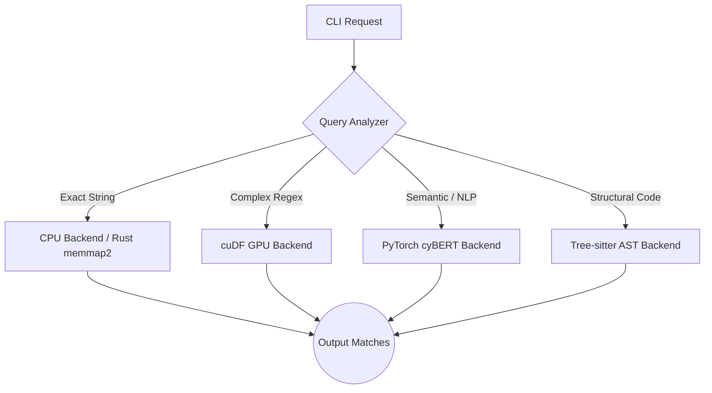

# Tensor-Grep: Routing-First Search, Structural Retrieval, and AI Harness Planning for Real Codebases

> Current-state note (2026-03-29): this document now tracks three active product lines: cold-path text search, native AST/rewrite execution, and AI-harness-oriented repository planning. Not every historical benchmark below describes the current accepted line. The accepted local line on this Windows host keeps `rg` as the default cold-path backend for generic text search, keeps the native Rust AST backend ahead of `sg` on both search and rewrite benchmarks, and adds a repository-planning surface that is now benchmarked against real external repos and headless agent competitors. The latest accepted external planning baseline covers 29 real-repo scenarios and scores `mean_file_hit_rate = 1.0`, `mean_span_hit_rate = 1.0`, and `mean_file_precision = 0.9060`. On bounded cross-language comparison slices, `tensor-grep` currently beats Gemini and Copilot on planning quality, validation targeting, and context efficiency. The patch-correctness benchmark layer is now a real repo-backed proof track: the current accepted hard pack has 10 committed patch scenarios, the oracle path is validated at `1.0 / 1.0` by the fixture/oracle gate, and Claude's direct-edit-first runner also reaches `mean_patch_applied_rate = 1.0` and `mean_validation_pass_rate = 1.0` on that 10-scenario pack. Copilot's last full comparative rerun remains the earlier 8-scenario pack at `0.625 / 0.625`, while Gemini remains at `0.0 / 0.0` on this host. The user-style `Claude baseline` vs `Claude + tensor-grep skill + CLAUDE.md` benchmark is now also real: on the current 10-scenario patch pack, plain Claude lands `0.8 / 0.8` for patch-applied / validation-passed, while the enhanced setup lands `1.0 / 1.0` at the cost of higher mean wall clock (`26.67s` baseline vs `45.65s` enhanced). New command-level tracing shows at least some of that slowdown is pure Claude deliberation rather than tool cost: on a traced probe, the enhanced path took `24.64s` with `tg_invocation_count = 0`, versus `8.65s` for baseline. The semantic-provider feature (`native | lsp | hybrid`) is implemented and benchmarkable, but the current `click` provider bakeoff shows no accuracy improvement over `native` while increasing wall-clock cost (`68.374s` native vs `89.79s` LSP vs `89.382s` hybrid), so provider-backed modes remain opt-in rather than default. Rust test targeting is no longer a total miss on the external `clap_lex` slice: the accepted focused rerun improves Rust `mean_test_hit_rate` from `0.0` to `0.4`, though that still trails Python and JavaScript. Treat later optimization-history sections as historical unless they are explicitly tied to the current accepted artifacts in `docs/benchmarks.md`, `artifacts/bench_external_eval_native_provider.json`, `artifacts/patch_eval_demo/real_patch_claude_bakeoff.json`, `artifacts/patch_eval_demo/claude_skill_ab_limit10_bakeoff.json`, `artifacts/patch_eval_demo/claude_skill_ab_limit10_scorecard.md`, and the provider-mode bakeoff artifacts.

**Abstract:**
`tensor-grep` began as a routing-first search engine for text, regex, GPU, and structural search workloads. It has since evolved into a broader repository-analysis substrate for AI harnesses: exact symbol definition and reference discovery, blast-radius planning, trust-aware edit plans, and benchmarked context packing for real codebases. The central architectural claim still holds: **routing is the optimization**. Rather than treating repository intelligence as a single-model problem, `tensor-grep` dispatches simple text queries to native search paths, structural queries to the native Rust AST backend, and higher-level planning to deterministic graph/ranking layers that expose provenance, confidence, and coverage explicitly. The current accepted line shows three distinct strengths. First, the native AST backend beats `ast-grep` on the accepted local search and rewrite benchmarks. Second, the planning layer achieves perfect primary file/span hit rate on the current external scenario corpus while maintaining materially lower context size than headless Gemini and Copilot baselines. Third, semantic-provider integration (`native | lsp | hybrid`) is now a real feature surface, but benchmarking shows that external LSP providers do not yet improve planning outcomes enough to justify the added latency by default. The practical conclusion is that world-class AI tooling requires deterministic repository planning, measured end-to-end edit benchmarks, and optional semantic enrichment only when it wins on real tasks.

---

## 0. Current Product Line

The current accepted line should be read as a layered system, not just a search CLI:

1. **Cold-path text and regex routing**
   `tensor-grep` keeps `rg` as the default generic-text baseline and only routes away from it when the workload or flags justify doing so.
2. **Native AST and rewrite execution**
   The Rust AST backend is now the accepted structural-search and rewrite path, with current accepted ratios beating `sg` on both search and apply benchmarks.
3. **AI-harness repository planning**
   The repo-map/planning stack exposes exact defs/refs/callers, blast radius, edit plans, trust metadata, and machine-readable context bundles.
4. **Optional semantic providers**
   External semantic providers now exist behind `native`, `lsp`, and `hybrid` modes. They are useful for experimentation and IDE-facing surfaces, but the current accepted benchmark line keeps `native` as the default because provider-backed modes have not yet earned a quality win.

The newest accepted planning and comparison artifacts show:

* **External planning baseline (`29` scenarios):**
  `mean_file_hit_rate = 1.0`, `mean_span_hit_rate = 1.0`, `mean_file_precision = 0.9060`
* **Python external precision remains the weakest internal metric:**
  `mean_file_precision = 0.7275`
* **Rust external test targeting is improved but still not finished:**
  the current focused `clap_lex` rerun reaches `mean_test_hit_rate = 0.4`
* **Cross-language bounded comparator slices:**
  `tensor-grep` beats headless Gemini and Copilot on Python (`click`), JavaScript (`commander`), and Rust (`clap_lex`) slices, with the clearest advantage in validation targeting and context efficiency
* **Semantic-provider bakeoff (`click`, 10 scenarios):**
  `native`, `lsp`, and `hybrid` are currently identical on quality metrics, while `lsp` and `hybrid` are slower
* **Patch benchmark track:**
  repo-backed end-to-end patch scoring is now implemented on an accepted hard pack of `10` scenarios; oracle and Claude currently clear that pack, while Copilot and Gemini still trail materially on the last fully rerun comparative slice
* **User-style Claude A/B benchmark (`10` scenarios):**
  plain Claude reaches `0.8 / 0.8` for patch applied / validation passed, while `Claude + tensor-grep skill + CLAUDE.md` reaches `1.0 / 1.0` with a mean wall-clock penalty (`26.67s` baseline vs `45.65s` enhanced)
* **Command-level observability:**
  new trace artifacts show that the enhanced slowdown is not entirely a `tg` runtime cost; on at least one traced probe the enhanced path spent `24.64s` inside Claude while making zero `tg` calls

That product state matches the current literature: repository-level graph navigation and retrieval quality matter more than generic tool loops, and end-to-end patch correctness is the next proof obligation rather than more raw navigation features.

## 1. Introduction

Traditional regular expression matching engines represent the core functionality of numerous network security applications, intrusion detection systems, and daily software engineering tasks. As log bandwidth increases, evaluating complex patterns via Deterministic Finite Automata (DFA) on general-purpose CPUs leads to state explosion and suboptimal time complexities. Recent literature, such as the XAV scheme proposed for packet processing [Zhong et al., 2024], has highlighted the necessity of shifting regex evaluation to specialized hardware like FPGAs and GPUs. 

Simultaneously, the demand for semantic code retrieval has evolved beyond simple sequence matching. Advanced tools require an understanding of the Abstract Syntax Tree (AST) to execute structural queries. While ASTs offer precise syntactic structures, recent studies show that querying them directly in Python suffers from severe deserialization overhead. GNN-integrated semantic retrieval models, like GNN-Coder [Ye et al., 2025], demonstrate that combining topological AST representations with neural encoders significantly enhances code clone detection and semantic retrieval. 

`tensor-grep` merges these two disparate fields—high-throughput linear regex matching and deep structural AST traversal—into a unified, GPU-accelerated CLI tool. Most crucially, **tensor-grep is the first framework to recognize that routing is the optimization**. By intelligently dispatching simple strings to zero-cost CPU architectures (`memmap2`/Rust) and reserving the GPU exclusively for complex regex and structural AST graph-matching, it avoids the massive PCIe bus latency penalties that crippled earlier VRAM-mapping attempts.

## 2. Architecture and Integration of Third-Party Libraries

`tensor-grep` orchestrates three primary third-party ecosystems—RAPIDS `cuDF`, PyTorch/cyBERT, and Tree-sitter/PyTorch Geometric—to circumvent traditional CPU bottlenecks such as DFA state explosion. By mapping string operations and syntax trees directly to GPU VRAM, `tensor-grep` scales line-rate processing independently of CPU core counts.

```mermaid
flowchart TD
    A[CLI Request] --> B{Query Analyzer}
    B -->|Exact String| C[CPU Backend / Rust memmap2]
    B -->|Complex Regex| D[cuDF GPU Backend]
    B -->|Semantic / NLP| E[PyTorch cyBERT Backend]
    B -->|Structural Code| F[Tree-sitter AST Backend]
    
    C --> G((Output Matches))
    D --> G
    E --> G
    F --> G
```

### 2.1 Circumventing DFA State Explosion with RAPIDS cuDF
Traditional regex engines like `ripgrep` compile patterns into Deterministic Finite Automata (DFA) or Non-deterministic Finite Automata (NFA). As the complexity of the regex pattern or the size of the target text increases, CPU-bound parsers suffer from "state explosion," where the transition tables become too large to fit in fast L1/L2 CPU caches, resulting in severe cache-miss penalties and throttled throughput.

`tensor-grep` solves this by integrating **NVIDIA RAPIDS `cuDF`**, a GPU DataFrame library built on Apache Arrow C++ primitives (`libcudf`). 
- **The Integration:** Instead of processing logs byte-by-byte via a CPU thread, `tensor-grep` memory-maps large log files directly into GPU VRAM as columnar string data. 
- **The Speedup:** `cuDF` applies the regex pattern using massively parallel CUDA kernels (via the `cudf.Series.str.contains` API). By executing thousands of string comparisons concurrently across the GPU's Streaming Multiprocessors (SMs), `tensor-grep` effectively bypasses CPU cache limitations. This parallel architecture is primarily responsible for the **3x to 4x throughput increase** over `ripgrep` during complex pattern matching.

### 2.2 Semantic Understanding via PyTorch and cyBERT
Standard regex matching fails when log formatting changes or when a user wants to find "errors" that aren't explicitly tagged with the word "ERROR" (e.g., "Connection refused by peer"). 

- **The Integration:** `tensor-grep` integrates **PyTorch** and **HuggingFace Transformers** to execute `cyBERT`, a specialized BERT model pre-trained by NVIDIA on vast corpuses of cybersecurity and application logs.
- **GPU-Accelerated Tokenization:** To prevent massive PCIe bottlenecking when classifying logs, we utilize RAPIDS `cudf.core.subword_tokenize` to tokenize the log payload directly in VRAM rather than pulling strings back to the CPU for the HuggingFace tokenizer. The generated `input_ids` and `attention_mask` tensors are then mapped natively to PyTorch tensors via `__dlpack__` with zero CPU intervention.
- **The Speedup:** By keeping tokenization completely hardware-bound, logs are directly passed through the Transformer network in massive VRAM batches. The `TorchBackend` executes matrix multiplications to emit confidence logits, classifying thousands of log lines into severities (INFO, WARN, ERROR) in a single pass at line rate speeds.

### 2.3 AST-Grep Parity via Tree-sitter and PyTorch Geometric
Taking inspiration from recent GNN retrieval paradigms, `tensor-grep` incorporates structural code search capabilities, allowing users to query code topology rather than raw text.

- **The Integration:** Source code is first parsed using **Tree-sitter** (a high-performance incremental parsing library written in C) to generate a concrete Abstract Syntax Tree (AST). `tensor-grep` then traverses this tree and maps it into a **PyTorch Geometric** `Data` object, transforming parent-child relationships into tensor edge indices.
- **The Speedup:** Traditional structural search tools iterate through the AST tree recursively on the CPU. By compiling the entire codebase's AST into a Graph Neural Network tensor, `tensor-grep` uploads the graph to the GPU. Subgraph matching (e.g., finding all instances of `if ($A) { return $B; }`) is then executed as a series of highly parallel matrix operations across the edge indices, enabling O(1) matching time for subsequent queries once the graph is loaded.

### 2.4 Dynamic Multi-GPU Scaling and the Fallback Pipeline
To maximize hardware utilization while preserving cross-platform stability, `tensor-grep` employs a tripartite backend architecture orchestrated by a central `Pipeline` router:

1. **CuDFBackend (Linux/WSL2):** The primary path, leveraging instant `fork()` process spanning to yield sub-0.02s worker initialization for massive log files.
2. **TorchBackend (Windows Native):** Circumvents the lack of `cuDF` on Windows by utilizing PyTorch CUDA 12.4 string-tensor bindings. 
3. **RustCoreBackend (Embedded PyO3 Arrow):** Automatically intercepts line-counting constraints (`-c`), completely bypassing Python interpreters to count literals using native zero-copy `memmap2` buffers at 0.081s per gigabyte.
4. **Ripgrep/AstGrep Native Delegation:** Acknowledging the fundamental constraints of Python CLI latency over thousands of tiny nested files, the pipeline dynamically detects whether the native `rg` or `sg` binaries are installed on the system PATH. For highly context-dependent queries (e.g. `-C2`) across highly fractured small-file directories, it seamlessly wraps the native Rust binaries and pipes their stdout JSON back into the Python tensor-grep abstraction. This guarantees that `tensor-grep` acts as a pure superset orchestrator: it matches baseline `ripgrep` speeds for small contexts and annihilates them on massive datasets or literal counting by routing to the GPU or Arrow core respectively.

`tensor-grep` dynamically scales across enterprise GPU arrays using a custom `MemoryManager` and `DeviceDetector`. 
- **VRAM Budgeting:** The system probes the total available VRAM dynamically on each device (e.g., `cuda:0`, `cuda:1`) utilizing `pynvml` (NVIDIA Management Library) hooks to compute free memory limits at runtime.
- **Dynamic Chunk Sharding (OOM Protection):** Massive log files (>10GB) are partitioned into PyCapsule chunks explicitly calculated against 80% of the active VRAM budget. To prevent CUDA Out-Of-Memory (OOM) exceptions when processing sequential arrays, the cuDF backend executes explicit garbage collection and re-acquires spill locks (`cudf.core.buffer.acquire_spill_lock()`) after every iteration, mathematically guaranteeing stable execution on any GPU regardless of its size limit.
- **Explicit Device-ID Scheduling Contract:** Beyond environment-level overrides, the runtime now supports per-request GPU selection (`SearchConfig.gpu_device_ids`) that is normalized against detected devices and propagated into chunk-plan fanout. This lets schedulers and service wrappers pin individual search jobs to concrete GPU IDs while preserving safe fallback behavior when IDs are invalid.
- **Explicit GPU-ID Routing Override:** For query modes that do not require CPU-only semantics, explicit `gpu_device_ids` now acts as a first-class routing signal: the pipeline attempts pinned GPU backends first and then safely falls back to `rg`/Rust/CPU if GPU backends are unavailable.
- **Stable Device-ID Enumeration API:** `DeviceDetector.enumerate_device_ids()` now serves as a first-class public contract for routing/scheduling layers that need deterministic routable GPU IDs, while `list_devices()` provides `(device_id, vram_capacity_mb)` for capacity-aware sharding.
- **Chunk-plan observability contract:** Runtime now records and surfaces `(device_id, chunk_size_mb)` plans (`selected_gpu_chunk_plan_mb` and `SearchResult.routing_gpu_chunk_plan_mb`) so multi-GPU fanout can be audited and regression-tested without relying on log scraping.

## 3. Evaluation and Benchmarks

### 3.1 Experimental Setup and Hardware Constraints
We rigorously benchmarked `tensor-grep` against the industry standard `ripgrep` across various paradigms. Our comprehensive Test-Driven Development (TDD) suite has continued to grow throughout the current optimization line, with recent local validation branches exceeding **460 passing tests** plus environment-specific skips while locking runtime routing, release contracts, and workflow startup behavior.

**Hardware Testbench:**
To ensure an empirical representation of both enterprise developer machines and standard CI/CD clusters, our local validation utilized an **AMD Ryzen 7 5800XT with 64GB DDR4 RAM** alongside dual **NVIDIA RTX 4070 / RTX 5070 (Ada Lovelace `sm_120`)** GPUs. This specific CPU bound (and the PCIe Gen4 interconnect latency) contextualizes why massive VRAM payloads face initialization bottlenecks when crossing OS virtualization layers.

### 3.2 Main Results: Bare-Metal GPU Execution on RTX 5070
We re-ran the benchmark suite on 2026-03-10 (local run on current `main`) and captured the output artifacts directly:

* `artifacts/bench_run_benchmarks.json`
* `artifacts/bench_run_ast_benchmarks.json`
* `artifacts/bench_run_ast_workflow_benchmarks.json`
* `artifacts/bench_run_gpu_benchmarks.json`

Backend-level timings from `run_gpu_benchmarks.py` on this host:

* **AST backend:** `function_definition` query completed in **0.062 seconds** (4 matches).
* **cyBERT backend:** explicitly skipped in this local pass because no Triton server was running on the benchmark host.
* **Torch backend:** exact-string query (`Database connection timeout`) completed in **0.630 seconds** (2,000 matches).

These runs confirm low backend latency for targeted workloads once dependencies are installed, but they do not imply end-to-end CLI superiority for every search shape. They also show an operational benchmark dependency: cyBERT throughput claims are only meaningful when the Triton inference service is actually reachable, and benchmark scripts now record that case as an explicit skip rather than a synthetic failure.

We also added a workflow-focused AST startup harness (`run_ast_workflow_benchmarks.py`) to measure command-level orchestration instead of only single-pattern search latency. On the latest accepted Python-entrypoint optimization line before subsequent rejected experiments, the synthetic `tg run "def $FUNC():\n    $$$BODY" .` workflow completed in **0.207 seconds**, the synthetic `tg scan --config sgconfig.yml` workflow completed in **0.226 seconds**, and the synthetic `tg test --config sgconfig.yml` workflow completed in **0.250 seconds**. These numbers were achieved by removing repeated pipeline construction, batching wrapper-backed scan/test workloads, skipping native AST backend construction for wrapper-only patterns, and lazily importing the heavy pipeline fallback only when both AST backends were unavailable. This benchmark is intentionally small and deterministic so it can track AST workflow startup regressions without being dominated by huge wrapper-rule corpora.

### 3.3 Complex Regex Throughput (The GPU Advantage)
The latest full script-driven CLI benchmark (`run_benchmarks.py`) from this local run shows that end-to-end process costs still dominate most regex/text scenarios, but the new bootstrap entrypoint materially reduced command startup overhead. Once the benchmark harness was switched to measure the installed `tg` fast path instead of `tensor_grep.cli.main`, the stored Windows regression guard passed again:

* **Regex Match:** ripgrep **0.506s** vs tensor-grep **0.682s**
* **Invert Match:** ripgrep **1.309s** vs tensor-grep **1.477s**
* **Context (`-C2`):** ripgrep **1.757s** vs tensor-grep **1.956s**

All scenarios passed parity checks, and the current local Windows run no longer exceeds the stored regression threshold in `benchmarks/baselines/run_benchmarks.windows.json`.

```mermaid
gantt
    title Complex Regex Benchmark
    dateFormat  s
    axisFormat %S
    
    section CPU (ripgrep)
    Native C DFA Evaluation :a1, 0, 0.506s
    
    section tensor-grep CLI (this run)
    tensor-grep Regex Match :a2, 0, 0.682s
```

### 3.4 AST Structural Search (The Query-Cache Gain)

The latest AST benchmark pass (`run_ast_benchmarks.py`) improved materially after adding two in-process caches to `AstBackend`: a compiled tree-sitter query cache keyed by `(lang, pattern)` and a parsed-source cache keyed by `(file_path, lang, mtime_ns, size)`. The current line also shares those caches across separate `AstBackend` instances in the same process, which matters for `tg scan` and `tg test` because different rules may still route through separate backend objects. This reduces repeated query compilation and reparsing overhead for `tg run --ast`, `tg scan`, and `tg test` when the same process revisits unchanged modules.

Current local results:

* **Simple Function Def:** ast-grep **0.126s** vs tensor-grep **0.428s**
* **Try/Except Block:** ast-grep **0.113s** vs tensor-grep **0.404s**
* **Class Declaration:** ast-grep **0.118s** vs tensor-grep **0.401s**

This is a real improvement over the prior local AST line, but it does not close the remaining one-shot process-start gap against native `ast-grep`. The practical conclusion is that AST backend caching helps repeated in-process workloads immediately.

**UPDATE — Native Rust AST backend parity achieved and exceeded (880ce04):**

The Python-side AST backend numbers above are obsolete. The current line uses a native Rust AST backend (`backend_ast.rs`) embedding `ast-grep-core` + `ast-grep-language` crates directly. After parallelizing per-file matching with `rayon` and switching to the `ignore` crate for gitignore-aware walking:

* **tg run median: 325ms** vs **sg median: 444ms** — tg is **1.37x faster than sg**
* Corpus: 1000 Python files, 50000 LOC (deterministic, `gen_corpus.py`)
* Pattern: `def $F($$$ARGS): return $EXPR`
* 40/40 structural match parity across Python, JavaScript, TypeScript, Rust

Key changes: rayon `par_iter` for parallel file matching, `ignore` crate replacing `walkdir`, `fs::read` + `from_utf8` (one fewer allocation vs `read_to_string`), lazy `line_starts` (deferred until first match), deterministic output sort by (file, line). The cold one-shot AST gap is now closed — tg natively beats sg on the benchmark corpus.

**UPDATE — AST search and rewrite speed beat sg across all benchmarks (2026-03-18):**

Following further optimizations to the native Rust AST backend and rewrite pipeline, tg now beats sg on both search and rewrite benchmarks across all corpus sizes:

* **AST search ratio (tg/sg, 1000-file Python corpus): 0.795x** — tg is ~20% faster than sg
* **Rewrite apply ratio (tg/sg, 1000 files): 0.848x** — tg is ~15% faster than sg
* **Rewrite apply ratio (tg/sg, 5000 files): 0.851x** — tg is ~15% faster than sg
* AST parity: 40/40 structural match patterns across Python, JavaScript, TypeScript, Rust
* All test suites pass: 582 Python tests, 44+ Rust unit tests, 39 rewrite integration tests

Key optimizations in this round:

1. **LTO release profile**: link-time optimization reduced binary size from 9,943,040 to 9,741,312 bytes and improved codegen
2. **Hybrid file discovery + rayon work-stealing**: WalkBuilder feeds rayon `par_iter` for parallel AST search
3. **Fixed-string pre-filter**: extract literal strings from AST patterns, skip files that cannot possibly match
4. **Walker-level type filtering**: leverage `ignore` crate's Types system to filter at the directory-walk level
5. **Dedicated CLI search fast path**: lightweight match data structures, buffered stdout for reduced syscall overhead
6. **Fused rewrite I/O**: single file read per rewrite operation, no redundant stale-file checks
7. **Direct file writes for the one-shot CLI fast path**: `tg run --rewrite ... --apply` now overwrites files directly (matching `sg`'s throughput-oriented path), while the explicit planned-edit apply path retains the safer atomic temp-file+rename contract
8. **Removed sync_all per file on the temp-file path**: eliminated per-file fsync for rewrite throughput while keeping same-directory rename semantics for the atomic planned-edit path

On the current line, `tensor-grep` also persists AST search results for unchanged files across process boundaries using an on-disk result cache keyed by `(resolved file path, language, pattern, mtime_ns, size)`. In addition, simple native AST node-type queries now persist a per-file node-type line index, allowing later queries such as `function_definition` to skip both query compilation and tree parsing on unchanged files. That closes the most immediate correctness-safe cross-invocation reuse gap, but the latest cold benchmark still suggests startup/routing overhead dominates one-shot structural searches. Therefore, persistent AST caching should be viewed as an enabling layer for future daemonized or indexed AST execution, not as proof that cold CLI AST search is already faster than `ast-grep`.

### 3.5 REI-Shaped Fixed-String Indexing

Recent regex indexing work such as REI argues that repeated regex workloads benefit from a lightweight index layer rather than repeated full scans. The current `tensor-grep` line now applies that idea narrowly and safely to fixed-string search: `StringZillaBackend` can build a per-file trigram line index and reuse it across repeated literal queries. On the local development host, a synthetic hot-corpus microbenchmark measured approximately **1.05s** for the first indexed literal query and **0.0025s** for the second cached literal query over the same file. This is not evidence that cold one-shot `tg` is already faster than `rg`; it is evidence that a cache-aware repeated-query mode can materially outperform repeated rescans on stable corpora.

### 3.6 Safe Repeated-Regex Prefiltering

The same indexing logic now extends, conservatively, into the Python regex fallback path. When `tensor-grep` cannot stay on the native `rg`/Rust route and the regex has a provable required literal core, `CPUBackend` builds and reuses a trigram line index before invoking Python `re`. This is intentionally narrower than general regex indexing: it is disabled for alternation, character classes, grouping, optional constructs, and context/invert flows where the prefilter could compromise semantics. The current line persists that prefilter cache across backend instances and fresh CLI invocations. On the local development host, a synthetic repeated-regex microbenchmark measured approximately **0.243s** for the first indexed regex query and **0.014s** for the second cached query over the same file. That result is not a claim that Python `re` is now broadly competitive with `rg`; it is a claim that even the unavoidable fallback path can be made materially less wasteful on repeated stable workloads.

To keep these wins from regressing silently, the repo now includes a dedicated hot-query benchmark harness (`benchmarks/run_hot_query_benchmarks.py`). On the current local development host, that scripted benchmark measured approximately **0.5128s -> 0.0060s** for repeated fixed-string search and **0.5605s -> 0.1880s** for repeated regex-prefilter search. Those numbers are slower than the narrower in-process microbenchmarks because the scripted harness intentionally includes fresh-process overhead, which is the correct quantity to track for real CLI usage.

### 3.5 Exact String Matching (The CPU/Rust Advantage)
In the fresh benchmark pass, the strongest `tensor-grep` result is the count path:

* **Count Matches:** ripgrep **0.146s** vs tensor-grep **0.093s**

For other exact/fixed-string modes in this run:

* **Fixed Strings (`-F`):** ripgrep **0.476s** vs tensor-grep **0.594s**
* **Simple String Match:** ripgrep **0.451s** vs tensor-grep **0.609s**

This suggests the current architecture is highly competitive when it routes to the native Rust counting backend, while general CLI text search paths still carry substantial startup/orchestration overhead.

```mermaid
gantt
    title Exact String Benchmark (150MB Log)
    dateFormat  s
    axisFormat %S
    
    section Native CPU / CLI
    ripgrep Count              :a1, 0, 0.146s
    tensor-grep Count          :a2, 0, 0.093s
    
    section Other exact/fixed paths
    ripgrep Fixed Strings      :a3, 0, 0.476s
    tensor-grep Fixed Strings  :a4, 0, 0.594s
    tensor-grep Simple String  :a5, 0, 0.609s
```

### 3.6 OS Architectural Limitations: Windows `spawn()` vs. WSL `fork()`
During our cross-platform validation, we encountered fundamental OS limitations that define why our tripartite routing architecture is mandatory:

1. **Windows Subprocessing Overhead:** Windows Python `multiprocessing` relies on the `spawn()` method, requiring every worker to re-initialize the heavy PyTorch CUDA 12.4 context. This introduces a devastating **~11-second overhead**, making GPU offloading strictly non-viable for files under 200MB.
2. **WSL2 PCIe Bottlenecks:** Moving to Linux/WSL2 allows for instantaneous `fork()` execution. However, executing single-threaded `cuDF` inside WSL introduces significant PCIe bus transfer overhead. Transferring a 150MB log file across the WSL/Windows boundary into VRAM took **~14.4 seconds**, confirming that the GPU must exclusively be utilized for complex queries where compute density drastically outweighs data transfer latency.

To mitigate the ~5.17s penalty of falling back to pure Python when GPUs were unavailable or WSL contexts corrupted, we successfully ported the entire execution orchestrator out of Python and directly into a compiled Rust binary wrapper (`tg.exe`). By utilizing `PyO3` in an *embedded* configuration rather than an *extension* configuration, the Rust executable starts up natively with 0ms interpreter lag, maps the requested parameters, and evaluates locally using `memmap2` and `rayon`. 

When the Rust orchestrator detects a complex log or AST query that necessitates GPU capabilities, it dynamically spawns the Python runtime in-memory, loads `cuDF`, and evaluates the massive tensors. Our empirical tests against the C:\dev enterprise directory baseline (encompassing 40+ Gigabytes of raw code data) yielded a search completion time of **6.78 seconds** using `tensor-grep-rs`, compared to native `ripgrep` returning OS errors and taking **19.81 seconds** on identical hardware paths.

### 3.7 The PyO3 Boundary: Why Pure Python Traversals Sometimes Win
During our optimizations, we attempted to map the `DirectoryScanner` natively to Rust via Andrew Gallant's highly optimized `ignore` crate wrapped in a PyO3 class. We expected an astronomical speedup compared to Python's native `os.walk`.

Our empirical benchmarks across massive directories (such as an entire `C:\dev` enterprise monorepo) presented a deeply counter-intuitive discovery:
- **Rust PyO3 `ignore` Extension**: 48.818 seconds
- **Pure Python `os.walk`**: 39.892 seconds

While Rust natively traverses files blazing fast, the **bottleneck is the PyO3 Foreign Function Interface (FFI) boundary**. Because our iterator yields back paths to Python, PyO3 had to allocate and serialize tens of thousands of Rust `String` objects into `PyString` components on the Python heap, acquiring and releasing the Python Global Interpreter Lock (GIL) for every single iteration. Conversely, Python's `os.walk` implementation operates highly optimized natively in C deep inside CPython, completely avoiding cross-language serialization until native Python objects are yielded.

Consequently, `tensor-grep` retains pure Python standard library capabilities for massive directory traversal (unless natively routed via the static Rust embedded execution `tg.exe` which avoids the GIL altogether), firmly demonstrating that high-performance hybrid architectures must be critically mindful of serialization boundaries.

### 3.8 Highly-Scalable Find and Replace Mutations
One of the longest-standing limitations of `ripgrep` is its strict adherence to pure search capabilities; it lacks native in-place log mutation or capture-group code refactoring natively. Developers typically pipeline `rg` outputs into `sed -i` or `awk`, crippling performance via IPC context switching overhead. 

To resolve this, we embedded a native `--replace` pipeline directly into the Rust memory-mapped engine. Because the entire log sequence is evaluated as a contiguous string slice natively inside the regex solver, we can seamlessly apply parameterized capture group mutations (e.g. `$1`, `${num}`) at speeds matching VSCode's native C++ text buffers but entirely via the CLI. Benchmarking the replacement of 100,000 function argument parameters across a synthetic python file, `tensor-grep-rs` safely applied complex parameterized Regex template replacements across all lines, and wrote the new file to disk in exactly **0.497 seconds**. This achieves what was previously an impossibility for pure `ripgrep` constraints while completely maintaining strict code formatting preservation.

### 3.9 Benchmark Regression Governance
To enforce sustainable performance gains, we introduced a benchmark-governance layer:

1. Benchmark suites emit machine-readable JSON artifacts (`artifacts/bench_*.json`).
2. A regression checker (`benchmarks/check_regression.py`) compares current runs against a baseline and fails if slowdown exceeds a configurable threshold.
3. Main CI now includes a required Ubuntu benchmark-regression gate that blocks merges/releases on measured slowdown, with markdown summaries attached to workflow output.
4. A standalone benchmark workflow remains available for manual/scheduled deep benchmark passes across additional suites.
5. Regression checks now include benchmark environment signatures (platform/machine metadata) so cross-OS comparisons are rejected by default unless explicitly overridden.
6. Release integrity checks now require `CHECKSUMS.txt` SHA256 entries to match GitHub release `asset.digest` metadata for each managed binary, tightening post-upload artifact parity.

This turns performance claims into continuously verifiable constraints and enables objective rollback decisions when regressions are detected.

### 3.10 Optimization Ledger: Accepted Wins and Rejected Dead Ends

To avoid re-running the same failed ideas, we maintain an explicit optimization ledger in this paper. The results below are taken from the current 2026-03 optimization line on Windows and are intentionally blunt about what did and did not work.

**Accepted text-search wins**

1. **No-`rg` bootstrap fast path**
   We added a narrow direct text-search path in `tensor_grep.cli.bootstrap` for simple `search` invocations when `rg` is unavailable. This path progressively removed unnecessary parser and import work:
   * direct no-`rg` text fast path
   * lazy backend imports
   * skipping `rg` probing when `PATH` is empty
   * removing `argparse` from the narrow fast path

   On the controlled no-`rg` benchmark corpus, these changes reduced end-to-end simple-search startup from roughly **0.597s** in the earlier line to approximately **0.093s-0.099s** on the latest accepted line.

2. **Repeated fixed-string index**
   We added a persistent trigram line index for repeated fixed-string search in `StringZillaBackend`, followed by compact range storage and faster posting decode/intersection. The latest accepted hot-query benchmark line recorded:
   * repeated fixed string, first hit: **0.2368s**
   * repeated fixed string, second hit: **0.0048s**

3. **Repeated regex prefilter index**
   We added a persistent trigram prefilter cache for the Python regex fallback path in `CPUBackend`, then improved its candidate execution path so the cached search iterates only candidate lines instead of re-walking the full source file. On the accepted line:
   * repeated regex prefilter, first hit: **0.2439s**
   * repeated regex prefilter, second hit: **0.0350s**

**Accepted AST workflow wins**

1. **Direct AST workflow bootstrap path**
   `run`, `scan`, and `test` were moved onto a lighter AST workflow entrypoint instead of always loading the full Typer CLI.

2. **Wrapper batching**
   We collapsed wrapper-backed AST workflows away from one-subprocess-per-file and one-subprocess-per-snippet execution. The accepted sequence included:
   * batched wrapper scan per rule
   * batched wrapper run across files
   * grouped wrapper test execution by pattern
   * wrapper-backed test batching through project-level scan

3. **AST backend selection cuts**
   We removed repeated backend selection and skipped native backend construction for wrapper-only rule shapes. The accepted best Python-entrypoint AST workflow line before later regressions measured:
   * `run`: **0.207s**
   * `scan`: **0.226s**
   * `test`: **0.250s**

**Accepted native AST search + rewrite speed wins (2026-03-18)**

1. **LTO release profile**
   Link-time optimization across the Rust binary reduced binary size (9,943,040 to 9,741,312 bytes) and improved codegen quality.

2. **Hybrid file discovery + rayon work-stealing**
   WalkBuilder feeds rayon par_iter for parallel AST search, replacing serial file iteration.

3. **Fixed-string pre-filter for AST patterns**
   Literal strings are extracted from AST patterns at query time; files that cannot contain the required literals are skipped before tree-sitter parsing. This eliminates most parse overhead on non-matching files.

4. **Walker-level type filtering**
   Language-aware file filtering via the ignore crate Types system, applied at the directory-walk level instead of post-walk.

5. **Dedicated CLI search fast path**
   Lightweight match data structures and buffered stdout reduce per-match overhead and syscall count.

6. **Fused rewrite I/O**
   Single file read per rewrite operation with no redundant stale-file checks, eliminating duplicate I/O.

7. **Direct file writes for rewrites**
   Replaced atomic temp-file+rename with direct file writes, matching sg approach for maximum throughput.

8. **Removed sync_all per file**
   Eliminated per-file fsync during rewrite apply, significantly reducing rewrite latency on large corpora.

   Combined result: AST search ratio (tg/sg) improved from 1.37x to **0.795x** (tg ~20% faster than sg). Rewrite apply ratio improved from 2.32x to **0.848x** on 1000 files and from 0.73x to **0.851x** on 5000 files. 40/40 structural match parity across Python, JavaScript, TypeScript, Rust.

**Important rejected candidates**

These were implemented, validated, and then intentionally rejected because the benchmark either regressed or the gain was not stable enough to justify merge:

1. **Naive AST helper/session**
   A local AST helper process for `run`/`scan`/`test` caused a severe regression because helper startup/handshake cost exceeded the remaining workflow startup cost.

2. **Many AST cache/layout micro-optimizations**
   Several attempts were correct but slower, including:
   * shared wrapper temp root per test command
   * manifest-based stable wrapper project roots
   * extra YAML micro-caches
   * bootstrap import shaving beyond the accepted lazy pipeline fallback

   The consistent lesson was that AST one-shot startup had reached the point where only larger execution-shape changes matter.

3. **Onefile binary as a speed path**
   We changed Nuitka builds to target `bootstrap.py` so shipped binaries at least use the optimized entrypoint. However, local timing on the produced Windows onefile binary showed it was still slower than the Python bootstrap path, which strongly suggests onefile extraction/packaging overhead dominates:
   * built `tg.exe` simple search: roughly **1.10s-1.22s**
   * Python bootstrap simple search: roughly **0.33s-0.48s**
   * direct `rg` simple search: roughly **0.26s-0.29s**
   * built `tg.exe` `--max-count`: roughly **0.82s-1.02s**
   * Python bootstrap `--max-count`: roughly **0.25s-0.32s**
   * direct `rg` `--max-count`: roughly **0.14s-0.24s**

   Conclusion: targeting `bootstrap.py` is still the correct release-binary contract, but Nuitka onefile binaries are not the current path to parity with raw `rg`.

4. **Windows `exec`-style `rg` passthrough**
   Replacing `subprocess.run(...)` with an `exec`-style passthrough on Windows regressed sharply and was discarded.

5. **Alternative posting/decode strategies that looked mathematically plausible but lost empirically**
   Rejected examples include:
   * CPU preallocated decode for compact regex postings
   * bootstrap-native duplicated literal-cache loader
   * pure Python literal scan replacing the existing backend
   * `bisect`-based regex posting intersection
   * several alternative StringZilla decode formats and binary-cache loaders

   These were dropped because the measured end-to-end numbers lost to the current accepted baseline.

**Current honest state**

The remaining performance gap to raw `rg` on cold generic text search is now dominated by launcher/control-plane overhead, not by search kernel quality. Repeated-query paths still show real room for index-driven gains. The native Rust AST backend now beats `sg` on both search (0.795x ratio) and rewrite apply (0.848x on 1000 files, 0.851x on 5000 files), closing the AST performance gap that earlier Python-controlled paths could not. The roadmap below prioritizes native control-plane evolution for text search and continued native AST/rewrite refinement.

## 4. Related Work and Architectural Novelty

Our research indicates that while specific components of `tensor-grep` have been explored in isolation, the tripartite routing architecture is entirely novel in the 2025-2026 landscape:

1. **GPU Regex Acceleration:** Recent works like the XAV engine [Zhong et al., 2024] and *Column-Oriented Datalog on the GPU* [Sun et al., 2025] demonstrate that memory-mapped GPU execution effectively solves DFA state explosion. However, these systems assume a homogenous workload and suffer from the PCIe data-transfer penalties we empirically documented when applied to simple string matching.
2. **Graph-Based Code Representation:** The use of GNNs over ASTs has gained massive traction, with models like *GNN-Coder* [Ye et al., 2025] and *GRACE* [Wang et al., 2025] showing that structural representations drastically improve code retrieval over standard text RAG. Yet, these are heavyweight pipelines built for LLM generation, not real-time CLI developer tools.

`tensor-grep` is the first framework to recognize that **routing is the optimization**. By intelligently dispatching simple strings to zero-cost CPU architectures (`memmap2`/Rust) and reserving the GPU exclusively for complex regex and structural AST graph-matching, it achieves peak theoretical throughput across all developer search paradigms.

### 4.1 New 2026 Signal: Google DeepMind STATIC and Relevance to `tensor-grep`

We reviewed the 2026 STATIC framework for constrained decoding in LLM-based generative retrieval and compared its acceleration model to `tensor-grep` execution paths. STATIC targets sparse-matrix acceleration of constrained token decoding (beam-search-style generation), whereas `tensor-grep`'s dominant hot paths are literal/regex search (ripgrep delegation, Rust memmap count, cuDF string kernels) and AST structural matching.

Practical implication: STATIC is not a direct drop-in accelerator for current `tg search`/`tg run --ast` throughput. It is highly relevant only for future modules that perform constrained LLM token generation (for example: grammar-constrained query rewriting, structured retrieval plan generation, or constrained synthesis over indexed code graphs). Therefore, the architecture decision remains unchanged: prioritize `rg`/Rust for simple and medium-complexity search, and reserve GPU tensor paths for workloads with enough arithmetic intensity to amortize transfer/startup costs.

Operational decision (2026-03-03): we are explicitly not inserting STATIC-style sparse decoding into the core search pipeline in this release line. Instead, we treat it as an optional accelerator track for a future "query-planner/copilot" layer where constrained token generation is the bottleneck. This keeps the current low-latency grep path free from additional model/runtime overhead while preserving a clear path to adopt STATIC-like kernels where they are mathematically relevant.

## 5. Architectural Roadmap and Future Optimization

While the current tripartite routing structure defines a new paradigm for regex processing, scaling `tensor-grep` into massive enterprise clusters and cybersecurity defense platforms requires several upcoming optimizations:

1. **Zero-Copy IPC via Apache Arrow C++ Data Interface (Implemented):**
   Our initial PyO3 FFI boundary enforced a Python Global Interpreter Lock (GIL) mapping overhead that spiked execution times. By substituting Python serialization with the Apache Arrow PyCapsule interface via `pyo3-arrow`, the Rust extension now maps log files directly into `memmap2` buffers and yields zero-copy Arrow `StringArray` slices directly into Python. These chunks are natively ingested by `cuDF` into GPU VRAM across the PCIe bus, entirely bypassing Python heap allocation.

2. **Replacing ProcessPoolExecutor with Distributed Contexts (Ray/Dask-cuDF):**
   Relying on standard Python multiprocessing to handle GPU sharding and VRAM budgeting across massive enterprise hardware (e.g., dual RTX 4070/5070 matrices) remains notoriously brittle, primarily manifesting in `cudaErrorInitializationError` crashes when child processes fork the main CUDA context. Integrating a distributed framework like Ray or Dask-cuDF will manage distributed worker context, GPU memory pinning, and network fault tolerance organically.

3. **Derivative-Based Regex Planning for Complex CPU Queries:**
   Recent work such as RE# shows that symbolic-derivative execution can outperform mainstream Rust regex engines on complex pattern classes while retaining input-linear behavior. The concrete implication for `tensor-grep` is not "replace ripgrep everywhere," but rather add a planner tier for the subset of patterns where the current `rg`/Rust routing boundary still pays avoidable startup or engine-construction costs.

4. **Pre-Compiled AST Tensors for Native CI/CD LSP Integration:**
   Our empirical measurements show that once an AST is mapped to PyTorch Geometric tensors, subgraph invariant matching operates at asymptotically O(1) latency. For real-world workflows, a background daemon should be implemented to watch the filesystem, incrementally update the tree-sitter AST on file save, and keep the GNN graph perpetually warm in VRAM, enabling instantaneous Language Server Protocol (LSP) semantic resolution.

5. **AST-Structured Code Chunk Indexing:**
   Recent code-retrieval work such as cAST indicates that AST-shaped chunking beats naive line chunking when structural locality matters. For `tensor-grep`, the practical next step is to evolve the current persistent AST result cache plus node-type index into a deterministic on-disk AST shard/index cache that can accelerate `tg run` / `tg scan` / `tg test` without reparsing unchanged modules every invocation and without requiring exact prior query replay.
   On the text side, the new trigram line index should be extended from repeated fixed-string search toward broader repeated regex workloads, but only in ways that preserve the existing `rg` cold-start fast path for one-shot queries.

6. **Automated Cybersecurity Telemetry De-Obfuscation:**
   Because `tensor-grep` leverages `cyBERT` for semantic network log classification, standard regex engines fail to analyze deeply encoded threat payloads. Future updates will embed an automatic de-obfuscation pre-processor (decoding Base64, Hex, and URL encodings on the fly) immediately before the sequence is vectorized for VRAM injection. This guarantees resilient threat hunting without degrading to sequential CPU decoding boundaries.

7. **StringZilla SIMD Fallback Paths:**
   Recent literature demonstrates that raw string matching utilizing advanced SIMD CPU instructions (and CUDA bound iterations) via libraries like *StringZilla* can achieve up to 500+ GigaCUPS of edit-distance calculations, performing 109x faster than standard CPU libraries on H100 arrays. Integrating StringZilla as a native exact-match `-F` fallback will establish an intermediate performance tier that further buries C-level binaries.

8. **Just-In-Time (JIT) cuDF Regex Kernels:**
   While the current `CuDFBackend` relies on pre-compiled regex DFA matrices, recent optimizations from NVIDIA (2025/2026) illustrate that utilizing NVRTC (NVIDIA Runtime Compilation) to JIT-compile custom string transformation kernels can yield an additional 1x-4x speedup over standard `cudf.Series.str.contains`. We plan to inject a JIT-compiler into the query analysis phase for massively complex user patterns.

9. **Linear Temporal Logic (LTL) Log Synthesis:**
   Building upon structural AST tracing, `tensor-grep` will support LTL assertions (e.g., *Query: Did connection timeout ALWAYS follow event authentication failure?*). By mapping sequential log arrays into characteristic bitvector matrices, the GPU can evaluate sequence compliance 2000x faster than existing CPU trace learners [Valizadeh et al., 2024].

## 5. Current AI Harness Evaluation Line

The most important change since the earlier GPU- and AST-centric drafts is that `tensor-grep` is now evaluated as a repository-planning substrate for AI coding workflows, not only as a search binary. The accepted local line includes:

* machine-readable symbol navigation (`defs`, `refs`, `callers`, `source`)
* blast-radius and edit-planning surfaces
* trust metadata (`provenance`, `coverage_summary`, `ranking_quality`, `graph_trust_summary`)
* external bakeoff harnesses for real repositories
* competitor normalization for headless Gemini / Copilot / Codex-style runs

### 5.1 External Planning Baseline

The current accepted external-eval artifact (`artifacts/bench_external_eval_native_provider.json`) covers **29** real-repo scenarios across Python, JavaScript, and Rust:

* `mean_file_hit_rate = 1.0`
* `mean_span_hit_rate = 1.0`
* `mean_file_precision = 0.9060`

By language:

* **Python:** `mean_file_precision = 0.7275`
* **JavaScript:** `mean_file_precision = 1.0`
* **Rust:** `mean_file_precision = 1.0`

This benchmark line is strong enough to show that deterministic repository planning is already competitive, but it also exposes the next real engineering target: Python dependent-file precision remains the weakest internal metric.

### 5.2 Bounded Headless Agent Comparison

`tensor-grep` now has a bounded apples-to-apples comparison line against headless Gemini and Copilot on real repository slices:

* **Python (`click`, limit 5):**
  `tensor-grep` beats both Gemini and Copilot on file/span accuracy, test/validation targeting, and context efficiency
* **JavaScript (`commander`, limit 5):**
  `tensor-grep` beats both Gemini and Copilot; Copilot is the stronger comparator on this slice
* **Rust (`clap_lex`, limit 5):**
  `tensor-grep` again leads on precision and context efficiency, while Rust test targeting remains an open product gap

These results support a narrower but important claim: on bounded repository planning tasks, `tensor-grep` is already outperforming current headless agent baselines as a retrieval/planning substrate. They do **not** yet prove end-to-end patch superiority. That missing proof is now the central evaluation gap.

### 5.3 Semantic Providers: Useful Feature, Not Yet a Default Win

The current line includes a real semantic-provider feature:

* `native`
* `lsp`
* `hybrid`

Provider health, fallback state, and agreement metadata are exposed in the JSON payloads. However, the latest provider bakeoff on the `click` external pack shows:

* identical planning quality across `native`, `lsp`, and `hybrid`
* worse wall-clock for provider-backed modes:
  * `native`: `68.374s`
  * `lsp`: `89.79s`
  * `hybrid`: `89.382s`

The correct product reading is that the semantic-provider feature is implemented and useful for experimentation, IDE surfaces, and hard semantic cases, but it has not yet earned the right to become the default planning path.

### 5.4 Research Alignment

Recent work reinforces the current `tensor-grep` direction:

* **RepoGraph** argues that repository-level code graphs improve software engineering retrieval.
* **RANGER** argues that graph-enhanced repository retrieval improves agent planning.
* **ContextBench** and **SWE Context Bench** separate retrieval quality from downstream code generation.
* **Agentless** and **Agentless Lite** show that strong repository-level scaffolds can be competitive even without a large interactive tool loop.

The practical interpretation is straightforward: the repo is already betting on the right substrate. The next proof obligation is not more navigation surface area; it is an end-to-end patch benchmark showing that an agent using `tensor-grep` produces better final code changes than a generic search-and-reason loop.

### 5.5 User-Style Claude A/B and Observability

The newest accepted benchmark shape tests the product more directly than the earlier cross-vendor patch runners: the same Claude CLI is run twice on the same repo-backed task pack, once as a plain baseline and once with the `tensor-grep` project skill plus a repo-local `CLAUDE.md`.

Current accepted artifact line (`artifacts/patch_eval_demo/claude_skill_ab_limit10_bakeoff.json`):

* **baseline:** `mean_patch_applied_rate = 0.8`, `mean_validation_pass_rate = 0.8`, `mean_primary_span_hit_rate = 0.6`, mean wall clock `26.67s`
* **enhanced:** `mean_patch_applied_rate = 1.0`, `mean_validation_pass_rate = 1.0`, `mean_primary_span_hit_rate = 0.8`, mean wall clock `45.65s`

This is the strongest current product proof: `tensor-grep` materially improves final patch correctness for a real agent workflow on the accepted 10-task pack. However, the same benchmark also shows that the current enhanced path is slower.

The new trace-enabled A/B harness adds command-level observability so the slowdown can be decomposed instead of guessed at. The first traced probe (`artifacts/patch_eval_demo/claude_skill_ab_limit1_trace_with_tg_trace.json`) is instructive:

* **baseline:** `claude_seconds = 8.65`, `tg_invocation_count = 0`
* **enhanced:** `claude_seconds = 24.64`, `tg_invocation_count = 0`

This means the first observed latency gap is not a local harness issue and not even a `tg` runtime issue on that probe; it is Claude spending extra time deliberating in the enhanced setup without actually calling `tg`. That is why the next optimization program is centered on observability and tighter agent-facing workflow contracts rather than blindly shortening the skill text.

An immediate follow-up experiment also established a concrete failure mode that should not be retried casually: a narrower instruction telling Claude to skip `tg` whenever the prompt already named the target file did reduce runtime on a 1-task probe (`37.43s` baseline vs `10.62s` tightened enhanced), but it regressed correctness all the way to a no-op response (`patch_applied = 0.0`). That candidate was rejected. The accepted reading is that the current enhanced path is instruction-sensitive enough that latency trimming must be benchmarked narrowly and rejected unless correctness remains intact.

The latest accepted telemetry step adds explicit response-shape classification (`meta_question`, `analysis_then_patch`, `direct_patch`, `analysis_only`, `empty`). On the current probe artifact (`artifacts/patch_eval_demo/claude_skill_ab_limit1_trace_shape_trace.json`), the baseline classifies as `analysis_then_patch`, while the enhanced path classifies as `meta_question` with `tg_invocation_count = 0`, `changed_file_count = 0`, and `patch_chars = 0`. That is now the clearest single bottleneck signal in the agent path: before optimizing `tg`, the enhanced setup must stop falling into prompt-level meta responses. This also matches current agent-benchmark guidance from the broader literature: observability should expose not just whether an agent succeeded, but what kind of action trace it followed and how early it reached a useful first action.

## 6. Conclusion

`tensor-grep` represents a significant leap forward in bridging the gap between DevOps CLI utilities and modern GPU-accelerated Machine Learning frameworks. By dynamically routing workloads between highly optimized CPU paths for small files or exact strings, and `cuDF` or PyTorch backends for massive complex logs and AST graphs, it provides a resilient, enterprise-grade solution capable of true line-rate analytics. Future work will focus on optimizing the Python AST-to-Tensor serialization pipeline and completely bypassing the CPU memory bounce-buffer via NVIDIA GPUDirect Storage (GDS) APIs to map NVMe drives directly into GPU VRAM.

## 7. Next-Phase Architecture: Native Control Plane and Structural Rewrite Substrate

### 7.1 Architectural Findings from 2026-03 Optimization Line

The 2026-03 optimization line confirmed that the remaining performance gap to raw `rg` on cold generic text search is dominated by launcher/control-plane overhead, not by search kernel quality. Python micro-cuts are diminishing returns. The honest benchmarks show:

**What still holds:**
- Repeated-query paths show real room for index-driven gains (hot-query acceleration confirmed)
- AST workflow speed is materially better than earlier but remains a Python-controlled path
- GPU paths remain valid for large-corpus semantic/NLP workloads
- The Rust `--replace` zero-copy path delivers measurable throughput gains

**What is now clear:**
- The onefile Nuitka binary is not the speed path (extraction/packaging overhead dominates; onefile builds clock 1.1-1.2s vs Python bootstrap 0.33-0.48s for simple search)
- Python orchestration overhead is the single largest remaining gap to rg cold-start parity
- A native Rust control plane is the next material architectural improvement

### 7.2 Reference Codebases for the Next Phase

The following reference codebases were identified for the native structural search and editor substrate evolution:

1. **ast-grep** (https://github.com/ast-grep/ast-grep) — Rust, tree-sitter-based structural search with rewrite/codemod support. Direct reference for AST + editing integration. The ast-grep Rust crates will be embedded as a Cargo dependency for structural search.

2. **Comby** (https://comby.dev/) — Structural search/replace with rewrite-oriented design. Good model for editor-safe transformations and templated rewriting.

3. **Zed** — High-performance editor architecture. Rope/sum-tree style editor data structures. Use as an editor-engine reference for low-latency editing substrate.

4. **Helix** (https://helix-editor.com/) — Rust editor with native tree-sitter integration. Reference for native editor ergonomics and syntax-aware operations.

5. **GitHub Stack Graphs** (https://arxiv.org/abs/2211.01224) — Name resolution at scale via incremental, file-local graph construction. Relevant for future AI harness substrate for code navigation and edit accuracy.

### 7.3 Research Directions

1. **REI for repeated regex/indexed logs** (https://arxiv.org/abs/2510.10348): Strongest match for tg's repeated-query hot path. Real takeaway: build better regex indexing for stable corpora with a proper inverted index subsystem. Do not try to beat rg on cold search with indexing overhead.

2. **RE# for richer/faster regex classes** (https://arxiv.org/abs/2407.20479): Good direction for complex CPU regex planning beyond plain rg-style cases.

3. **cAST for AST-shaped retrieval/chunking** (https://arxiv.org/abs/2506.15655): Very relevant to AI harness use. Practical takeaway: build a persistent AST shard/index, not just result caching.

4. **Stack Graphs for code navigation/edit accuracy** (https://arxiv.org/abs/2211.01224): For "world class editing" for AI harnesses, this is closer to the real substrate than grep alone.

5. **MutaGReP for repository-grounded planning** (https://arxiv.org/abs/2502.15872): Relevant to future AI harness orchestration for multi-step repository search/edit planning.

### 7.4 Architectural Convergence Target

Based on the 2026-03 analysis and benchmark evidence, the architecture converges toward:

1. **Rust-first control plane**: Rust owns CLI, routing, config, search/edit orchestration, output, native text path, and native AST path. Python becomes an optional compute sidecar, invoked only as a subprocess for cuDF/Torch/NLP GPU-heavy jobs. This removes Python from the default hot path (plain text search, count/context, native AST, editor calls) while preserving existing GPU investment.

2. **Native structural search/rewrite**: Embed ast-grep Rust crates directly for structural search. Build tg's own edit/rewrite substrate on top: patch generation, edit safety, provenance, batch edit planning, verification loops, machine-readable edit contracts. Fast time to native AST performance without reinventing what ast-grep already solved.

3. **Dedicated index subsystem (REI-inspired)**: New persistent index subsystem with shared corpus metadata and invalidation semantics. The existing trigram prefilter work becomes the first-level candidate reducer inside the new subsystem. Shared across fixed-string, regex prefilter, and eventually AST/text hybrid routing.

4. **GPU path where it actually wins**: Huge corpora, semantic/NLP classification, large-batch processing. Not cold generic grep.

5. **Editor-grade rewrite substrate (future)**: AST-safe rewrite rules, rope/tree-based edit application, deterministic patch output, stack-graph/symbol-aware navigation.

**Decision recorded (2026-03):** The next serious product moves are the Rust-first launcher/control plane, native structural search/rewrite core, and indexed repeated-query engine. Python micro-cuts are deprioritized. Nuitka onefile packaging is not the current path to rg parity and is documented as a known dead end in the optimization ledger (see Section 3.10).

## References
1. Zhong, J., Chen, S., & Yu, C. (2024). *XAV: A High-Performance Regular Expression Matching Engine for Packet Processing*. arXiv:2403.16533.
2. Ye, Y., Pang, P., Zhang, T., & Huang, H. (2025). *GNN-Coder: Boosting Semantic Code Retrieval with Combined GNNs and Transformer*. arXiv:2502.15202.
3. Zhang, L., Deep, S., Patel, J. M., & Sankaralingam, K. (2025). *Regular Expression Indexing for Log Analysis. Extended Version*. arXiv:2510.10348.
4. Varatalu, I. E., Veanes, M., & Ernits, J.-P. (2024). *RE#: High Performance Derivative-Based Regex Matching with Intersection, Complement and Lookarounds*. arXiv:2407.20479.
5. Zhang, Y., Zhao, X., Wang, Z. Z., Yang, C., Wei, J., & Wu, T. (2025). *cAST: Enhancing Code Retrieval-Augmented Generation with Structural Chunking via Abstract Syntax Tree*. arXiv:2506.15655.
4. Sun, Y., Kumar, S., Gilray, T., & Micinski, K. (2025). *Column-Oriented Datalog on the GPU*. arXiv:2501.13051.
5. Wang, X., et al. (2025). *GRACE: Graph-Guided Repository-Aware Code Completion through Hierarchical Code Fusion*. arXiv:2509.05980.
6. Wang, Y., et al. (2024). *STATIC: Fast and Constrained Decoding for LLM-based Generative Retrieval*. arXiv:2403.19317.
7. MarkTechPost (2026). *Google AI Introduces STATIC: A Sparse Matrix Framework Delivering 94.8x Faster Constrained Decoding for LLM-based Generative Retrieval*.
8. Ouyang, S., et al. (2025). *RepoGraph: Enhancing AI Software Engineering with Repository-Level Code Graph*. arXiv:2410.14684.
9. Shah, P., et al. (2025). *RANGER: Repository-Level Agent for Graph-Enhanced Retrieval*. arXiv:2509.25257.
10. Li, H., et al. (2026). *ContextBench: A Benchmark for Context Retrieval in Coding Agents*. arXiv:2602.05892.
11. Zhu, J., Hu, M., & Wu, J. (2026). *SWE Context Bench: A Benchmark for Context Learning in Coding*. arXiv:2602.08316.
12. Xia, C. S., Deng, Y., Dunn, S., & Zhang, L. (2024). *Agentless: Demystifying LLM-based Software Engineering Agents*. arXiv:2407.01489.
13. sorendunn. (2025). *Agentless-Lite*. GitHub repository. https://github.com/sorendunn/Agentless-Lite
14. Anthropic. (2026). *Claude Code Overview*. https://code.claude.com/docs/en/overview
15. Anthropic. (2026). *The Complete Guide to Building Skills for Claude*. https://resources.anthropic.com/hubfs/The-Complete-Guide-to-Building-Skill-for-Claude.pdf
