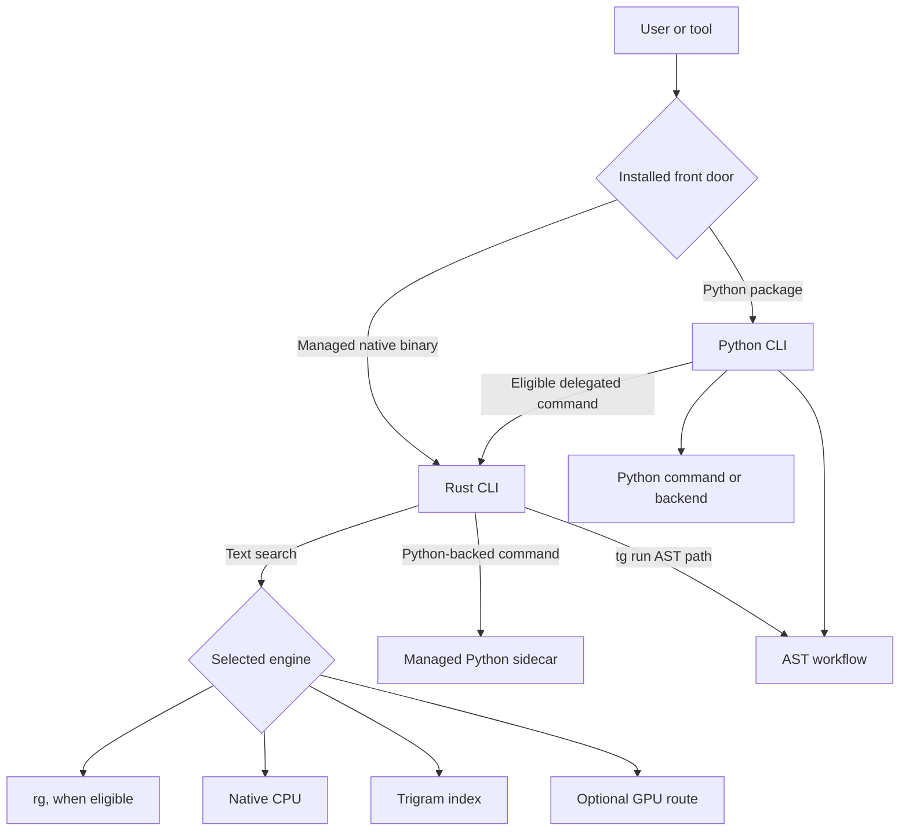

# Architecture

`tensor-grep` (`tg`) has a Rust command-line program and a Python package. Which one receives a command first depends on how the user installed it. The command names are designed to feel like one tool, but the two installation entry points do not have identical startup and dependency paths.

## Follow a request

The diagram is a map, not a complete routing specification. Some commands have early passthrough paths, and `tg run` has an AST path. The maintained conditions are in [routing policy](routing_policy.md).

## The two installation entry points

- **Managed native install:** the released native binary is the `tg` front door. It handles native text search and can hand Python-backed commands to the managed Python sidecar. A sidecar is a separate process used to provide commands implemented in Python.
- **Python package install:** the console command starts through Python. It can use packaged Rust extensions for supported native functionality, and some features that require a standalone executable need an explicitly configured native binary.

Within the Rust executable, both the bare positional search form (`tg PATTERN PATH`) and command form (`tg search PATTERN PATH`) can lead to the text-search router. These are two parser forms inside one binary; they are separate from the native-versus-Python installation choice. `tg run` follows an AST workflow path. Do not infer the implementation for a command from its name alone; see the route details for current behavior.

## Search engines and limits

The search router can select `rg`, native CPU search, a trigram index, an AST backend, or optional GPU paths according to flags, output shape, available tools, and project state. A backend is the engine that performs the request. Routing is conditional, so a release containing a GPU-related build configuration does not mean GPU is the default or that every search uses it.

The trigram index records character groups to narrow which files need a full scan. It is a file named `.tg_index` at the indexed project root. It can narrow some compatible text searches; whether it is used depends on the query and route. For exact flags and fallbacks, use [routing policy](routing_policy.md).

AST workflows parse source into an abstract syntax tree (AST), then match or analyze code structure. Parser and language coverage constrain what can be found. Call graphs and caller lists can have unresolved or bounded results, so an absent edge is not proof that no caller exists. Orientation scores suggest central files or entry points from available signals; they are not proof of runtime importance or safety.

## From a question to relevant code

Commands such as `tg context` and `tg prepare` use Python services to gather and rank
candidate files and symbols. A **symbol** is a named code element, such as a function
or class. Query words, symbol matches, filenames, and relationships between code elements
help select useful results. Production files, tests, generated code, and vendored code
can receive different treatment. Exact symbol evidence takes priority over a filename
phrase match.

The selected results must fit an output budget. This makes them practical to read or
send to an assistant, but it also means that relevant code may be omitted. Sessions
reuse project snapshots for repeated requests; refreshing a session updates its view
after files change. Ranking and caching do not establish that a proposed edit is correct.

## CLI and MCP access

People can read command output in a terminal. Scripts can request structured JSON or
NDJSON where supported. **MCP** (Model Context Protocol) lets a compatible assistant
call the tool's search and analysis functions through `tg mcp`. These interfaces share
underlying services, while their public input and output contracts are documented in
the [harness API](harness_api.md). Running an MCP server does not by itself grant a
client permission to apply every proposed change.

## Local state has different purposes

| Location | Purpose | How to treat it |
|---|---|---|
| `.tg_index` | Native trigram index file used by eligible text searches | Rebuildable search data; may be removed when the index is stale |
| `.tg_cache/ast/` | AST project data, including `project_data_v6.json` | Rebuildable parser and project data; separate from the text index |
| `.tensor-grep/sessions/` | Persisted session metadata and snapshots | State for reusable project context; inspect before cleanup |
| `.tensor-grep/checkpoints/` | Saved file contents and metadata for rollback | Durable recovery material; do not delete when clearing caches |
| Resident worker memory | Optional in-process AST data | Volatile; worker behavior is experimental |

Some session requests may use an optional daemon response cache. That cache is scoped to daemon requests and is not the checkpoint store. See [cache management](runbooks/cache-management.md) before removing local state and [session daemon protocol](session_daemon_protocol.md) for session behavior.

## Source map

| Area | Role |
|---|---|
| `rust_core/` | Native CLI, text-search routing, indexing, and native execution paths |
| `src/tensor_grep/cli/` | Python command handlers and CLI workflows |
| `src/tensor_grep/backends/` | Backend interfaces and implementations |
| `src/tensor_grep/core/` | Shared Python core logic |
| `tests/` | Tests for command contracts and behavior |
| `scripts/` | Build, release, validation, and maintenance tools |

## Contracts and implementation detail

[Contracts](CONTRACTS.md) is the canonical source for compatibility promises, completeness fields, state behavior, and failure semantics. [Harness API](harness_api.md) documents machine-readable output. [Experimental features](EXPERIMENTAL.md) identifies behavior outside stable guarantees. This overview intentionally avoids duplicating the full routing table and contract ledger.
